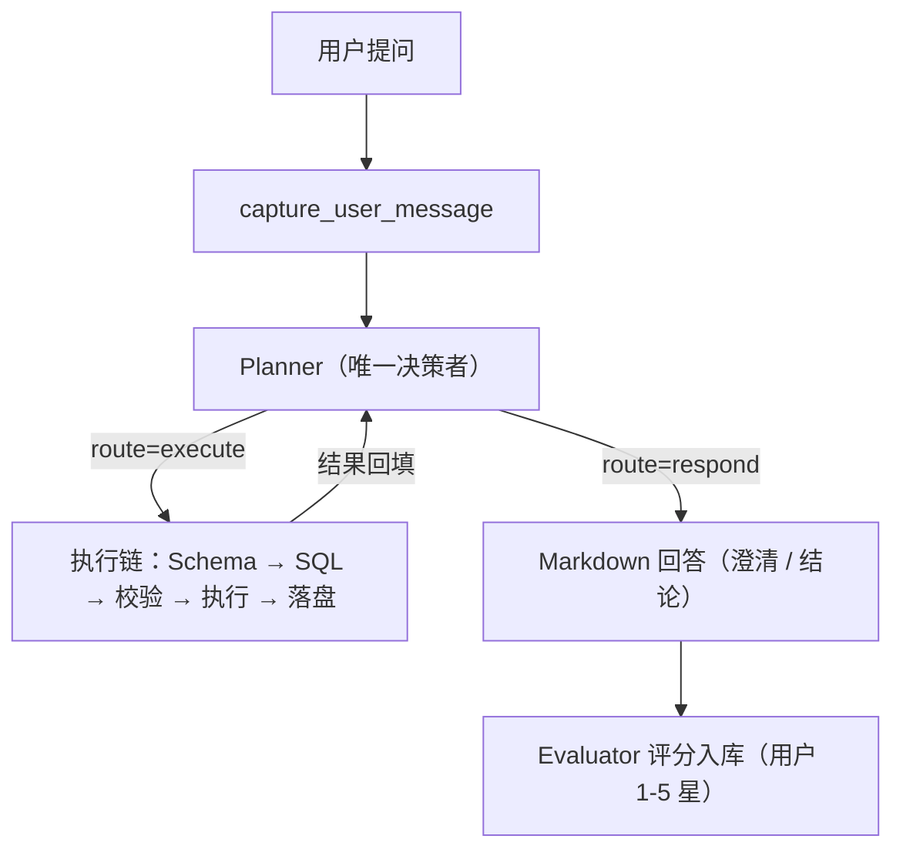

# 智能数仓助手 — 数据问答 Agent

> 基于 LangGraph 的问答式取数系统：自然语言提问 → 语义层定位口径 → 生成 SQL → 多引擎执行 → Markdown 回答与图表。
> 前端支持 Web（ChatGPT 风格）与飞书机器人，另提供 CLI 调试入口。

## 一、项目定位

把"业务口径 + 数仓表 + 查询引擎"打包成一个可以直接对话的取数助手。

- 输入：业务人员的中文提问，例如"查询昨天租赁中的订单数，按月租拆一下"。
- 输出：结论 + 口径说明 + 数据表格/图表，并说明数据来源。
- 底线：**语义层是权威口径来源**，LLM 不猜指标；未命中就澄清或拒答，不编造数据。

核心能力：

| 能力 | 说明 |
|---|---|
| 语义层优先 | 指标口径、来源表、物理字段、维度、枚举统一维护在 `semantic_layer/`，由语义层检索命中 |
| 口径澄清 | 同一指标存在多种口径时先反问用户，确认后再查询 |
| 多数据源路由 | Trino 主通道 / Doris 专属库 / Hive 兜底，按表配置自动选择与降级 |
| 安全护栏 | 只读 SQL、白名单表、强制分区过滤（`pt_dt`）、AST 校验 |
| 渐进式披露 Skill | 仿 Codex 的 skill 机制：先看描述、命中后再读正文与引用文件，避免提示词膨胀 |
| 连续问答 | 整个对话共享一个 LangGraph Checkpoint，支持追问、改口径、基于结果继续问 |
| 可观测 | JSON Lines 全链路日志（按 `request_id` 还原）、token 统计、思考过程流式输出 |

## 二、快速开始

### 1. 环境要求

- Python 3.11+
- MySQL 8（会话落库、评测记录）
- 查询引擎连通性：Trino（主）/ Doris（`data_project` 库）/ Hive（兜底）
- 模型网关：任意 OpenAI 兼容 API
- 可选：`ENABLE_RAG=true` 时需要 embedding 服务与 FAISS 索引

### 2. 安装依赖

```bash
pip install -r agentTest/requirements.txt
```

### 3. 配置环境变量

```bash
cp agentTest/.env.example agentTest/.env
```

最小可用配置（仅语义层模式，不启用 RAG）：

```ini
# 模型网关
OPENAI_API_KEY=...
OPENAI_BASE_URL=...
MODEL_NAME=...
MODEL_ENABLE_THINKING=false       # false 关闭思考提速；留空则保持模型默认

# 语义层模式：关闭 RAG / embedding，仅靠语义层文件检索
ENABLE_RAG=false

# MySQL（会话与评测落库）
MYSQL_HOST=localhost
MYSQL_PORT=3306
MYSQL_USER=root
MYSQL_PASSWORD=...
MYSQL_DATABASE=data_agent

# 查询引擎（路由规则见 agentTest/config/datasource_scope.yaml）
DATA_SOURCE_TYPE=auto
TRINO_HOST=...
TRINO_PORT=8443
TRINO_USER=...
TRINO_PASSWORD=...
TRINO_CATALOG=hive

DORIS_HOST=...
DORIS_PORT=9030
DORIS_USER=...
DORIS_PASSWORD=...

# 飞书机器人（可选，配置后启动时自动接入长连接）
FEISHU_APP_ID=...
FEISHU_APP_SECRET=...
```

常用可选变量：

| 变量 | 作用 |
|---|---|
| `EMBEDDING_MODEL` | embedding 模型名（启用 RAG 时需要） |
| `LLM_FAST_MODEL` / `LLM_FAST_ENABLE_THINKING` | 工具循环等快速环节单独指定模型与思考开关 |
| `MODEL_CONTEXT_WINDOW` | 上下文窗口 token 数，默认 256000，供前端进度圆环使用 |
| `LLM_STRUCTURED_OUTPUT_METHOD` | 结构化输出方式，默认 `json_mode` |
| `SKILL_INDEX_MAX_CHARS` | Skill 索引注入的字符上限，默认 4000 |
| `LOG_LLM_ENABLED` / `LOG_LLM_MAX_LENGTH` / `LOG_STATE_TOP_N` | 日志详细程度（见 `agentTest/config/log_config.py`） |

> MySQL 无需手工建表，服务启动时自动创建 `conversations`、`conversation_messages`、`evaluated_dialogues`。

### 4. 启动

Web 端（推荐）：

```bash
python web/server.py
# 本机访问：  http://localhost:5000
# 内网同事：  http://<本机内网IP>:5000    （启动日志会直接打印可用地址）
```

CLI 端（终端对话调试）：

```bash
python -m agentTest.langgraph_app.demo
```

### 5. 首次初始化（可选）

仅在启用 RAG 或需要构建元数据索引时执行；仅语义层模式可跳过。

```bash
# 白名单多退少补 → 元数据采集增强 → FAISS/BM25 索引同步 → 优秀案例清理
python -m agentTest.scripts.sync_metadata
```

## 三、项目结构

```text
Project/
├── README.md                # 本文件（项目唯一总览）
├── agentTest/               # 后端核心：Agent、语义层、元数据、数据源
│   ├── langgraph_app/       # LangGraph 编排（生产核心）
│   ├── langchain_app/       # RAG 检索基建（可选，ENABLE_RAG=false 时不参与）
│   ├── semantic_layer/      # 语义层（权威口径，gitignore，需单独同步）
│   ├── metadata/            # 元数据采集 / 增强 / Provider
│   ├── datasource/          # Trino / Doris / Hive 适配与引擎路由
│   ├── db/                  # 连接配置 + SQL 安全守卫
│   ├── validate/            # SQL 只读 / 白名单校验
│   ├── config/              # 阈值配置 + 引擎路由 + 白名单 metadata.yaml
│   ├── skills/              # Skill（渐进式披露）
│   ├── scripts/             # 运维 / 构建 / 排查脚本
│   └── tests*               # 单元测试与 SQL 安全守卫专项测试
├── web/                     # Flask 服务 + 前端静态资源 + 飞书机器人
├── docs/                    # 架构、课程、指南、求职等文档
└── minesweeper/             # 附属小项目
```

`agentTest/` 内部关键目录：

| 目录 | 职责 |
|---|---|
| `langgraph_app/graphs` `nodes` `routers` `state` | 图编排、节点实现、路由与状态定义 |
| `langgraph_app/prompts` | 各节点提示词 |
| `langgraph_app/services` | 方案解析、Join 规划、SQL 生成、结果落盘等 |
| `langgraph_app/tools` | 暴露给 LLM 的工具（语义层检索、Schema、执行、图表、Skill） |
| `langgraph_app/runtime` | 日志、流式总线、事件与上下文 |
| `semantic_layer/` | metrics / semantic_models / physical / relationships / join_contracts |
| `datasource/` | 引擎适配器与 `registry.py`（引擎路由） |

## 四、系统架构

主链路：

```text
Web / 飞书 / CLI
  → capture_user_message
  → Planner（唯一 Agent，ReAct 工具循环）
      · search_semantic      语义层优先检索口径与来源表
      · read_skill          按需加载 skill（渐进式披露）
      · query_stored_result 复用已落盘结果
      · execute_query       精确 Schema → 生成 SQL → 校验 → 执行 → 落盘
  → 基于工具结果直接撰写 Markdown 回答（含口径说明、表格或图表）
```



设计要点：

- **单 Agent + 工具**：查询子流程（原 Seeker）已收敛为 `execute_query` 工具，Planner 是唯一的决策者与输出者。
- **语义层优先**：问数先定位指标口径，未命中则澄清或拒答，不凭猜测生成 SQL。
- **生成与校验分离**：SQL 生成、安全校验、引擎执行、结果落盘各自独立，失败按链条重试或降级。

数据流转（启用 RAG 时）：

```text
Hive 表结构
  → metadata_enricher（采集 + LLM 增强）→ MySQL enriched_* 三张表
  → build_indexes（向量化）→ FAISS 六层索引 + BM25
  → Planner 语义识别与澄清
  → 生成 SQL → 校验 → 执行 → 结果落盘 CSV
  → Evaluator 评分（>= 80 分且按问题去重）→ FAISS 优秀案例（后续查询的 Few-shot）
```

> `ENABLE_RAG=false` 时跳过 `build_indexes → FAISS` 与 Few-shot 召回，评分只落 MySQL。

## 五、关键机制

### 语义层（权威口径）

- 位置：`agentTest/semantic_layer/`，按 `metrics / semantic_models / physical / relationships / join_contracts` 分文件维护。
- 每个指标包含：口径来源表、聚合表达式、支持维度、注意事项、枚举取值。
- 逻辑名与物理名分离：指标里的 `platform`、`dealer` 是逻辑维度，真实字段（如 `pt_platform`、`company_id`）由语义层映射。
- 该目录**不在 git 中**，更新后需单独同步到服务器。

### Skill（渐进式披露）

- 位置：`agentTest/skills/<name>/`，入口 `SKILL.md`，可带 `references/` 等附属文件。
- 模型先看到 skill 的名称与描述，判断相关后再读取正文与引用文件，避免提示词膨胀。
- 当前用于问数场景的规范约束：回答模板、口径追问、图表选择、数据扩展分析等。

### 多数据源路由

- 规则单一事实源：`agentTest/config/datasource_scope.yaml`。
- 默认候选链：`[trino, hive]`，Trino 为主通道，失败降级 Hive 兜底。
- 库级覆盖：`data_project` 仅走 Doris，失败直接报错不降级。
- 元数据与语义层仍以 Hive 为准，该配置只决定"查询走哪个引擎"。
- 仅连接/执行异常才降级，SQL 校验失败不降级。

### 状态与记忆

| 标识 | 含义 |
|---|---|
| `conversation_id` | 前端一个完整对话，同时作为 LangGraph Checkpoint 的 thread_id |
| `topic_id` | 日志/状态标识，去 Topic 化后固定 |
| `request_id` | 一次图调用，日志检索与问题定位的主键 |

- Web / CLI 每轮只传身份字段与 `current_user_input`，业务状态由 `AgentState` 管理。
- 整个对话共享 Checkpoint，历史完整保留，支持追问与改口径。
- 当前 Checkpointer 为进程内 `MemorySaver`，服务重启后不可恢复（后续改造项）。

### 安全护栏

- 只读 SQL：仅允许 `SELECT`。
- 白名单：表必须同时存在于配置与实际元数据中。
- 强制分区过滤：所有参与表都必须带各自的日期分区条件（默认 `pt_dt`）。
- AST 校验：字段归属、Join 对齐、危险语法拦截（如 `a.pt_dt = b.pt_dt` 不算独立过滤）。

## 六、前端能力

Web（`web/static/`，ChatGPT 风格）：

- 会话列表（新建 / 重命名 / 软删除）、创建人标记、SSE 实时刷新
- 真流式输出：思考过程与最终回答边生成边推送，并显示思考耗时
- 查看执行 SQL、token 消耗（输入/输出/缓存命中率）、上下文占用圆环
- 表格 + ECharts 图表：折线 / 柱状 / 条形 / 面积 / 饼 / 环形 / 词云 / 热力图，可切换与缩放
- 用户 1-5 星评分、生成中断、最近一轮提问重新编辑

飞书（`web/feishu_bot.py`）：

- 长连接接收私聊与群 @ 消息，复用同一套查询链路与会话
- 使用互动卡片渲染 Markdown，多表格回答自动拆分为多条卡片
- 回答中的 `chart` 块会渲染成 PNG 图片一并发送
- 同一应用凭证同一时刻只能有一条长连接，本地与服务器不要同时启动，否则消息会被其中一端抢走

## 七、常用操作

### 元数据与索引

```bash
# 一键：白名单多退少补 → 元数据采集增强 → FAISS/BM25 同步 → 优秀案例清理
python -m agentTest.scripts.sync_metadata [--force-table] [--force] [--skip-vector] [--skip-prune-examples] [--dry-run]

# 只采集增强元数据（Hive → MySQL，按 schema 指纹增量）
python -m agentTest.metadata.metadata_enricher

# 只构建/同步向量索引（MySQL → FAISS + BM25）
python -m agentTest.scripts.build_indexes [--force] [--target {db,table,column,enriched,bm25}]
```

| 参数 | 作用 |
|---|---|
| `--force-table` | 强制重跑表级/库级增强并同步向量库，字段级复用现有结果 |
| `--force` | 强制重建索引（删除缓存重新 embedding） |
| `--skip-vector` | 只更新 MySQL，不同步向量库 |
| `--dry-run` | 只打印将执行的步骤，不实际执行 |

### 优秀案例清理与枚举采样

```bash
# 清理引用了白名单外表的优秀案例（MySQL + FAISS）
python -m agentTest.scripts.prune_examples_by_scope [--dry-run]

# 刷新字段枚举样本（内容变化才写库，并同步 column 向量层）
python agentTest/scripts/refresh_enum_samples.py [--table 表名] [--column 字段名] [--refresh] [--skip-vector] [--dry-run]
```

### 查看向量库内容

```bash
python -m agentTest.scripts.view_faiss [--index {db,table,column,example,enriched,schema}]
```

### 日志排查

```bash
python agentTest/scripts/trace_view.py [--date YYYY-MM-DD] [--no-color] <子命令>
```

常用子命令：

| 子命令 | 作用 |
|---|---|
| `list` | 列出最近请求（`--limit N`） |
| `show <trace_id>` | 渲染单个请求的树形调用链（`--full` 不截断） |
| `slow` | 按请求耗时排行（`--top N`） |
| `nodeslow` | 节点耗时排行（`--top N`） |
| `prompt <request_id>` | 查看该请求的 LLM 输入与输出 |
| `summary <request_id>` | 请求级摘要：结果、耗时、节点数、LLM 调用数 |
| `filter` | 按 `--event` / `--node` / `--request` / `--keyword` 等条件过滤 |
| `tail` | 查看原始日志尾部（`--lines N`、`--follow`） |

日志文件：`agentTest/logs/langgraph_app.jsonl`（JSON Lines，按天滚动、保留 14 天）。

更多排查思路见 [日志使用与问题排查指南](docs/指南/日志使用与问题排查指南.md)。

### 查看评测记录

```sql
-- 最近的对话与评分
SELECT id, question, user_score, comprehensive_score, is_high_quality, created_at
FROM evaluated_dialogues ORDER BY created_at DESC LIMIT 20;

-- 仅高分示例（>= 80 分）
SELECT id, resolved_question, comprehensive_score, example_hash
FROM evaluated_dialogues WHERE is_high_quality = 1;
```

## 八、部署与运维

当前部署在服务器 `TM6088`（Ubuntu 22.04）：

- 代码目录：`/opt/gy-data-agent/bd-skills`（分支 `gy-data-agent`）
- 虚拟环境：`/opt/gy-data-agent/.venv`
- 服务托管：systemd，服务名 `dataagent`
- 网页端：`http://10.14.50.4:5000`

### 日常操作

```bash
cd /opt/gy-data-agent/bd-skills
git pull                                             # 更新代码

systemctl start dataagent.service                    # 启动
systemctl stop dataagent.service                     # 停止
systemctl restart dataagent.service                  # 重启
systemctl status dataagent.service                   # 查看状态

journalctl -u dataagent.service -f                   # 实时日志
journalctl -u dataagent.service -n 100 --no-pager    # 最近 100 行
```

### 数据与配置

```bash
# MySQL（服务启动时自动建表：conversations / conversation_messages / evaluated_dialogues）
mysql -u root -p -e "USE data_agent; SHOW TABLES;"

# 导出评测记录
mysql -u root -p -B data_agent -e "SELECT * FROM evaluated_dialogues LIMIT 100" | tr '\t' ','
```

- `.env` 位置：`agentTest/.env`，修改后必须重启服务才生效。
- `ENABLE_RAG=false` 时不需要 MySQL 增强元数据与 FAISS 索引文件。
- `agentTest/semantic_layer/` 不在 git 中，语义层变更后必须手工同步到服务器同一路径。

### 常见问题

飞书图表中文显示方块：确认服务器装了中文字体，缺则安装并重启。

```bash
fc-list :lang=zh | head
apt install -y fonts-noto-cjk fonts-wqy-zenhei
systemctl restart dataagent.service
```

飞书端只收到「正在思考中」而网页端正常：多为互动卡片发送失败，查结构化日志。

```bash
grep "feishu.card.failed"  agentTest/logs/langgraph_app.jsonl | tail -20
grep "feishu.chart.skipped" agentTest/logs/langgraph_app.jsonl | tail -20
```

### 双仓库同步（开发机）

`D:\code\Project\test`（开发工作区）与 `D:\code\gy-data-agent\bd-skills`（部署源）两份代码必须保持一致：

```powershell
(Get-FileHash D:\code\Project\test\web\server.py -Algorithm MD5).Hash
(Get-FileHash D:\code\gy-data-agent\bd-skills\web\server.py -Algorithm MD5).Hash
```

不一致时以 `bd-skills` 为部署源覆盖并重启服务。

完整步骤见 [服务器部署与维护](docs/指南/服务器部署与维护.md)。

## 九、文档索引

- [文档索引（全部文档入口）](docs/文档索引.md)
- [多智能体 Text2SQL 系统架构](docs/架构/多智能体Text2SQL系统架构文档.md)
- [State 与记忆系统架构](docs/架构/State与记忆系统架构.md)
- [语义层架构（权威口径层）](docs/架构/语义层架构.md)
- [元数据与向量检索架构](docs/架构/元数据与向量检索架构.md)
- [skill 机制（渐进式披露，仿 Codex）](docs/架构/skill机制.md)
- [多数据源架构（Hive / Doris / Trino）](docs/架构/多数据源架构.md)
- [日志使用与问题排查指南](docs/指南/日志使用与问题排查指南.md)
- [服务器部署与维护](docs/指南/服务器部署与维护.md)
- [求职材料：项目面试问题与参考答案](docs/求职/项目面试问题与参考答案.md)
