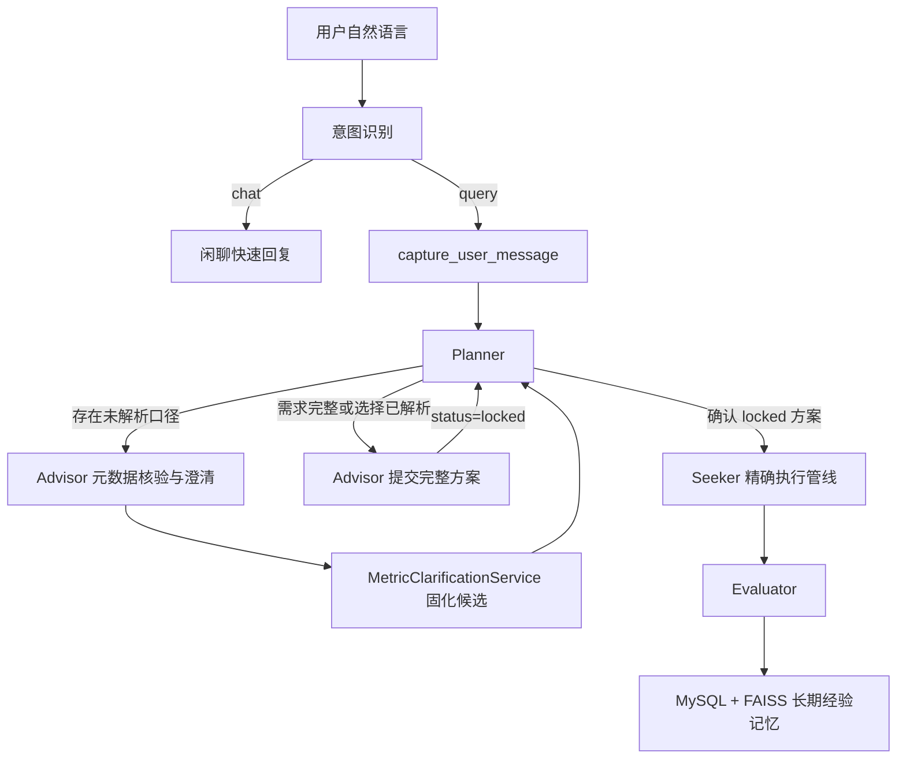

# 智能数仓助手 — 多智能体 Text2SQL 系统

> [查看完整文档索引](./文档索引.md)

基于 LangGraph 的多智能体协同框架，将自然语言分析需求自动转换为 Hive SQL 并执行查询。

## 快速开始

### 1. 环境要求

- Python 3.11+
- Hive 连接（PyHive）
- MySQL（增强元数据存储）
- 阿里云百炼 Embedding API

### 2. 安装依赖

```bash
pip install -r agentTest/requirements.txt
```

### 3. 配置环境变量

编辑 `agentTest/.env` 文件：

```env
OPENAI_API_KEY=your_api_key
OPENAI_BASE_URL=https://dashscope.aliyuncs.com/compatible-mode/v1
MODEL_NAME=qwen-plus
EMBEDDING_MODEL=text-embedding-v4

MYSQL_HOST=localhost
MYSQL_PORT=3306
MYSQL_USER=root
MYSQL_PASSWORD=your_password
MYSQL_DATABASE=agent_hub

HIVE_HOST=your_hive_host
HIVE_PORT=10000
HIVE_USER=hive
HIVE_DATABASE=default

# 日志开关（可选，见 agentTest/config/log_config.py）
LOG_LLM_ENABLED=True        # 是否记录 LLM 调用（llm.call / llm.response）
LOG_LLM_MAX_LENGTH=0        # LLM 输入输出最大长度，0=不截断
LOG_STATE_TOP_N=3           # State 快照中列表字段最多记录条数
```

### 4. 初始化元数据与向量索引（首次运行前）

```bash
# 一键完成元数据采集、增强与向量索引同步（拆分命令见下方【常用操作】）
python -m agentTest.scripts.sync_metadata
```

### 5. 启动

**CLI 模式**（终端对话）：

```bash
python -m agentTest.langgraph_app.demo
```

**Web 模式**（浏览器访问，ChatGPT 风格界面）：

```bash
# 安装 Web 依赖
pip install flask flask-cors

# 启动
python web/server.py

# 浏览器打开 http://localhost:5000
```

## Web 前端功能

| 功能 | 说明 |
|------|------|
| 🧠 意图识别 | LLM 自动区分闲聊和查询，闲聊秒回、查数走完整管线 |
| ➕ 新建对话 | 左侧栏按钮，每个 `conversation_id` 可包含多个独立 Topic |
| 📋 对话列表 | 历史对话一键切换，支持删除和重命名 |
| 🔍 思考过程 | 点击折叠面板查看意图识别、Planner 路由、命中表/字段、系统评分 |
| 📊 查看 SQL | 点击折叠面板查看实际执行的 SQL |
| ⭐ 用户打分 | Evaluator 模块打分入口，1-5 星评分，评分后自动同步 FAISS 示例库 |
| 🔢 指标选项确认 | 多口径候选由程序固化，支持数字、中文序号、字段名和中文含义选择 |

## 架构



详细设计：

- [多智能体 Text2SQL 系统架构](./架构/多智能体Text2SQL系统架构文档.md)
- [State 与记忆系统架构](./架构/State与记忆系统架构.md)
- [元数据与向量检索架构](./架构/元数据与向量检索架构.md)
- [日志使用与问题排查指南](./指南/日志使用与问题排查指南.md)

## 技术栈

| 组件 | 技术 |
|------|------|
| 图编排 | LangGraph（StateGraph + 进程内 MemorySaver checkpoint） |
| LLM 接口 | LangChain + OpenAI 兼容 API |
| 意图识别 | LangChain `with_structured_output`（Pydantic 结构化分类） |
| 向量检索 | FAISS（余弦相似度，三层索引：库/表/字段 + 示例库） |
| 数据源 | PyHive（Hive） |
| 元数据存储 | MySQL（增强后库/表/字段三级 + 评估记录表） |
| Web 服务 | Flask |
| 日志 | JSON Lines 结构化日志 `agentTest/logs/langgraph_app.jsonl`，按天滚动保留 14 天 |

## 项目结构

```
Project/
├── agentTest/
│   ├── langgraph_app/     # 多智能体框架与State/消息记忆
│   ├── langchain_app/     # RAG检索链与向量库
│   ├── metadata/          # 元数据增强与MySQL存储
│   ├── config/            # Planner/Advisor/Evaluator配置
│   ├── scripts/           # 索引构建与查看脚本
│   └── logs/              # 运行时日志
├── web/                   # Flask服务与前端静态资源
├── docs/                  # 统一文档目录
└── minesweeper/           # 附属扫雷网页版源码
```

## State 与记忆

- `conversation_id` 表示一个前端完整对话。
- `topic_id` 表示对话中的一次独立查数任务。
- `request_id` 表示一次 HTTP 或 CLI 图调用。
- LangGraph checkpoint 使用 `conversation_id:topic_id` 隔离 Topic。
- Web/CLI 每轮只传身份字段和 `current_user_input`，业务状态由 `AgentState` 管理。
- `messages + add_messages` 统一保存用户、Advisor、工具和 Seeker 消息。
- `AnalysisSpec.pending_clarifications` 固化上一轮指标候选（clarification_id + options），Planner LLM 结合历史对话判断 `user_selection`，程序白名单校验后生成 `explicit_user`。
- `topic_status` 已覆盖 new/clarifying/confirmed/generating_sql/validating_sql/executing/completed/failed，Web/CLI 使用终态创建新 Topic。
- Planner 返回 `partial/none` 时，Advisor 先检索元数据并向用户追问；未确认口径由程序级指标歧义门禁在 `submit_query_plan → lock_query_plan` 之间拦截。
- 需求完整或用户本轮解决歧义后，Advisor 直接调用 `submit_query_plan` 生成 `status=locked` 的完整方案。
- Planner → Advisor 状态交接、同轮锁定和指标门禁已经进入主链路；已确认指标由程序收敛，不依赖 LLM 必须提交可选参数。
- Planner 在用户最终确认后将方案更新为 `status=confirmed`。
- Seeker 不再通过向量检索重新选表，而是由 `QueryPlanSchemaResolver` 按 `confirmed_plan` 精确校验并加载物理 Schema。
- 当前 `MemorySaver` 只提供进程内短期记忆，服务重启恢复属于后续上线改造。

详见 [State 与记忆系统架构](./架构/State与记忆系统架构.md)。

## 常用操作

### 一键同步元数据与向量索引（推荐）

```bash
python -m agentTest.scripts.sync_metadata [--force-table] [--force] [--skip-vector] [--dry-run]
```

| 参数 | 作用 |
|---|---|
| `--force-table` | 强制重跑表级/库级增强并同步向量库，字段级复用 MySQL 现有结果不重新采样 |
| `--force` | 强制重建向量索引（删除缓存重新 embedding） |
| `--skip-vector` | 只更新 MySQL，不同步向量库 |
| `--dry-run` | 只打印将执行的步骤，不实际执行 |

### 仅采集与增强元数据（Hive → MySQL）

```bash
# 从 Hive 采集表结构并 LLM 增强 → 写入 MySQL（schema 指纹增量，未变化跳过）
python -m agentTest.metadata.metadata_enricher
```

### 仅构建/同步向量索引（MySQL → FAISS）

```bash
python -m agentTest.scripts.build_indexes [--force] [--target {db,table,column,enriched}]
```

| 参数 | 作用 |
|---|---|
| `--force` | 强制重建（删除所有缓存重新构建） |
| `--target` | 只同步指定索引，取值 db / table / column / enriched |

### 枚举采样刷新（内容变化才写库 + 更新 column 向量层）

```bash
python agentTest/scripts/refresh_enum_samples.py [--table 表名] [--column 字段名] [--refresh] [--skip-vector] [--dry-run]
```

| 参数 | 作用 |
|---|---|
| `--table` | 只处理指定表名 |
| `--column` | 只处理指定字段名 |
| `--refresh` | 强制重新采样（默认只补采空 sample_values），内容变化才更新 MySQL 与向量 |
| `--skip-vector` | 不同步 column 向量索引（只更新 MySQL） |
| `--dry-run` | 只打印待处理清单，不写库 |

### 查看向量数据库内容

```bash
python -m agentTest.scripts.view_faiss [--index {db,table,column,example,enriched,schema}]
```

| 参数 | 作用 |
|---|---|
| `--index` | 只查看指定索引，取值 db / table / column / example / enriched / schema，可重复指定，默认查看全部 |

### 查看日志

```bash
python agentTest/scripts/trace_view.py [--date 日期] [--no-color] <list|show|slow|filter|tail|nodeslow> [子命令参数]
```

| 子命令 | 参数 |
|---|---|
| `list` | 列出最近请求：`--limit N` 条数（默认 20） |
| `show <trace_id>` | 渲染单个请求的树形调用链：`--full` 不截断长文本 |
| `slow` | 按请求耗时排行：`--top N` 条数（默认 10） |
| `filter` | 按条件过滤：`--event` 事件名、`--node` 节点名、`--request` request_id 前缀、`--topic` topic_id、`--error` error_id、`--keyword` 关键词、`--limit` 条数（默认 50）、`--full` 不截断 |
| `tail` | 查看原始日志尾部：`--lines N` 行数（默认 20）、`--follow` 持续跟踪新增内容 |
| `nodeslow` | 节点耗时排行：`--top N` 条数（默认 20） |
| `prompt <request_id>` | 查看 LLM 输入与输出：调用→输出交错配对、同调用方输入去重，`--caller` 指定调用方、`--full` 不截断 |
| `summary <request_id>` | 请求级摘要：输入/结果/耗时/节点数/LLM 调用数与事件分布 |

全局参数：`--date YYYY-MM-DD` 指定日志日期（默认读取当前文件）；`--no-color` 禁用彩色输出。

完整字段、事件说明、错误编号定位和常见问题排查见 [日志使用与问题排查指南](./指南/日志使用与问题排查指南.md)。

### 查看 MySQL 中的评估记录

```sql
-- 所有对话记录（含评分）
SELECT id, question, user_score, comprehensive_score, is_high_quality, created_at
FROM evaluated_dialogues ORDER BY created_at DESC LIMIT 20;

-- 仅高分示例（>= 80 分）
SELECT id, resolved_question, comprehensive_score, example_hash
FROM evaluated_dialogues WHERE is_high_quality = 1;

-- 用户未打分的记录
SELECT id, question FROM evaluated_dialogues WHERE user_score = 75;
```

## 数据流转

```
Hive 表结构
  ↓ metadata_enricher（采集 + LLM 增强）
MySQL（enriched_databases / enriched_tables / enriched_columns）
  ↓ build_indexes（向量化）
FAISS（db / table / column / enriched / schema / example 六层索引）
  ↓ Planner/Advisor 使用 db/table/column 做语义识别与澄清
locked 方案 → 用户确认 → confirmed_plan
  ↓ QueryPlanSchemaResolver 精确校验库表字段并加载 Hive Schema
用户查询 → SQL 生成 → 执行 → Evaluator 评分
  ↓ >= 80 分 + 按问题去重（原文 hash / 语义 ≥0.9 且表字段一致，高分优先）
FAISS（example_faiss_index，原文召回）→ 后续查询的 RAG Few-shot 示例（effective_query 注入）
  ↓ 用户打分（1-5 星）
MySQL 重算综合分 → is_high_quality 变化时 → FAISS 自动增删
```

## 当前架构

当前系统已从“单表 Text2SQL 原型”演进为具备多轮澄清、安全多表规划、确定性降级和全链路审计能力的智能数仓助手。

### 当前完整链路

```text
Web / CLI 请求
  → capture_user_message
  → Planner：还原有效需求、识别确认意图、选择 Advisor 或 Seeker
  → Advisor：元数据检索、消除业务歧义、同轮生成 locked QueryPlan
  → 用户仅确认一次 locked QueryPlan
  → Seeker：字段覆盖分析 → JoinPlanner → 精确 Schema → SQL 生成
  → 逐表过滤自动修复 → SQL 安全校验 → Hive 执行 → 最终答案 → Evaluator
```

### 本轮架构强化

- **单次确认协议**：未生成 `locked_plan` 时禁止展示最终确认话术；Advisor 在用户解决歧义的同一轮直接调用 `submit_query_plan`。
- **跨轮指标状态闭环**：候选写入 pending，Planner 确定性解析“第二个”等短回答，Advisor 使用已确认字段覆盖 LLM 漏传或改写的 measures。
- **多表字段来源锁定**：执行阶段优先校验 QueryPlan 中已经锁定的 `field_sources`，禁止静默换表。
- **复合 Join 键**：关系元数据支持字符串和字段列表，当前运营日报与经销商维表按 `pt_platform + company_id` 关联。
- **Join 推测开关**：`ALLOW_AI_INFERRED_JOIN=True` 时允许缺少人工关系的场景进入 LLM 推测；关闭时安全拒绝。
- **全局逐表过滤**：`hive_guardrails.py` 中的 `REQUIRED_FILTER_FIELDS_FOR_ALL_TABLES` 定义所有参与表都必须单独过滤的字段，当前配置为 `pt_dt`。
- **业务过滤独立**：时间分区要求对所有表生效，但 `filters` 按表独立，可以不同，禁止把主表业务条件复制到维表。
- **确定性自动修复**：简单查询缺少维表分区过滤时，系统优先根据 confirmed QueryPlan 重建安全 SQL；无法重建才进入 LLM 重试。
- **执行前硬门禁**：字段对字段条件如 `a.pt_dt = b.pt_dt` 只算 Join 对齐，不算独立日期过滤。

### 当前能力边界

- 当前一次只澄清一个指标口径；候选提出后支持隔数轮回复编号（延迟澄清恢复），查询成功后支持基于结果追问；多 pending 冲突消解等能力经评估不再引入。
- Checkpointer 仍为进程内 `MemorySaver`，服务重启后不能恢复 Topic。
- 时间表达式的确定性 SQL 构造目前优先覆盖“昨天”场景，复杂时间范围继续走 LLM 修复链。
- JoinPlanner 当前连接 QueryPlan 涉及表，尚未自动引入桥表或基于成本选择最优路径。
- Hive 执行仍是主要耗时来源，需要继续建设超时、异步执行、查询成本控制和结果缓存。

### 求职材料

- [大厂 AI 数据开发岗位简历项目](./求职/大厂AI数据开发岗位简历项目.md)
- [项目面试问题、困难与参考答案](./求职/项目面试问题与参考答案.md)
### 连续问答能力（第13课已实现）

现有架构已实现两类 Topic 级连续问答能力：

- 查询完成后，用户可以继续问“第一名的业务经理是谁”“这些经销商里有几个正常状态”“换成最近 7 天”。
- Advisor 给出候选后，用户可以先询问口径差异或修改其他条件，隔数轮再回复“第二个”。

设计上使用 `QueryResultSnapshot（last_query_result）+ pending_clarifications`，不新增独立 Agent，也不把大结果和全部消息直接塞给 LLM；`FollowUpContext` 等结构化跟进状态经评估不再引入。
