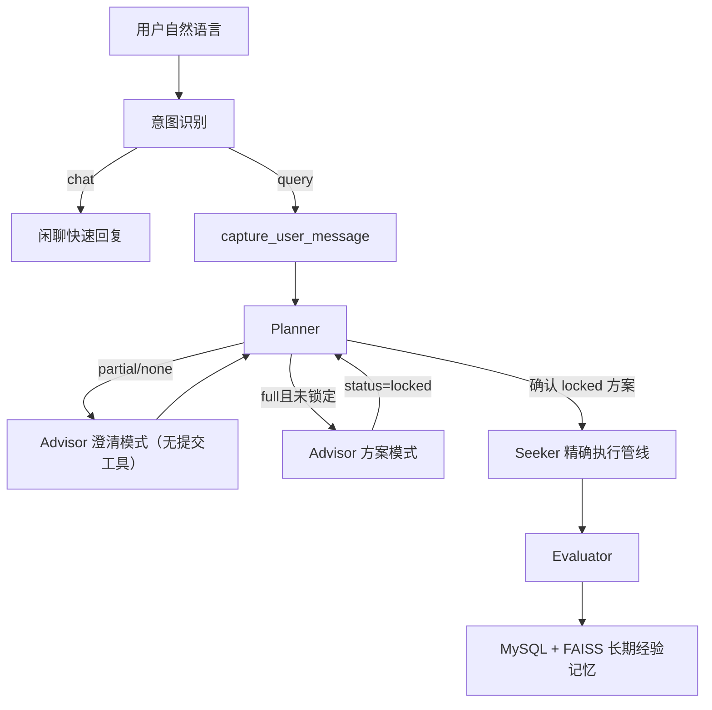

# 智能数仓助手 — 多智能体 Text2SQL 系统

> 最后更新：2026-07-30  
> [查看完整文档索引](./文档索引.md)

基于 LangGraph 的多智能体协同框架，将自然语言分析需求自动转换为 Hive SQL 并执行查询。

## 快速开始

### 1. 环境要求

- Python 3.11+
- Hive 连接（PyHive）
- MySQL（增强元数据存储）
- 阿里云百炼 Embedding API

### 2. 安装依赖

```bash
pip install -r agentTest/requirements.txt
```

### 3. 配置环境变量

编辑 `agentTest/.env` 文件：

```env
OPENAI_API_KEY=your_api_key
OPENAI_BASE_URL=https://dashscope.aliyuncs.com/compatible-mode/v1
MODEL_NAME=qwen-plus
EMBEDDING_MODEL=text-embedding-v4

MYSQL_HOST=localhost
MYSQL_PORT=3306
MYSQL_USER=root
MYSQL_PASSWORD=your_password
MYSQL_DATABASE=agent_hub

HIVE_HOST=your_hive_host
HIVE_PORT=10000
HIVE_USER=hive
HIVE_DATABASE=default
```

### 4. 初始化元数据

```bash
# 从 Hive 采集表结构并 LLM 增强 → 写入 MySQL（增量：已存在的跳过）
python -m agentTest.metadata.metadata_enricher
```

### 5. 构建向量索引（MySQL → FAISS）

```bash
# 增量构建（已有缓存则跳过）
python -m agentTest.scripts.build_indexes

# 强制重建（删除所有缓存重新构建）
python -m agentTest.scripts.build_indexes --force

# 只重建指定索引
python -m agentTest.scripts.build_indexes --target column
```

### 6. 启动

**CLI 模式**（终端对话）：

```bash
python -m agentTest.langgraph_app.demo
```

**Web 模式**（浏览器访问，ChatGPT 风格界面）：

```bash
# 安装 Web 依赖
pip install flask flask-cors

# 启动
python web/server.py

# 浏览器打开 http://localhost:5000
```

## Web 前端功能

| 功能 | 说明 |
|------|------|
| 🧠 意图识别 | LLM 自动区分闲聊和查询，闲聊秒回、查数走完整管线 |
| ➕ 新建对话 | 左侧栏按钮，每个 `conversation_id` 可包含多个独立 Topic |
| 📋 对话列表 | 历史对话一键切换，支持删除和重命名 |
| 🔍 思考过程 | 点击折叠面板查看意图识别、Planner 路由、命中表/字段、系统评分 |
| 📊 查看 SQL | 点击折叠面板查看实际执行的 SQL |
| ⭐ 用户打分 | Evaluator 模块打分入口，1-5 星评分，评分后自动同步 FAISS 示例库 |

## 架构



详细设计：

- [多智能体 Text2SQL 系统架构](./架构/多智能体Text2SQL系统架构文档.md)
- [State 与记忆系统架构](./架构/State与记忆系统架构.md)
- [元数据与向量检索架构](./架构/元数据与向量检索架构.md)
- [日志使用与问题排查指南](./指南/日志使用与问题排查指南.md)

## 技术栈

| 组件 | 技术 |
|------|------|
| 图编排 | LangGraph（StateGraph + 进程内 MemorySaver checkpoint） |
| LLM 接口 | LangChain + OpenAI 兼容 API |
| 意图识别 | LangChain `with_structured_output`（Pydantic 结构化分类） |
| 向量检索 | FAISS（余弦相似度，三层索引：库/表/字段 + 示例库） |
| 数据源 | PyHive（Hive） |
| 元数据存储 | MySQL（增强后库/表/字段三级 + 评估记录表） |
| Web 服务 | Flask |
| 日志 | JSON Lines 结构化日志 `agentTest/logs/langgraph_app.jsonl`，按天滚动保留 14 天 |

## 项目结构

```
Project/
├── agentTest/
│   ├── langgraph_app/     # 多智能体框架与State/消息记忆
│   ├── langchain_app/     # RAG检索链与向量库
│   ├── metadata/          # 元数据增强与MySQL存储
│   ├── config/            # Planner/Advisor/Evaluator配置
│   ├── scripts/           # 索引构建与查看脚本
│   └── logs/              # 运行时日志
├── web/                   # Flask服务与前端静态资源
├── docs/                  # 统一文档目录
└── minesweeper/           # 附属扫雷网页版源码
```

## State 与记忆

- `conversation_id` 表示一个前端完整对话。
- `topic_id` 表示对话中的一次独立查数任务。
- `request_id` 表示一次 HTTP 或 CLI 图调用。
- LangGraph checkpoint 使用 `conversation_id:topic_id` 隔离 Topic。
- Web/CLI 每轮只传身份字段和 `current_user_input`，业务状态由 `AgentState` 管理。
- `messages + add_messages` 统一保存用户、Advisor、工具和 Seeker 消息。
- `topic_status` 已覆盖 new/clarifying/confirmed/generating_sql/validating_sql/executing/completed/failed，Web/CLI 使用终态创建新 Topic。
- Planner 返回 `partial/none` 时，Advisor 使用不绑定 `submit_query_plan` 的澄清 Agent，只能检索并追问用户。
- Planner 返回 `full` 时，Advisor 才使用方案 Agent 核对元数据并生成 `status=locked` 的完整方案。
- 当前代码仍存在“高相似候选数量强制 `full → partial`”分支，目标是删除路由控制并保留日志观测。
- Planner → Advisor 的 `PlannerHandoffState` 尚待实施，用于避免子图过滤 `planner_reason/planner_entities`。
- Planner 在用户最终确认后将方案更新为 `status=confirmed`。
- Seeker 不再通过向量检索重新选表，而是由 `QueryPlanSchemaResolver` 按 `confirmed_plan` 精确校验并加载物理 Schema。
- 当前 `MemorySaver` 只提供进程内短期记忆，服务重启恢复属于后续上线改造。

详见 [State 与记忆系统架构](./架构/State与记忆系统架构.md)。

## 常用操作

### 采集与增强元数据（Hive → MySQL）

```bash
python -m agentTest.metadata.metadata_enricher
```

### 构建向量索引（MySQL → FAISS）

```bash
# 增量构建（已有缓存则跳过）
python -m agentTest.scripts.build_indexes

# 强制重建（删除所有缓存重新构建）
python -m agentTest.scripts.build_indexes --force

# 只重建指定索引
python -m agentTest.scripts.build_indexes --target column
```

### 查看向量数据库内容

```bash
python -m agentTest.scripts.view_faiss
```

### 查看日志

```powershell
# 查看最新日志
Get-Content agentTest/logs/langgraph_app.jsonl -Tail 50 -Wait

# 转换为PowerShell对象后按request_id查询
$logs = Get-Content agentTest/logs/langgraph_app.jsonl |
    ForEach-Object { # 智能数仓助手 — 多智能体 Text2SQL 系统

> 最后更新：2026-07-30  
> [查看完整文档索引](./文档索引.md)

基于 LangGraph 的多智能体协同框架，将自然语言分析需求自动转换为 Hive SQL 并执行查询。

## 快速开始

### 1. 环境要求

- Python 3.11+
- Hive 连接（PyHive）
- MySQL（增强元数据存储）
- 阿里云百炼 Embedding API

### 2. 安装依赖

```bash
pip install -r agentTest/requirements.txt
```

### 3. 配置环境变量

编辑 `agentTest/.env` 文件：

```env
OPENAI_API_KEY=your_api_key
OPENAI_BASE_URL=https://dashscope.aliyuncs.com/compatible-mode/v1
MODEL_NAME=qwen-plus
EMBEDDING_MODEL=text-embedding-v4

MYSQL_HOST=localhost
MYSQL_PORT=3306
MYSQL_USER=root
MYSQL_PASSWORD=your_password
MYSQL_DATABASE=agent_hub

HIVE_HOST=your_hive_host
HIVE_PORT=10000
HIVE_USER=hive
HIVE_DATABASE=default
```

### 4. 初始化元数据

```bash
# 从 Hive 采集表结构并 LLM 增强 → 写入 MySQL（增量：已存在的跳过）
python -m agentTest.metadata.metadata_enricher
```

### 5. 构建向量索引（MySQL → FAISS）

```bash
# 增量构建（已有缓存则跳过）
python -m agentTest.scripts.build_indexes

# 强制重建（删除所有缓存重新构建）
python -m agentTest.scripts.build_indexes --force

# 只重建指定索引
python -m agentTest.scripts.build_indexes --target column
```

### 6. 启动

**CLI 模式**（终端对话）：

```bash
python -m agentTest.langgraph_app.demo
```

**Web 模式**（浏览器访问，ChatGPT 风格界面）：

```bash
# 安装 Web 依赖
pip install flask flask-cors

# 启动
python web/server.py

# 浏览器打开 http://localhost:5000
```

## Web 前端功能

| 功能 | 说明 |
|------|------|
| 🧠 意图识别 | LLM 自动区分闲聊和查询，闲聊秒回、查数走完整管线 |
| ➕ 新建对话 | 左侧栏按钮，每个 `conversation_id` 可包含多个独立 Topic |
| 📋 对话列表 | 历史对话一键切换，支持删除和重命名 |
| 🔍 思考过程 | 点击折叠面板查看意图识别、Planner 路由、命中表/字段、系统评分 |
| 📊 查看 SQL | 点击折叠面板查看实际执行的 SQL |
| ⭐ 用户打分 | Evaluator 模块打分入口，1-5 星评分，评分后自动同步 FAISS 示例库 |

## 架构


详细设计：

- [多智能体 Text2SQL 系统架构](./架构/多智能体Text2SQL系统架构文档.md)
- [State 与记忆系统架构](./架构/State与记忆系统架构.md)
- [元数据与向量检索架构](./架构/元数据与向量检索架构.md)
- [日志使用与问题排查指南](./指南/日志使用与问题排查指南.md)

## 技术栈

| 组件 | 技术 |
|------|------|
| 图编排 | LangGraph（StateGraph + 进程内 MemorySaver checkpoint） |
| LLM 接口 | LangChain + OpenAI 兼容 API |
| 意图识别 | LangChain `with_structured_output`（Pydantic 结构化分类） |
| 向量检索 | FAISS（余弦相似度，三层索引：库/表/字段 + 示例库） |
| 数据源 | PyHive（Hive） |
| 元数据存储 | MySQL（增强后库/表/字段三级 + 评估记录表） |
| Web 服务 | Flask |
| 日志 | JSON Lines 结构化日志 `agentTest/logs/langgraph_app.jsonl`，按天滚动保留 14 天 |

## 项目结构

```
Project/
├── agentTest/
│   ├── langgraph_app/     # 多智能体框架与State/消息记忆
│   ├── langchain_app/     # RAG检索链与向量库
│   ├── metadata/          # 元数据增强与MySQL存储
│   ├── config/            # Planner/Advisor/Evaluator配置
│   ├── scripts/           # 索引构建与查看脚本
│   └── logs/              # 运行时日志
├── web/                   # Flask服务与前端静态资源
├── docs/                  # 统一文档目录
└── minesweeper/           # 附属扫雷网页版源码
```

## State 与记忆

- `conversation_id` 表示一个前端完整对话。
- `topic_id` 表示对话中的一次独立查数任务。
- `request_id` 表示一次 HTTP 或 CLI 图调用。
- LangGraph checkpoint 使用 `conversation_id:topic_id` 隔离 Topic。
- Web/CLI 每轮只传身份字段和 `current_user_input`，业务状态由 `AgentState` 管理。
- `messages + add_messages` 统一保存用户、Advisor、工具和 Seeker 消息。
- `topic_status` 已覆盖 new/clarifying/confirmed/generating_sql/validating_sql/executing/completed/failed，Web/CLI 使用终态创建新 Topic。
- Planner 返回 `partial/none` 时，Advisor 使用不绑定 `submit_query_plan` 的澄清 Agent，只能检索并追问用户。
- Planner 返回 `full` 时，Advisor 才使用方案 Agent 核对元数据并生成 `status=locked` 的完整方案。
- 当前代码仍存在“高相似候选数量强制 `full → partial`”分支，目标是删除路由控制并保留日志观测。
- Planner → Advisor 的 `PlannerHandoffState` 尚待实施，用于避免子图过滤 `planner_reason/planner_entities`。
- Planner 在用户最终确认后将方案更新为 `status=confirmed`。
- Seeker 不再通过向量检索重新选表，而是由 `QueryPlanSchemaResolver` 按 `confirmed_plan` 精确校验并加载物理 Schema。
- 当前 `MemorySaver` 只提供进程内短期记忆，服务重启恢复属于后续上线改造。

详见 [State 与记忆系统架构](./架构/State与记忆系统架构.md)。

## 常用操作

### 采集与增强元数据（Hive → MySQL）

```bash
python -m agentTest.metadata.metadata_enricher
```

### 构建向量索引（MySQL → FAISS）

```bash
# 增量构建（已有缓存则跳过）
python -m agentTest.scripts.build_indexes

# 强制重建（删除所有缓存重新构建）
python -m agentTest.scripts.build_indexes --force

# 只重建指定索引
python -m agentTest.scripts.build_indexes --target column
```

### 查看向量数据库内容

```bash
python -m agentTest.scripts.view_faiss
```

### 查看日志

```bash
# PowerShell
Get-Content agentTest/logs/langgraph_app.jsonl -Tail 50 -Wait

# 或直接打开文件
notepad agentTest/logs/langgraph_app.jsonl
```

### 查看 MySQL 中的评估记录

```sql
-- 所有对话记录（含评分）
SELECT id, question, user_score, comprehensive_score, is_high_quality, created_at
FROM evaluated_dialogues ORDER BY created_at DESC LIMIT 20;

-- 仅高分示例（>= 80 分）
SELECT id, resolved_question, comprehensive_score, example_hash
FROM evaluated_dialogues WHERE is_high_quality = 1;

-- 用户未打分的记录
SELECT id, question FROM evaluated_dialogues WHERE user_score = 75;
```

### 清除向量数据库缓存（重新构建）

```bash
# 删除所有 FAISS 索引，下次启动自动重建
Remove-Item -Recurse agentTest/langgraph_app/cache/*faiss*
```

## 数据流转

```
Hive 表结构
  ↓ metadata_enricher（采集 + LLM 增强）
MySQL（enriched_databases / enriched_tables / enriched_columns）
  ↓ build_indexes（向量化）
FAISS（db / table / column / enriched / schema / example 六层索引）
  ↓ Planner/Advisor 使用 db/table/column 做语义识别与澄清
locked 方案 → 用户确认 → confirmed_plan
  ↓ QueryPlanSchemaResolver 精确校验库表字段并加载 Hive Schema
用户查询 → SQL 生成 → 执行 → Evaluator 评分
  ↓ >= 80 分 + 去重（hash + 余弦相似度）
FAISS（example_faiss_index）→ 后续查询的 RAG Few-shot 示例
  ↓ 用户打分（1-5 星）
MySQL 重算综合分 → is_high_quality 变化时 → FAISS 自动增删
```
 | ConvertFrom-Json }

$logs |
    Where-Object { # 智能数仓助手 — 多智能体 Text2SQL 系统

> 最后更新：2026-07-30  
> [查看完整文档索引](./文档索引.md)

基于 LangGraph 的多智能体协同框架，将自然语言分析需求自动转换为 Hive SQL 并执行查询。

## 快速开始

### 1. 环境要求

- Python 3.11+
- Hive 连接（PyHive）
- MySQL（增强元数据存储）
- 阿里云百炼 Embedding API

### 2. 安装依赖

```bash
pip install -r agentTest/requirements.txt
```

### 3. 配置环境变量

编辑 `agentTest/.env` 文件：

```env
OPENAI_API_KEY=your_api_key
OPENAI_BASE_URL=https://dashscope.aliyuncs.com/compatible-mode/v1
MODEL_NAME=qwen-plus
EMBEDDING_MODEL=text-embedding-v4

MYSQL_HOST=localhost
MYSQL_PORT=3306
MYSQL_USER=root
MYSQL_PASSWORD=your_password
MYSQL_DATABASE=agent_hub

HIVE_HOST=your_hive_host
HIVE_PORT=10000
HIVE_USER=hive
HIVE_DATABASE=default
```

### 4. 初始化元数据

```bash
# 从 Hive 采集表结构并 LLM 增强 → 写入 MySQL（增量：已存在的跳过）
python -m agentTest.metadata.metadata_enricher
```

### 5. 构建向量索引（MySQL → FAISS）

```bash
# 增量构建（已有缓存则跳过）
python -m agentTest.scripts.build_indexes

# 强制重建（删除所有缓存重新构建）
python -m agentTest.scripts.build_indexes --force

# 只重建指定索引
python -m agentTest.scripts.build_indexes --target column
```

### 6. 启动

**CLI 模式**（终端对话）：

```bash
python -m agentTest.langgraph_app.demo
```

**Web 模式**（浏览器访问，ChatGPT 风格界面）：

```bash
# 安装 Web 依赖
pip install flask flask-cors

# 启动
python web/server.py

# 浏览器打开 http://localhost:5000
```

## Web 前端功能

| 功能 | 说明 |
|------|------|
| 🧠 意图识别 | LLM 自动区分闲聊和查询，闲聊秒回、查数走完整管线 |
| ➕ 新建对话 | 左侧栏按钮，每个 `conversation_id` 可包含多个独立 Topic |
| 📋 对话列表 | 历史对话一键切换，支持删除和重命名 |
| 🔍 思考过程 | 点击折叠面板查看意图识别、Planner 路由、命中表/字段、系统评分 |
| 📊 查看 SQL | 点击折叠面板查看实际执行的 SQL |
| ⭐ 用户打分 | Evaluator 模块打分入口，1-5 星评分，评分后自动同步 FAISS 示例库 |

## 架构


详细设计：

- [多智能体 Text2SQL 系统架构](./架构/多智能体Text2SQL系统架构文档.md)
- [State 与记忆系统架构](./架构/State与记忆系统架构.md)
- [元数据与向量检索架构](./架构/元数据与向量检索架构.md)
- [日志使用与问题排查指南](./指南/日志使用与问题排查指南.md)

## 技术栈

| 组件 | 技术 |
|------|------|
| 图编排 | LangGraph（StateGraph + 进程内 MemorySaver checkpoint） |
| LLM 接口 | LangChain + OpenAI 兼容 API |
| 意图识别 | LangChain `with_structured_output`（Pydantic 结构化分类） |
| 向量检索 | FAISS（余弦相似度，三层索引：库/表/字段 + 示例库） |
| 数据源 | PyHive（Hive） |
| 元数据存储 | MySQL（增强后库/表/字段三级 + 评估记录表） |
| Web 服务 | Flask |
| 日志 | JSON Lines 结构化日志 `agentTest/logs/langgraph_app.jsonl`，按天滚动保留 14 天 |

## 项目结构

```
Project/
├── agentTest/
│   ├── langgraph_app/     # 多智能体框架与State/消息记忆
│   ├── langchain_app/     # RAG检索链与向量库
│   ├── metadata/          # 元数据增强与MySQL存储
│   ├── config/            # Planner/Advisor/Evaluator配置
│   ├── scripts/           # 索引构建与查看脚本
│   └── logs/              # 运行时日志
├── web/                   # Flask服务与前端静态资源
├── docs/                  # 统一文档目录
└── minesweeper/           # 附属扫雷网页版源码
```

## State 与记忆

- `conversation_id` 表示一个前端完整对话。
- `topic_id` 表示对话中的一次独立查数任务。
- `request_id` 表示一次 HTTP 或 CLI 图调用。
- LangGraph checkpoint 使用 `conversation_id:topic_id` 隔离 Topic。
- Web/CLI 每轮只传身份字段和 `current_user_input`，业务状态由 `AgentState` 管理。
- `messages + add_messages` 统一保存用户、Advisor、工具和 Seeker 消息。
- `topic_status` 已覆盖 new/clarifying/confirmed/generating_sql/validating_sql/executing/completed/failed，Web/CLI 使用终态创建新 Topic。
- Planner 返回 `partial/none` 时，Advisor 使用不绑定 `submit_query_plan` 的澄清 Agent，只能检索并追问用户。
- Planner 返回 `full` 时，Advisor 才使用方案 Agent 核对元数据并生成 `status=locked` 的完整方案。
- 当前代码仍存在“高相似候选数量强制 `full → partial`”分支，目标是删除路由控制并保留日志观测。
- Planner → Advisor 的 `PlannerHandoffState` 尚待实施，用于避免子图过滤 `planner_reason/planner_entities`。
- Planner 在用户最终确认后将方案更新为 `status=confirmed`。
- Seeker 不再通过向量检索重新选表，而是由 `QueryPlanSchemaResolver` 按 `confirmed_plan` 精确校验并加载物理 Schema。
- 当前 `MemorySaver` 只提供进程内短期记忆，服务重启恢复属于后续上线改造。

详见 [State 与记忆系统架构](./架构/State与记忆系统架构.md)。

## 常用操作

### 采集与增强元数据（Hive → MySQL）

```bash
python -m agentTest.metadata.metadata_enricher
```

### 构建向量索引（MySQL → FAISS）

```bash
# 增量构建（已有缓存则跳过）
python -m agentTest.scripts.build_indexes

# 强制重建（删除所有缓存重新构建）
python -m agentTest.scripts.build_indexes --force

# 只重建指定索引
python -m agentTest.scripts.build_indexes --target column
```

### 查看向量数据库内容

```bash
python -m agentTest.scripts.view_faiss
```

### 查看日志

```bash
# PowerShell
Get-Content agentTest/logs/langgraph_app.jsonl -Tail 50 -Wait

# 或直接打开文件
notepad agentTest/logs/langgraph_app.jsonl
```

### 查看 MySQL 中的评估记录

```sql
-- 所有对话记录（含评分）
SELECT id, question, user_score, comprehensive_score, is_high_quality, created_at
FROM evaluated_dialogues ORDER BY created_at DESC LIMIT 20;

-- 仅高分示例（>= 80 分）
SELECT id, resolved_question, comprehensive_score, example_hash
FROM evaluated_dialogues WHERE is_high_quality = 1;

-- 用户未打分的记录
SELECT id, question FROM evaluated_dialogues WHERE user_score = 75;
```

### 清除向量数据库缓存（重新构建）

```bash
# 删除所有 FAISS 索引，下次启动自动重建
Remove-Item -Recurse agentTest/langgraph_app/cache/*faiss*
```

## 数据流转

```
Hive 表结构
  ↓ metadata_enricher（采集 + LLM 增强）
MySQL（enriched_databases / enriched_tables / enriched_columns）
  ↓ build_indexes（向量化）
FAISS（db / table / column / enriched / schema / example 六层索引）
  ↓ Planner/Advisor 使用 db/table/column 做语义识别与澄清
locked 方案 → 用户确认 → confirmed_plan
  ↓ QueryPlanSchemaResolver 精确校验库表字段并加载 Hive Schema
用户查询 → SQL 生成 → 执行 → Evaluator 评分
  ↓ >= 80 分 + 去重（hash + 余弦相似度）
FAISS（example_faiss_index）→ 后续查询的 RAG Few-shot 示例
  ↓ 用户打分（1-5 星）
MySQL 重算综合分 → is_high_quality 变化时 → FAISS 自动增删
```
.request_id -eq "目标request_id" }
```

完整字段、事件说明、错误编号定位和常见问题排查见 [日志使用与问题排查指南](./指南/日志使用与问题排查指南.md)。

### 查看 MySQL 中的评估记录
```sql
-- 所有对话记录（含评分）
SELECT id, question, user_score, comprehensive_score, is_high_quality, created_at
FROM evaluated_dialogues ORDER BY created_at DESC LIMIT 20;

-- 仅高分示例（>= 80 分）
SELECT id, resolved_question, comprehensive_score, example_hash
FROM evaluated_dialogues WHERE is_high_quality = 1;

-- 用户未打分的记录
SELECT id, question FROM evaluated_dialogues WHERE user_score = 75;
```

### 清除向量数据库缓存（重新构建）

```bash
# 删除所有 FAISS 索引，下次启动自动重建
Remove-Item -Recurse agentTest/langgraph_app/cache/*faiss*
```

## 数据流转

```
Hive 表结构
  ↓ metadata_enricher（采集 + LLM 增强）
MySQL（enriched_databases / enriched_tables / enriched_columns）
  ↓ build_indexes（向量化）
FAISS（db / table / column / enriched / schema / example 六层索引）
  ↓ Planner/Advisor 使用 db/table/column 做语义识别与澄清
locked 方案 → 用户确认 → confirmed_plan
  ↓ QueryPlanSchemaResolver 精确校验库表字段并加载 Hive Schema
用户查询 → SQL 生成 → 执行 → Evaluator 评分
  ↓ >= 80 分 + 去重（hash + 余弦相似度）
FAISS（example_faiss_index）→ 后续查询的 RAG Few-shot 示例
  ↓ 用户打分（1-5 星）
MySQL 重算综合分 → is_high_quality 变化时 → FAISS 自动增删
```
