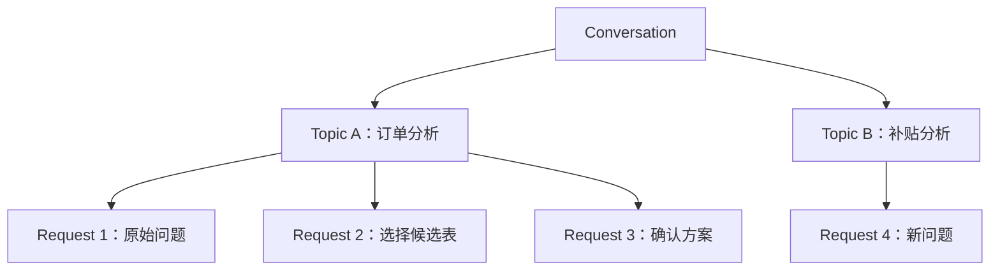
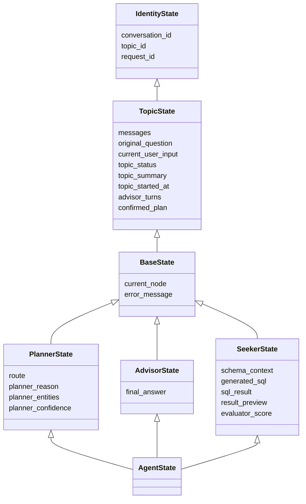
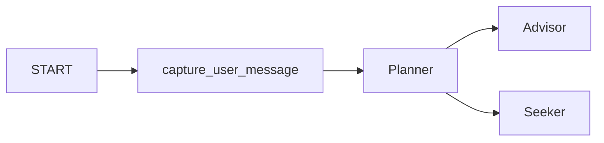
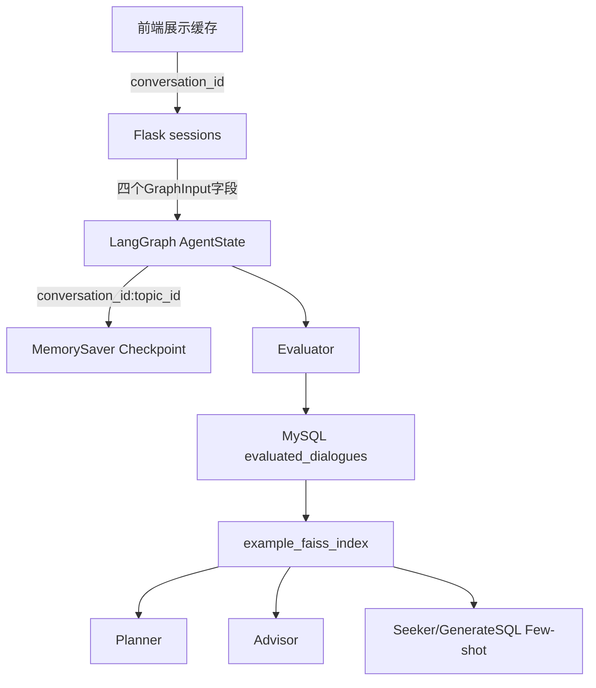
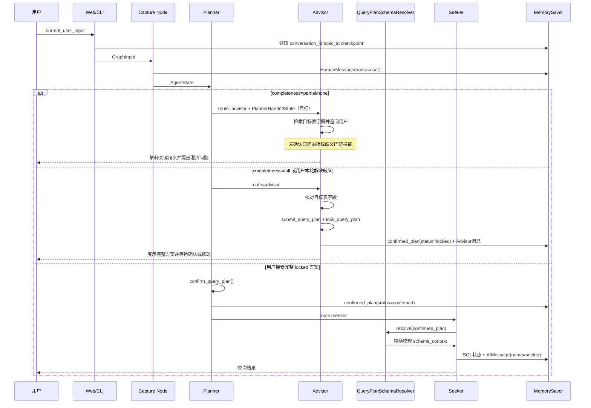

# State 与记忆系统架构

> 最后更新：2026-08-12
> [返回文档索引](../文档索引.md)

## 一、设计目标

State 与记忆系统负责解决以下问题：

1. 一个前端对话中可以连续处理多个独立查数任务。
2. 同一查数任务的多轮 Advisor 澄清需要共享上下文。
3. 新查数任务不能继承上一个任务的表、字段、SQL 或确认方案。
4. Web、CLI 和 LangGraph 只能存在一个业务状态真相来源。
5. 用户消息、Advisor 回复、工具消息和 Seeker 最终答案需要使用统一消息模型。

当前实现采用：

- `conversation_id / topic_id / request_id` 三层身份模型。
- `conversation_id:topic_id` 作为 LangGraph checkpoint 的 `thread_id`。
- `AgentState` 作为父图统一 State。
- `messages + add_messages` 作为 Topic 标准消息记忆。
- `MemorySaver` 作为进程内短期 Checkpointer。
- MySQL + FAISS 示例库作为跨 Topic 的长期经验记忆。

---

## 二、三层身份模型

| 标识 | 生命周期 | 含义 | 示例 |
|---|---|---|---|
| `conversation_id` | 一个前端对话 | 左侧会话列表中的完整聊天 | `6a8f...` |
| `topic_id` | 一次独立查数任务 | 从提出问题到 Seeker 完成查询 | `b7c1...` |
| `request_id` | 一次请求 | 一次 HTTP 请求或 CLI 图调用 | `d92e...` |

关系如下：



LangGraph 配置：

```python
graph_thread_id = f"{conversation_id}:{topic_id}"

config = {
    "configurable": {
        "thread_id": graph_thread_id,
    }
}
```

注意：

- 产品 API 使用 `conversation_id`，不使用 `thread_id`。
- `thread_id` 只作为 LangGraph Checkpointer 的框架配置字段。
- 同一 Topic 的所有 Request 复用同一个 `graph_thread_id`。
- Seeker 完成后，下一次查数创建新的 `topic_id`。

---

## 三、State 继承结构

下图只展示继承关系和关键字段，完整字段定义见后续各节。



文件位置：

```text
agentTest/langgraph_app/state/
├── base_state.py
├── query_plan.py
├── planner_state.py
├── advisor_state.py
├── seeker_state.py
└── agent_state.py
```

所有领域 State 都使用 `total=False`，表示 TypedDict 类型检查允许节点只返回本轮发生变化的字段。它不代表所有业务字段都可以永久缺失，例如进入 Seeker 前必须存在完整的 `confirmed_plan`。

字段状态说明：

- **使用中**：当前代码已经读写该字段。
- **部分使用**：已有代码读取或声明，但完整写入、持久化或展示链路尚未完成。
- **预留**：为后续课程设计，当前尚未进入主要运行链路。

### 3.1 IdentityState

只保存身份字段，不保存任何业务结果：

| 字段 | 类型 | 主要写入者 | 生命周期 | 状态 | 说明 |
|---|---|---|---|---|---|
| `conversation_id` | `str` | Web/CLI | 一个前端对话 | 使用中 | 前端会话列表中的对话标识，一个 Conversation 可以包含多个 Topic。 |
| `topic_id` | `str` | Web/CLI | 一次独立查数任务 | 使用中 | 隔离不同查数任务的业务状态，并与 `conversation_id` 共同组成 checkpoint `thread_id`。 |
| `request_id` | `str` | Web/CLI | 一次 HTTP/CLI 调用 | 使用中 | 标识单次图调用，并用于生成消息 ID，防止同一请求重复追加用户或 Agent 消息。 |

三个业务身份字段会被 Planner、Advisor、Seeker 自动继承；`graph_thread_id` 由 `conversation_id:topic_id` 派生并注入日志上下文。全链路日志使用四个身份字段定位请求，具体查询命令见 [日志使用与问题排查指南](../指南/日志使用与问题排查指南.md)。

### 3.2 TopicState

保存一次查数任务需要跨轮次共享的状态：

| 字段 | 类型 | 主要写入者 | 主要读取者 | 状态 | 说明 |
|---|---|---|---|---|---|
| `messages` | `Annotated[list[AnyMessage], add_messages]` | Capture、Advisor、Seeker | Planner、Advisor、GenerateSQL、Evaluator | 使用中 | 当前 Topic 的标准消息历史。节点只返回新增消息，由 `add_messages` 按消息 ID 合并。 |
| `original_question` | `str` | Planner 首轮初始化 | Planner、Advisor、Seeker、Evaluator | 使用中 | 当前 Topic 的首轮原始问题，同一 Topic 后续澄清轮次保持不变。 |
| `effective_query` | `str` | Planner | Planner、Advisor、GenerateSQL、Evaluator、build_final_answer | 使用中 | Planner 每轮改写后的有效需求（需求基线），`original_question` 保留原文、本字段滚动更新；`build_final_answer` 以它作为回答基准。 |
| `current_user_input` | `str` | Web/CLI | Capture、Planner、Advisor | 使用中 | 用户本轮真实输入，每个 Request 都会更新，例如候选序号、确认词或修改意见。 |
| `topic_status` | `TopicStatus` | Capture、Planner、Advisor、Seeker 各阶段节点 | Web、CLI、恢复与监控流程 | 使用中 | 描述 Topic 当前生命周期阶段。现有节点在完成后写入下一业务阶段，Web/CLI 使用终态判断是否创建新 Topic。 |
| `topic_summary` | `str` | 后续摘要节点 | Planner、Advisor、问题改写节点 | 预留 | 对较早对话的压缩摘要，用于控制多轮消息 Token，不替代 `confirmed_plan`。 |
| `topic_started_at` | `float` | 后续 Topic 初始化节点 | Evaluator、监控与超时处理 | 预留 | Topic 开始时间，计划使用 Unix 时间戳，用于计算完整 Topic 耗时。 |
| `advisor_turns` | `int` | Advisor | Evaluator、前端或 CLI | 使用中 | Advisor 完成一次澄清回复后加一，用于评估澄清轮数和对话效率。 |
| `confirmed_plan` | `QueryPlan` | Advisor、Planner | Planner、Seeker、GenerateSQL、Evaluator | 使用中 | 同一个键同时承载 `locked` 和 `confirmed` 两个阶段。Advisor 写入完整 `locked` 方案，Planner 在用户接受完整方案后写回 `confirmed` 方案；只有 `confirmed` 才允许进入 Seeker。 |
| `analysis_spec` | `AnalysisSpec` | Planner、Advisor | Planner、Advisor、后续连续问答节点 | 使用中 | 保存指标概念、解析证据和 `pending_clarifications`。Planner 采用增量更新：模型判断 `user_selection` + 程序白名单校验，不能因短回答重建后丢失已确认字段。 |
| `last_query_result` | `QueryResultSnapshot` | `build_final_answer` 节点 | FollowUpAnalyzer、Planner | 使用中 | 保存上一轮结果引用、列、预览行、行数、实体键和 QueryPlan，用于“第一名”“这些”“刚才结果”等追问。 |
| `pending_clarifications` | `list[PendingClarification]` | Advisor、Planner、澄清服务 | Planner、Advisor、FollowUpAnalyzer | 使用中 | 候选创建时固化 `clarification_id` 与 options；用户未选择同一概念时复用 open pending，选择通过白名单校验后清空。多 pending 冲突保护第二阶段接入。 |
| `follow_up_context` | `FollowUpContext` | 第13课连续问答分析 | Planner、Seeker | 规划中 | 标记新查询、结果追问、方案修改或口径解释，并记录引用结果和变化槽位。 |

#### TopicStatus 可选值

| 值 | 含义 | 当前状态 |
|---|---|---|
| `new` | Topic 首轮消息已捕获，尚未完成 Planner 分析 | 使用中 |
| `clarifying` | Advisor 正在澄清，或 locked 方案正在等待用户最终确认 | 使用中 |
| `confirmed` | Planner 已将 locked 方案升级为 confirmed，准备进入 Seeker | 使用中 |
| `generating_sql` | Schema 已准备完成，或 SQL 修复后准备重新生成 | 使用中 |
| `validating_sql` | SQL 已生成，正在或即将进行合法性与资源保护校验 | 使用中 |
| `executing` | SQL 已通过校验，进入 Hive 执行与结果整理阶段 | 使用中 |
| `completed` | 最终回答已构建，包括正常空结果 | 使用中 |
| `failed` | 已知业务失败或 SQL 达到最大修复次数后结束 | 部分使用 |
| `cancelled` | 用户主动取消或系统终止 Topic | 预留 |

### 3.3 BaseState

`BaseState` 在 Topic 记忆之上增加所有 Agent 可共享的流程控制字段：

| 字段 | 类型 | 主要写入者 | 主要读取者 | 状态 | 说明 |
|---|---|---|---|---|---|
| `current_node` | `str` | 后续可观测性中间件 | Web、日志和恢复流程 | 预留 | 记录当前或最近执行的图节点，方便展示状态和定位中断位置。 |
| `error_message` | `str` | Web 统一异常边界 | 日志和失败恢复流程 | 使用中 | 只保存稳定错误代码和 `error_id`，例如 `QUERY_EXECUTION_FAILED:...`；内部异常消息和完整堆栈仅写日志。 |

### 3.4 PlannerState

PlannerState 保存需求理解和父图路由结果：

| 字段 | 类型 | 主要写入者 | 主要读取者 | 状态 | 说明 |
|---|---|---|---|---|---|
| `route` | `str` | Planner | PlannerRouter、Web、Evaluator | 使用中 | 当前父图路由结果，现阶段主要为 `advisor` 或 `seeker`。 |
| `planner_reason` | `str` | Planner | 日志、Evaluator、Advisor（目标） | 使用中但跨子图读取待修复 | Planner 对完整性判断和路由选择的解释。字段当前存在于父图，但 `AdvisorState` 未声明时会在子图边界被过滤。 |
| `planner_entities` | `dict` | Planner | Advisor、日志 | 使用中但跨子图读取待修复 | Planner 从问题中识别的候选表、字段和完整度等分析结果，不等同于用户确认方案。当前 `AdvisorState` 未声明该字段，实际进入 Advisor 子图时可能丢失。 |
| `planner_confidence` | `float` | 计划中的置信度计算 | Planner 路由与监控 | 预留 | 计划用于表达 Planner 对当前路由判断的置信程度，当前路由主要依赖完整度与规则。 |
| `confirmed_plan` | `QueryPlan` | Planner 最终确认、Advisor 初始锁定 | Planner、Seeker | 使用中 | 与 TopicState 中的同名字段是同一个共享键。Planner 读取 `locked` 方案，并在模型判断用户接受完整方案且程序校验通过后调用 `confirm_query_plan()` 写回 `confirmed`。当前子 State 仍重复声明该字段，属于可继续清理的类型定义冗余。 |

`planner_entities` 是候选分析，`confirmed_plan` 才是用户确认后的执行契约，不能用前者直接替代后者进入 Seeker。

### 3.5 AdvisorState

AdvisorState 保存澄清过程产生的业务结果：

| 字段 | 类型 | 主要写入者 | 主要读取者 | 状态 | 说明 |
|---|---|---|---|---|---|
| `confirmed_plan` | `QueryPlan` | Advisor 的 `submit_query_plan`/`update_draft_plan` + Planner 的 `_apply_user_selection_to_draft` | Planner、Seeker、Evaluator | 使用中 | 全局唯一共享查询方案，三态：`draft`（追问中逐步完善，Advisor `update_draft_plan` 或 Planner 改选落草稿）、`locked`（Advisor 提交完整方案，领域服务派生 `tables/fields/status/locked_at`）、`confirmed`（Planner 确认，允许进入 Seeker）。 |
| `final_answer` | `str` | Advisor | Web/CLI、Evaluator | 使用中 | Advisor 本轮向用户展示的澄清问题、候选项或方案确认文本。 |

AdvisorState 中的 `confirmed_plan` 与 TopicState、PlannerState、SeekerState 中的同名字段仍然是 checkpoint 中的同一个键，不会产生多份方案。

#### Planner → Advisor Handoff State（待实施）

父图 `AgentState` 聚合了 PlannerState 和 AdvisorState，但 LangGraph 子图只接收其 State Schema 声明的字段。当前 `AdvisorState` 没有声明 `planner_entities/planner_reason`，因此 Planner 的完整度、有效需求和判断原因可能在进入 Advisor 子图时被过滤。

目标设计是不把这些字段塞入所有 Agent 共享的 BaseState，而是增加最小交接契约：

```python
class PlannerHandoffState(TypedDict, total=False):
    planner_reason: str
    planner_entities: dict
```

然后由 PlannerState 和 AdvisorState 共同继承：

```python
class PlannerState(BaseState, PlannerHandoffState, total=False):
    ...

class AdvisorState(BaseState, PlannerHandoffState, total=False):
    ...
```

这样可以保证 Planner→Advisor 显式透传，同时不会让 Seeker 获得不需要的模糊度分析字段。该方案已经确认，代码尚未实施。

### 3.6 SeekerState

SeekerState 覆盖 Schema 准备、SQL 生成、校验、执行、回答和评估链路：

| 字段 | 类型 | 主要写入者 | 主要读取者 | 状态 | 说明 |
|---|---|---|---|---|---|
| `schema_documents` | `List[Any]` | 无活动写入者 | 旧节点 | 已退出运行链路，待删除 | 字段仍残留在 `SeekerState`，但当前 Seeker 不再召回或持久化 Document；旧 Schema 上下文节点也不在当前 Seeker 图中。 |
| `schema_context` | `str` | RetrieveSchema / `QueryPlanSchemaResolver` | GenerateSQL | 使用中 | Resolver 根据 `status=confirmed` 的方案精确校验目标库表和字段，再将确认表的完整物理 Schema 格式化为 SQL 生成上下文。 |
| `schema_candidate_ids` | `List[str]` | 无活动写入者 | 无活动读取者 | 已退出运行链路，待删除 | 当前链路直接使用 `confirmed_plan.table` 作为稳定物理表标识。 |
| `generated_sql` | `str` | GenerateSQL、ValidateSQL | ValidateSQL、ExecuteSQL、FinalAnswer、Evaluator | 使用中 | 当前生成并可能经过 LIMIT 修正后的 SQL。 |
| `sql_valid` | `bool` | ValidateSQL | SQLRouter、FinalAnswer | 使用中 | 表示当前 SQL 是否通过基础语法和资源保护校验。 |
| `sql_error` | `str` | ValidateSQL | PrepareSQLFix、FinalAnswer | 使用中 | SQL 校验失败原因，成功时写为空字符串。 |
| `sql_result` | `Any` | ExecuteSQL | FinalAnswer | 使用中，待瘦身 | SQL Tool 返回的完整执行结果；后续大结果应迁移到独立存储，State 只保存引用和预览。 |
| `result_id` | `str` | 后续结果存储服务 | Web、历史恢复接口 | 预留 | 完整查询结果在独立存储中的标识。 |
| `result_preview` | `List[Any]` | 后续结果整理节点 | Web/GraphOutput | 预留 | 适合前端展示的少量结果行，避免将完整数据集放入 checkpoint。 |
| `final_answer` | `str` | BuildFinalAnswer | Web/CLI、Evaluator | 使用中 | Seeker 成功结果或失败说明的最终自然语言回答；与 Advisor 的同名字段按当前路由覆盖。 |
| `retry_count` | `int` | PrepareSQLFix | GenerateSQL、SQLRouter | 使用中 | 当前 SQL 修复次数，路由器使用它限制最大重试次数。 |
| `sql_fix_reason` | `str` | PrepareSQLFix | GenerateSQL | 使用中 | 累积之前 SQL 校验失败原因，帮助下一轮避免重复错误。 |
| `confirmed_plan` | `QueryPlan` | Planner | QueryPlanSchemaResolver、GenerateSQL、Evaluator | 使用中 | Seeker 只读且要求 `status=confirmed`。Resolver 用它精确加载物理 Schema，GenerateSQL 用它校验 SQL 与表、字段、时间和过滤条件的一致性。当前仅支持单表，`tables` 为未来 Join 预留。 |
| `total_topic_time_ms` | `float` | Demo/后续请求计时 | Evaluator | 部分使用 | Topic 总耗时，当前主要由 Demo 或调用层提供，Web 链路尚未统一写入。 |
| `evaluator_score` | `float` | Evaluator | Web/GraphOutput、MySQL 记录 | 使用中 | 时间、轮数、LLM 自评和默认用户分加权后的综合评分。 |
| `evaluator_self_score` | `float` | Evaluator | Web、评估分析 | 使用中 | Evaluator LLM 对连贯性和回答满意度等维度计算的自评分。 |
| `evaluator_dialogue_id` | `int` | Evaluator | Web 评分接口、GraphOutput | 使用中 | MySQL `evaluated_dialogues` 记录主键，用于用户后续评分和示例库同步。 |

### 3.7 AgentState

父图使用：

```python
class AgentState(PlannerState, AdvisorState, SeekerState, total=False):
    pass
```

它不是第四套状态，也没有新增字段，而是 PlannerState、AdvisorState、SeekerState 的聚合视图。三个子图在同一个父图 checkpoint 中读写共享键。

需要特别注意：

- 多个 State 重复声明 `confirmed_plan`，只是表达不同模块的读写职责，不会创建多份数据。
- Advisor 和 Seeker 都声明 `final_answer`，当前只会执行其中一条路由，最终由实际执行的 Agent 写入。
- AgentState 字段较多不代表每个节点都需要返回完整 State，节点只返回本轮修改字段。

### 3.8 GraphInput 与 GraphOutput

#### GraphInput

Web 和 CLI 每轮只允许传入四个必填字段：

| 字段 | 类型 | 必填 | 说明 |
|---|---|---|---|
| `conversation_id` | `str` | 是 | 当前前端对话标识。 |
| `topic_id` | `str` | 是 | 当前独立查数任务标识。 |
| `request_id` | `str` | 是 | 当前请求标识，并用于消息幂等 ID。 |
| `current_user_input` | `str` | 是 | 用户本轮原始输入。 |

以下字段禁止由 Web 重复维护并重新传入：

- `original_question`
- `advisor_turns`
- `confirmed_plan`
- Planner、Advisor、Seeker 的中间结果

这些字段由 checkpoint 自动恢复。

#### GraphOutput

GraphOutput 定义前端展示和后续持久化需要的最小输出边界：

| 字段 | 类型 | 状态 | 说明 |
|---|---|---|---|
| `topic_id` | `str` | 使用中 | 返回当前响应所属 Topic，便于前端关联消息。 |
| `topic_status` | `str` | 使用中 | 返回 Topic 当前生命周期状态，Web/CLI 使用终态管理下一个 Topic。 |
| `route` | `str` | 使用中 | 本轮最终进入 Advisor 还是 Seeker。 |
| `final_answer` | `str` | 使用中 | Advisor 澄清回复或 Seeker 最终答案。 |
| `generated_sql` | `str` | 使用中 | Seeker 路径生成的 SQL；Advisor 路径通常为空。 |
| `result_preview` | `list[Any]` | 预留 | 查询结果的有限预览，不返回完整大结果。 |
| `evaluator_score` | `float` | 使用中 | Seeker 完成后的综合评分。 |
| `evaluator_dialogue_id` | `int` | 使用中 | 评估记录主键，供后续用户评分。 |

当前 `GraphInput` 和 `GraphOutput` 主要承担类型与架构边界说明。Supervisor 仍以 `StateGraph(AgentState)` 构建，Web 通过 checkpoint 读取最终 State；后续可以在图构建时进一步启用输入输出 Schema 约束。

---

## 四、统一消息模型

`TopicState.messages` 定义为：

```python
messages: Annotated[list[AnyMessage], add_messages]
```

`add_messages` reducer 的作用：

- 节点只返回本轮新增消息。
- LangGraph 自动与历史消息合并。
- 相同消息 ID 再次写入时更新原消息，避免重复追加。

### 4.1 消息分类

| 场景 | 消息类型 | `name` | 消息 ID |
|---|---|---|---|
| 用户输入 | `HumanMessage` | `user` | `{request_id}:user` |
| Advisor 用户可见回复 | `AIMessage` | `advisor` | `{request_id}:advisor` |
| Seeker 最终回答 | `AIMessage` | `seeker` | `{request_id}:seeker` |
| 工具调用结果 | `ToolMessage` | 无 | Agent 自动生成 |

### 4.2 用户消息入口

Supervisor 的首个节点是 `capture_user_message`：



入口节点使用 `request_id` 构造稳定消息 ID，因此同一个请求重复执行时不会无限追加相同用户消息。

### 4.3 Advisor 消息写入

Advisor 的处理原则：

1. 从 `messages` 读取完整 Topic 历史。
2. 临时向本轮用户消息注入 Planner 候选表和相似示例。
3. 临时上下文只用于 Agent 调用，不写入 checkpoint。
4. 只返回本轮新增的 AI/Tool 消息。
5. 用户可见回复统一保存为 `AIMessage(name="advisor")`。

Planner 使用 `get_last_ai_content(messages, "advisor")` 理解“1”“第二个”“好的”等短回答。

### 4.4 Seeker 消息写入

最终回答以 `effective_query`（当前有效需求）为基准生成，已确认口径覆盖只保留 `confirmed_plan.measures` 中的指标，避免多轮追问后按话题首轮原文误判结果不完整。

`build_final_answer_node` 将最终回答同时写入：

```python
{
    "final_answer": final_answer,
    "messages": [
        AIMessage(
            content=final_answer,
            name="seeker",
            id=f"{request_id}:seeker",
        )
    ],
}
```

Evaluator 只提取 `user/advisor` 可见消息评估澄清过程，不会把工具消息和 Seeker 最终答案误判为 Advisor 对话。

---

## 五、记忆分层



### 5.1 前端展示缓存

当前 `web/server.py` 的 `sessions` 只负责：

- 当前 `topic_id`
- 前端展示消息
- 会话标题
- `_new_topic` 临时切换标记

它不再保存 `original_question`、`advisor_turns` 或 `confirmed_plan`。

### 5.2 Topic 短期记忆

`MemorySaver` 保存当前 Python 进程内的 checkpoint：

- 同一 Topic 多轮共享 State。
- 不同 Topic 使用不同 checkpoint。
- 服务重启后状态丢失。
- 当前不适合多进程或多实例部署。

因此本文档中的“MemorySaver”应理解为进程内短期记忆，而不是生产级持久化存储。

### 5.3 长期经验记忆

Evaluator 将对话及评分写入 MySQL；达到高质量阈值的记录同步到 `example_faiss_index`。示例按“问题”去重（精确 hash + 语义相似 ≥ 0.9 且表/字段一致），合并时高分优先；MySQL 保留原文（`question`）、改写需求（`effective_query`）与确认方案（`resolved_question`），FAISS 用原文召回、用 `effective_query` 注入 Few-shot。

长期经验记忆不恢复某个 Topic 的运行状态，而是为未来新 Topic 提供 Few-shot 示例：

- Planner：参考相似问题的历史成功方案。
- Advisor：参考相似问题的澄清路径。
- GenerateSQL：参考相似问题的 SQL。

---

## 六、一次完整请求的数据流

> 下图表示 Handoff 契约修复后的目标链路。当前 `AdvisorState` 仍可能过滤 `planner_reason/planner_entities`，`PlannerHandoffState` 尚待实施。



关键约束：

- Advisor 统一使用 `plan_agent`；指标选择先由 `MetricClarificationService` 基于 pending options 确定性解析，未命中内容再交给模型理解。
- `partial/none` 时先检索并追问，未确认口径由 `MetricAmbiguityValidator` 在提交链路拦截，不生成 `locked` 方案。
- `full` 或用户本轮解决歧义后提交完整方案，仍必须先检索目标表字段。
- Planner 的有效需求、候选和原因已通过共享 State 交给 Advisor；Planner 组装 AnalysisSpec 时采用增量更新。
- Advisor 只能形成 `locked` 方案，不能直接授权执行。
- Planner 负责理解用户对完整方案的确认或修改；确认失败继续返回 Advisor。
- Resolver 不做语义检索，不允许在方案缺失时猜表或猜字段。
- 当前 Resolver 加载确认表的完整物理 Schema，因为 `filters` 仍是字符串。

## 七、当前边界与后续改造

### 已完成

- 三层身份模型。
- Topic checkpoint 隔离。
- Graph State 单一业务真相来源。
- 标准 `messages` 消息记忆。
- 用户、Advisor、工具、Seeker 消息统一。
- 基于消息 ID 的基础幂等合并。
- `QueryPlan` 的 `locked → confirmed` 两阶段契约。
- `QueryPlanSchemaResolver` 按确认方案精确校验并加载单表物理 Schema。
- Seeker 已退出 `enriched_faiss_index`、通用 `runtime["retriever"]` 和旧 Schema enrich 链路。
- Advisor 使用统一自适应模式；`partial/none` 可以继续工具核验，但 unresolved 指标会在锁定前被程序门禁拦截。
- `topic_status` 生命周期状态机已进入 Capture、Planner、Advisor、Seeker、Web 和 CLI 主链路。

### 待完成

- 为未捕获的 LLM、Hive、Evaluator 和基础设施异常统一写入 `failed/error_message`。
- 使用 `topic_summary` 控制长对话 Token。
- 将 `MemorySaver` 替换为可恢复的持久化 Checkpointer。
- 将 Web 展示消息从进程内 `sessions` 迁移到持久化记录。
- 增加同一 Topic 的并发请求控制和完整请求幂等。
- 删除 `SeekerState.schema_documents/schema_candidate_ids` 以及子 State 中重复声明的 `confirmed_plan`，仅保留继承字段。
- 将字符串 `filters` 升级为结构化表达后，再按所需字段裁剪 Schema。
- 下一阶段优先增加连续问答结果快照、pending 澄清注册表和 FollowUpContext。
- QueryPlan 与系统内部 ExecutionPlan 的拆分继续保留在后续架构演进中。
- 新增关系元数据、TableCoverageAnalyzer 和确定性多表 Join Planner。
- 多表与分析查询功能完成后，再进行 Topic 摘要、持久化和并发优化。

---

## 八、关键文件

| 文件 | 职责 |
|---|---|
| `agentTest/langgraph_app/state/base_state.py` | 身份、Topic 和公共字段 |
| `agentTest/langgraph_app/state/query_plan.py` | QueryPlan 结构与 locked/confirmed 校验 |
| `agentTest/langgraph_app/services/query_plan_service.py` | 方案标准化、锁定和最终确认 |
| `agentTest/langgraph_app/state/analysis_spec.py` | 指标概念、解析证据与当前 pending 状态 |
| `agentTest/langgraph_app/services/metric_clarification_service.py` | 固化候选、解析用户选择并回写 AnalysisSpec |
| `agentTest/langgraph_app/services/query_plan_schema_resolver.py` | 按确认方案精确校验并加载单表 Schema |
| `agentTest/langgraph_app/nodes/retrieve_schema_node.py` | 调用 Resolver 写入 schema_context |
| `agentTest/langgraph_app/state/agent_state.py` | GraphInput、GraphOutput、AgentState 聚合 |
| `agentTest/langgraph_app/nodes/capture_user_message_node.py` | 记录本轮用户消息 |
| `agentTest/langgraph_app/message_utils.py` | 读取指定 Agent 回复、构造 Advisor 对话上下文 |
| `agentTest/langgraph_app/graphs/supervisor_graph.py` | 父图编排与 MemorySaver |
| `agentTest/langgraph_app/graphs/advisor_graph.py` | Advisor 消息与工具链管理 |
| `agentTest/langgraph_app/nodes/build_final_answer_node.py` | 写入 Seeker 最终消息 |
| `web/server.py` | Conversation/Topic 管理和 GraphInput 构造 |

相关文档：

- [多智能体 Text2SQL 系统架构](./多智能体Text2SQL系统架构文档.md)
- [元数据与向量检索架构](./元数据与向量检索架构.md)
- [后续课程规划](../课程/后续课程规划.md)

## 十三、State 契约同步

### 13.1 QueryPlan 当前关键字段

- `status`：`draft` 表示追问中逐步完善的方案（允许槽位为空），`locked` 表示等待用户最终确认，`confirmed` 表示允许进入 Seeker。
- `concept_resolutions`：`{指标概念: {field, table, source}}` 字典；draft/locked/confirmed 三态统一为该结构，`source=explicit_user` 才可作为门禁收敛证据。
- `tables/table`：完整参与表列表和主表。
- `measures/dimensions/fields`：业务字段及统一字段集合。
- `field_sources`：字段到物理表的锁定映射，执行阶段只能校验，不能静默改写。
- `table_plans`：每张表独立的 `time_field/time_range/filters`。
- `joins`：Join 边，支持单字段或复合字段列表。
- `target_grain`：参与表粒度说明，为后续聚合膨胀分析预留。

### 13.2 table_plans 语义

`table_plans` 不是全局过滤条件的复制结果：

```python
[
    {
        "table": "ads_trip.fact_table",
        "time_field": "pt_dt",
        "time_range": "昨天",
        "filters": "platform_type = '换电'",
    },
    {
        "table": "dim_trip.dim_table",
        "time_field": "pt_dt",
        "time_range": "昨天",
        "filters": "",
    },
]
```

时间计划可统一补齐，但业务过滤按表独立。全局必须过滤哪些字段由 Guardrails 配置决定，不由 State 写死。

### 13.3 Topic 与确认状态

推荐观察顺序：

```text
new → clarifying → confirmed → generating_sql
→ validating_sql → executing → completed / failed
```

`clarifying` 期间允许 Advisor 在同轮完成元数据核验并写入 locked QueryPlan，但 Topic 仍不会进入执行。只有下一轮 Planner 识别用户明确接受整份 locked 方案，才将其转换为 confirmed。

### 13.4 当前记忆边界

- `messages` 是 Topic 唯一标准消息历史。
- `request_id` 用于同轮消息去重和日志关联。
- `MemorySaver` 仅提供进程内恢复，不等于生产级持久化。
- 未来持久化时应优先保存 QueryPlan、Topic 状态、关键消息摘要和元数据版本，Schema Context 与大结果集按需重建。
## 十四、指标 pending 与连续问答状态设计

### 14.1 当前已经实现的状态闭环

`AnalysisSpec` 当前增加：

```python
pending_clarifications = [
    {
        "clarification_id": "request-id",
        "mention": "租赁中订单数量",
        "question": "“租赁中订单数量”存在多个口径，请选择：",
        "options": [
            {"index": 1, "field": "...", "table": "...", "meaning": "..."},
            {"index": 2, "field": "...", "table": "...", "meaning": "..."},
        ],
        "status": "open",
        "created_request_id": "request-id",
        "last_active_request_id": "request-id",
        "resolved_value": {},
    }
]
```

该结构解决的是“紧接下一轮回复编号”的稳定性，并支持延迟澄清恢复：

- 首轮 Advisor 无论是否调用 `submit_query_plan`，候选都会写回 State（`pending_clarifications`）。
- 下一轮 Planner LLM 结合【对话历史】+【待澄清候选】判断 `user_selection`，程序 `validate_user_selection` 做白名单校验。
- 编号以创建 pending 时的 options 为准，不受后续候选重排影响；用户未选择同一概念时复用原 open pending。
- 校验通过后生成 `resolution_source=explicit_user` 并清理 pending。
- 概念字符串跨轮一致性：`metric_mentions/dimension_mentions` 以已确认概念字符串为权威，候选展示含义（字段原始备注）不是业务概念，禁止同义改写（如“新增订单”→“新增订单数”）；该约束由 Planner prompt 与【已确认口径】提示语共同强化，避免概念漂移导致解析证据断链、重复澄清。
- Advisor 只依赖【当前已有方案】的 `concept_resolutions` 判断已确认口径，不再注入“已确认口径”列表；LLM 漏传时程序按 `explicit_user` 证据收敛 `measures` 仍可锁定方案。

### 14.2 为什么下一课不能只依赖 messages

用户可能经历以下对话：

```text
Advisor：请选择新增订单口径：1... 2...
User：第二个和第一个有什么区别？
Advisor：解释差异，但候选仍未选择
User：时间改成最近 7 天
Advisor：已记录时间修改，请继续选择指标口径
User：第二个
```

如果只看最近一条 Advisor 消息，“第二个”可能已经没有显式候选文本；如果重新检索候选，排序也可能变化。因此延迟选择必须读取结构化 pending，而不是从消息历史恢复编号。

### 14.3 连续问答状态结构

```python
class PendingClarification(TypedDict, total=False):
    clarification_id: str
    clarification_type: str
    mention: str
    question: str
    options: list[dict]
    status: str  # open / resolved / cancelled / expired
    created_request_id: str
    last_active_request_id: str
    resolved_value: dict

class QueryResultSnapshot(TypedDict, total=False):
    result_id: str
    source_request_id: str
    confirmed_plan: dict
    columns: list[str]
    preview_rows: list[dict]
    row_count: int
    result_summary: str
    entity_keys: list[str]

# 方案增量修改不引入 FollowUpContext 结构化状态：
# Planner 结合【对话历史 + effective_query 需求基线】处理“换成近 7 天”“再加城市”等表达，评估后不再新增。
```

### 14.4 生命周期规则

- pending 创建后保持 `open`，普通解释、闲聊或补充过滤条件不能自动删除。
- 只有明确选择、明确取消、Topic 结束或配置化过期策略才能关闭 pending。
- 只有一个 open pending 时，隔数轮回复“第二个”仍可直接解析。
- 多个 open pending 同时存在时，单独编号不具备唯一性，必须要求用户指定概念。
- `last_query_result` 只在同一 Topic 内可见，新 Topic 不得继承。
- 大结果只保存引用和有限预览；全量结果由结果存储或重新查询获取，不能无限写入 checkpoint。
- Topic 摘要未来可以压缩 messages，但不能替代 pending、QueryPlan 和结果快照等结构化事实。

### 14.5 连续问答优先级

本轮输入进入 LLM 前按以下顺序处理：

1. 尝试匹配 open pending 的明确选择。
2. 判断是否在询问 pending 选项差异；如果是，只解释并保持 pending。
3. 判断是否引用 `last_query_result`。
4. 判断是否修改上一轮 QueryPlan 的部分槽位。
5. 以上都不满足时，按新查询处理。

该顺序保证确定性状态优先于模型推测，同时避免把“第二个和第一个有什么区别”误判为已经选择第二个。
