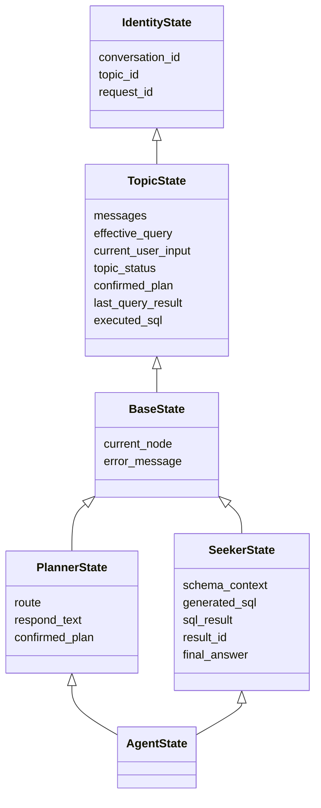

# State 与记忆系统架构

> 最后更新：2026-10-08
> [返回文档索引](../文档索引.md)

本文说明一次请求有哪些状态、状态怎么在父子图之间传递、记忆存在哪里。当前整体架构见 [Text2SQL 系统架构文档](./Text2SQL系统架构文档.md)。

## 一、设计目标

1. 一次对话的多轮问答共享同一份上下文，用户能连续追问与修改口径。
2. 身份字段（对话 / 任务 / 请求）贯穿全链路日志，任意一次请求都能还原。
3. 大数据集不写进 State，只保存引用与预览，避免 Checkpoint 膨胀。
4. 服务重启后对话历史不丢。

## 二、三层身份模型

| 字段 | 含义 | 生命周期 |
|---|---|---|
| `conversation_id` | 前端左侧列表里的一个完整对话 | 整个对话，同时作为 Checkpoint 的 `thread_id` |
| `topic_id` | 去 Topic 化后固定不变，仅作日志与状态标识 | 整个对话 |
| `request_id` | 一次图调用（一次提问） | 单次请求 |

Web / 飞书 / CLI 每轮只向图里传这四个字段：

```python
class GraphInput(TypedDict):
    conversation_id: str
    topic_id: str
    request_id: str
    current_user_input: str
```

业务状态一律由 `AgentState` 承载，调用方不参与业务字段拼装。

## 三、State 结构


```mermaid
classDiagram
    class IdentityState {
        conversation_id
        topic_id
        request_id
    }
    class TopicState {
        messages
        effective_query
        current_user_input
        topic_status
        confirmed_plan
        last_query_result
        executed_sql
    }
    class BaseState {
        current_node
        error_message
    }
    class PlannerState {
        route
        respond_text
        confirmed_plan
    }
    class SeekerState {
        schema_context
        generated_sql
        sql_result
        result_id
        final_answer
    }
    IdentityState <|-- TopicState
    TopicState <|-- BaseState
    BaseState <|-- PlannerState
    BaseState <|-- SeekerState
    PlannerState <|-- AgentState
    SeekerState <|-- AgentState
```

父图使用 `AgentState(PlannerState, SeekerState, total=False)`，所有字段都是可选的（`total=False`），节点只返回本轮发生变化的字段。

### 3.1 当前实际使用的字段

| 字段 | 类型 | 写入方 | 说明 |
|---|---|---|---|
| `conversation_id` / `topic_id` / `request_id` | `str` | 入口 | 身份字段，注入日志上下文 |
| `current_user_input` | `str` | 入口 | 本轮用户原话 |
| `effective_query` | `str` | Planner | 本轮需求基线（结合历史改写），滚动更新 |
| `messages` | `Annotated[list[AnyMessage], add_messages]` | 各节点 | 对话消息，节点只返回新增消息 |
| `topic_status` | `TopicStatus` | 各阶段 | 当轮阶段标识 |
| `respond_text` | `str` | Planner | 输出给用户的文本（澄清 / 最终回答） |
| `executed_sql` | `list` | `execute_query` | 本轮实际执行过的 SQL，供前端展示 |
| `last_query_result` | `QueryResultSnapshot` | 落盘后 | 上一轮结果引用 + 预览 + 实体键 |
| `final_answer` / `generated_sql` / `result_preview` | — | 兼容字段 | 对外 `GraphOutput` 与历史读取方兼容 |

`TopicStatus` 取值：`new` / `clarifying` / `confirmed` / `generating_sql` / `validating_sql` / `executing` / `completed` / `failed` / `cancelled`。

### 3.2 历史兼容字段

`SeekerState` 中的 `schema_context`、`sql_valid`、`retry_count`、`seeker_plan_error`、`plan_repair_rounds`、`empty_result_rounds` 等字段，来自早期"执行链作为独立子图 + 回 Planner 修复"的设计。当前单 Agent 下执行由 `execute_query` 工具在内部完成，失败信息直接作为工具返回值回填，不再依赖这些跨节点字段流转。保留它们是出于向后兼容与测试引用，新增功能不应继续依赖。

## 四、统一消息模型

- `messages` 使用 `add_messages` reducer 增量合并，节点只返回新增消息即可。
- 消息统一为 LangChain `AnyMessage`（用户、AI、工具消息）。
- Planner 每轮通过 `_build_history_context` 从 `messages` 构造对话历史（只取用户与 AI 的可见对话，不含工具中间结果），结合本轮输入产出 `effective_query`。
- 长回答在历史里会按长度截断，并在提示中说明"可用 `query_stored_result` 读取完整落盘结果"，避免提示词膨胀。

## 五、记忆分层

| 层级 | 载体 | 内容 | 生命周期 |
|---|---|---|---|
| 图状态 | `AgentState` | 本轮身份、需求、阶段、结果引用 | 单轮 |
| 对话记忆 | Checkpoint（SQLite） | 各轮 State 快照与 `messages` | 整个对话，跨重启 |
| 结果数据 | `agentTest/query_results/` | CSV 全量 + JSON 预览 + 脚本元数据 | 落盘保留，按 `request_id` 归档 |
| 审计记录 | MySQL `evaluated_dialogues` / `conversations` / `conversation_messages` | 问答记录、token、耗时、评分 | 长期 |

**Checkpoint**：`agentTest/langgraph_app/graphs/supervisor_graph.py` 使用 `SqliteSaver`，数据库文件 `agentTest/langgraph_app/cache/checkpoints.db`，`thread_id = conversation_id`。相比早期进程内 `MemorySaver`，服务重启后对话历史不丢失。

## 六、一次完整请求的数据流

```text
1. Web / 飞书 / CLI 构造 GraphInput 并调用图
2. capture_user_message
     → 写入 messages（本轮用户消息）
3. planner（ReAct 工具循环）
     → 读 messages + current_user_input，产出 effective_query
     → 需要口径：grep_semantic / read_metric
     → 需要数据：execute_query（结果落盘，executed_sql / last_query_result 更新）
     → 需要说明：make_chart
     → 达到可回答状态：写 respond_text，本轮结束
4. 图返回 GraphOutput，前端流式渲染
5. 成功回答落一条 evaluated_dialogues，等待用户打分
```

## 七、当前边界与后续改造

- **Checkpoint 为单机 SQLite**：多实例部署需要换成共享存储或独立会话服务。
- **`messages` 会随对话增长**：长对话依赖历史截断与落盘结果引用控制提示词规模。
- **历史兼容字段未清理**：`SeekerState` 与 `BaseState` 中部分字段已不在主链路使用，可在后续版本清理。
- **并发**：同一 `conversation_id` 同时只允许一个进行中的请求，重复提交会被拒绝。

## 八、关键文件

| 文件 | 职责 |
|---|---|
| `agentTest/langgraph_app/state/base_state.py` | Identity / Topic / Base State 定义，`TopicStatus` |
| `agentTest/langgraph_app/state/planner_state.py` | Planner 字段（`route` / `respond_text`） |
| `agentTest/langgraph_app/state/seeker_state.py` | 执行相关字段（部分为历史兼容） |
| `agentTest/langgraph_app/state/query_plan.py` | `QueryPlan` 契约 |
| `agentTest/langgraph_app/state/agent_state.py` | `AgentState` 聚合与 `GraphInput` / `GraphOutput` |
| `agentTest/langgraph_app/graphs/supervisor_graph.py` | 父图编排与 Checkpointer |
| `agentTest/langgraph_app/message_utils.py` | 历史消息读取与上下文构造 |
| `agentTest/langgraph_app/nodes/capture_user_message_node.py` | 记录本轮用户消息 |
| `web/server.py` | 会话管理、Checkpoint 回滚、上下文估算 |

相关文档：

- [Text2SQL 系统架构文档](./Text2SQL系统架构文档.md)
- [元数据与向量检索架构](./元数据与向量检索架构.md)
- [日志使用与问题排查指南](../指南/日志使用与问题排查指南.md)
