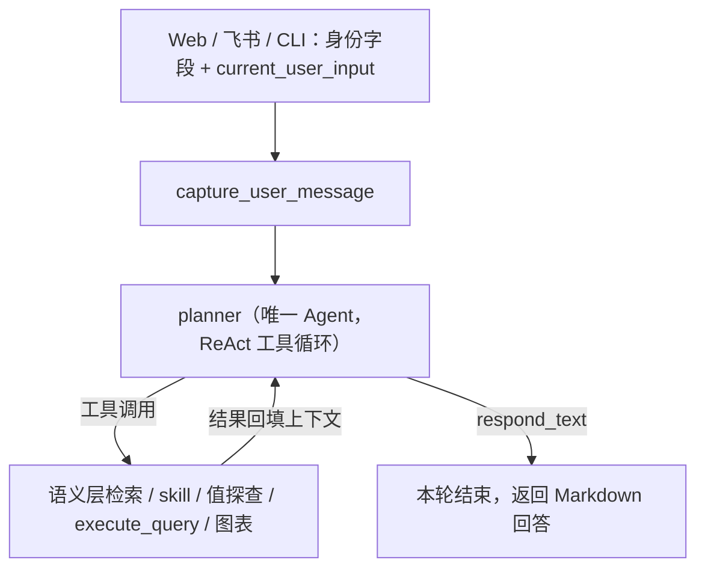

# Text2SQL 系统架构文档

> 最后更新：2026-10-08
> [返回文档索引](../文档索引.md)

## 一、系统定位

把"业务口径 + 数仓表 + 查询引擎"打包成一个可直接对话的取数系统：用户用中文提问，系统定位口径、生成 SQL、经过安全校验后执行，最终返回带口径说明的 Markdown 回答与图表。

**当前形态是单 Agent + 工具**（Codex 模式），不是多智能体协作：

- 父图只有两个节点：`capture_user_message → planner`，Planner 输出回答后本轮结束。
- 查数不是独立智能体，而是 Planner 在 ReAct 工具循环里调用 `execute_query` 工具。
- 没有 Advisor（方案澄清智能体）与 Seeker（执行智能体）；澄清由 Planner 直接 `respond` 承担，执行由工具承担。

**技术栈**：LangGraph（图编排）、LangChain（LLM 接口）、FAISS + BM25（可选 RAG 检索）、PyHive / Trino / PyMySQL（数据源）、MySQL（元数据与审计存储）、SQLite（Checkpoint 持久化）、Flask（Web 服务）、lark-oapi（飞书机器人）。

---

## 二、整体架构



### 图结构

- **父图**：`capture_user_message`（记录本轮输入）→ `planner` → `END`。
- **单 Agent 循环**：Planner 绑定工具后用 ReAct 循环自主决定"继续调工具"还是"输出最终回答"；工具结果回填同一上下文，不需要第二次 Planner 调用，也没有回环路由。
- **执行链内联**：原 Seeker 子图已取消，执行能力收敛为 `execute_query` 工具，在工具内部同步完成"引擎路由 → 安全校验 → 执行 → 落盘"。
- **Checkpoint**：使用 `SqliteSaver` 持久化到 `agentTest/langgraph_app/cache/checkpoints.db`，以 `conversation_id` 作为 `thread_id`，服务重启后会话历史不丢失。

### 关键设计原则

1. **单一决策者**：只有 Planner 做业务决策（是不是问数、口径够不够、要不要澄清、SQL 怎么写、回答怎么写）。
2. **程序只做安全与确定性兜底**：工具负责只读、白名单、分区过滤、LIMIT、审计落盘，不做任何 SQL 生成或业务判断。
3. **语义层优先**：问数先经语义层定位指标口径与来源表；未命中就澄清或拒答，不允许凭猜测生成 SQL。
4. **失败回到模型**：SQL 校验失败、执行报错、返回 0 行都作为工具结果回填，由 Planner 自行决定改 SQL 重试、探查取值还是向用户说明。

---

## 三、Planner 与工具集

Planner 的可用工具由工具注册表按 `group=planner` 装配（`runtime/graph_runtime.py` + `graphs/supervisor_graph.py`）：

| 工具 | 职责 | 备注 |
|---|---|---|
| `grep_semantic` | 在语义层指标文件中全文检索候选指标 | 支持一次传多个业务短词；不设文件数上限 |
| `read_metric` | 读取单个指标的完整口径（来源表 / 表达式 / 维度 / 枚举 / 备注） | 确认口径后再生成 SQL，禁止臆造指标 id |
| `list_metric_files` | 按主题列出语义层指标清单 | 无明显关键词时浏览用 |
| `read_skill` | 按需读取技能完整正文（渐进式披露） | 先只披露 name + description |
| `probe_values` | 用 `LIKE` 实时探查字段真实取值 | 0 行自愈用，不依赖元数据采样猜测 |
| `query_stored_result` | 复用 / 聚合已落盘的查询结果 | 避免重复查库 |
| `execute_query` | 执行只读 SQL 并落盘，返回摘要 | 支持单条 `sql` 或 `steps` 多段脚本 |
| `make_chart` | 从落盘结果生成规范 `chart` 代码块 | LLM 选类型/字段/标题，程序保证格式 |
| `search_databases` / `search_tables` / `search_columns` | RAG 双路召回的库/表/字段检索 | 仅 `ENABLE_RAG=true` 时返回结果，否则安全返回空 |

---

## 四、一次请求的完整链路

```text
1. Web / 飞书 / CLI 提交 {conversation_id, topic_id, request_id, current_user_input}
2. capture_user_message：写入本轮用户消息
3. planner（ReAct 循环）：
   a. 判断意图 —— 闲聊直接回答；问数进入检索
   b. grep_semantic 定位指标 → read_metric 确认口径与来源表字段
   c. 命中 skill 时 read_skill 读取对应行为规范
   d. 生成只读 SQL（多视角需求放进同一次 steps 的多段）
   e. 调 execute_query 执行 → 返回列 + 预览行 + 行数 + 全量 CSV 路径
   f. 0 行 / 报错 → 自行决定 probe_values 探查、改 SQL 重试或向用户说明
   g. 需要图表时调 make_chart 生成 chart 块
   h. 输出 respond_text（Markdown 回答）→ 本轮结束
4. 前端流式收到思考过程与最终回答；成功后落一条 evaluated_dialogues 供用户打分
```

---

## 五、模块职责

| 模块 | 路径 | 职责 |
|---|---|---|
| 图编排 | `langgraph_app/graphs/` | 父图定义与 Checkpointer 装配 |
| 节点 | `langgraph_app/nodes/` | `capture_user_message`、`planner`；其余为工具内部复用的执行辅助节点 |
| 提示词 | `langgraph_app/prompts/` | Planner 系统提示词、SQL 提示词、元数据增强提示词 |
| 服务 | `langgraph_app/services/` | 安全校验、结果落盘、Join 规划、流式输出、表覆盖分析 |
| 工具 | `langgraph_app/tools/` | 统一工具注册表与各工具实现 |
| 运行时 | `langgraph_app/runtime/` | 图运行时装配、结构化日志、流式总线 |
| 状态 | `langgraph_app/state/` | `AgentState` 及各领域 State 定义 |
| 技能 | `langgraph_app/skills/` + `skills/` | 技能索引与 SKILL.md 正文 |
| 语义层 | `semantic_layer/` | metrics / semantic_models / physical / relationships / join_contracts |
| 元数据 | `metadata/` | Hive 采集、增强、多源 Provider |
| 数据源 | `datasource/` | Trino / Doris / Hive 适配与引擎路由 |
| 安全校验 | `db/` `validate/` `services/sql_*_validator.py` | 只读、白名单、分区过滤、AST 校验 |
| Web | `web/` | Flask 服务、前端静态资源、飞书机器人 |
| 脚本 | `scripts/` | 元数据同步、索引构建、日志排查 |

---

## 六、执行与安全

### `execute_query` 内部流程

```text
SQL 文本
  → clear_sql 清洗
  → 缺少 LIMIT 时按安全兜底追加（默认 50，可被 result_limit 覆盖）
  → 解析涉及的表
  → 引擎路由：resolve_engine_candidates(表) → [trino, hive]；data_project → [doris]
  → 跨引擎检测：一次 SQL 涉及多引擎表时直接拒绝，提示拆开查询
  → 逐引擎尝试：sql_query_{engine} 工具内置三层安全校验
       · is_read_only_sql        —— 仅 SELECT / WITH
       · validate_hive_sql       —— 必须显式 LIMIT；JOIN 是否允许受 ALLOW_JOIN 控制
       · validate_sql_ast_guardrails —— 禁止 SELECT *、必须含分区过滤、AST 解析
       · 校验失败（ValueError）→ 不降级，直接返回错误
       · 执行异常 → 记录错误，降级到下一个引擎
  → 结果落盘（CSV / JSON / 脚本元数据）
  → 返回摘要给 Planner（列、预览行、行数、落盘路径、实际执行 SQL）
```

### 四层安全护栏

| 层级 | 规则 |
|---|---|
| 只读 | 仅允许 `SELECT` / `WITH`，禁止任何写操作 |
| LIMIT | 必须带显式 `LIMIT`；缺省时按安全兜底追加（默认 50） |
| 分区过滤 | SQL 必须包含时间/分区过滤条件（默认 `pt_dt`）；`a.pt_dt = b.pt_dt` 只算 Join 对齐，不算过滤 |
| 列裁剪 | 禁止 `SELECT *` |
| AST 校验 | 只读判定、表名解析、语法结构校验（`sql_ast_guardrails.py`） |
| Join 契约 | 语义层未配置连接关系时不允许模型推测（`ALLOW_AI_INFERRED_JOIN=False`） |
| 跨引擎 | 一条 SQL 涉及不同引擎候选链时直接拒绝，提示拆开查询 |

> **表级白名单已取消**：`is_table_allowed()` 统一放行，SQL 能访问哪些表由底层数据库账号（Hive / Trino / Doris）权限决定。`config/metadata.yaml` 的元数据接入范围仍用于元数据采集与向量索引，不影响执行期放行。

> 边界：当前主链路校验的是"整条 SQL 是否含分区过滤"；逐表分区校验能力位于 `services/sql_table_filter_validator.py`，目前仅在执行辅助节点中接线。

### 引擎路由

- 规则单一事实源：`agentTest/config/datasource_scope.yaml`。
- 默认候选链 `[trino, hive]`；`data_project` 库仅 `[doris]`，失败直接报错不降级。
- 元数据与语义层仍以 Hive 为准，该配置只决定"查询走哪个引擎"。
- 详见 [多数据源架构](./多数据源架构.md)。

---

## 七、检索与语义层

### 优先级

```text
语义层（grep_semantic + read_metric）  ← 主路径
    ↓ 未唯一命中且 RAG 开启
RAG 双路召回（BM25 + 向量）           ← 兜底
    ↓ 仍未命中
向用户澄清或拒答                       ← 不编造
```

### FAISS 索引布局

所有索引统一在 `agentTest/langgraph_app/cache/`：

| 索引 | 状态 | 用途 |
|---|---|---|
| `db_faiss_index` | 活动（需 RAG） | 库级检索 |
| `table_faiss_index` | 活动（需 RAG） | 表级检索 |
| `column_faiss_index` | 活动（需 RAG） | 字段级检索 |
| `example_faiss_index` | 活动（需 RAG） | 优秀案例 Few-shot |
| `enriched_faiss_index` | 兼容资产 | 已退出主链路 |
| `schema_faiss_index` | 对比资产 | 不进入主链路 |

> `ENABLE_RAG=false` 时以上索引均不加载，检索类工具安全返回空结果。

- 详见 [语义层架构](./语义层架构.md)、[元数据与向量检索架构](./元数据与向量检索架构.md)。

---

## 八、状态与记忆

| 标识 | 含义 |
|---|---|
| `conversation_id` | 一个完整对话，同时是 Checkpoint 的 `thread_id` |
| `topic_id` | 日志 / 状态标识，去 Topic 化后固定 |
| `request_id` | 一次图调用，日志检索与问题定位主键 |

- Web / CLI 每轮只传身份字段与 `current_user_input`，业务状态由 `AgentState` 承载。
- Checkpoint 为 SQLite 持久化，跨重启保留会话历史。
- 详见 [State 与记忆系统架构](./State与记忆系统架构.md)。

---

## 九、接入端

### Web 端（`web/`，ChatGPT 风格）

```bash
python web/server.py
# http://localhost:5000  |  内网 http://<本机IP>:5000（启动日志会打印）
```

| 功能 | 说明 |
|---|---|
| 意图识别 | LLM 自动区分闲聊与问数，闲聊秒回 |
| 会话管理 | 新建 / 重命名 / 软删除，创建人标记，SSE 实时刷新 |
| 流式输出 | 思考过程与最终回答真流式推送，显示思考耗时 |
| 查看 SQL | 折叠面板展示本轮实际执行过的 SQL |
| token 统计 | 输入 / 输出 / 缓存命中率 / 上下文占用圆环 |
| 图表 | ECharts：折线 / 柱状 / 条形 / 面积 / 饼 / 环形 / 词云 / 热力图 |
| 用户打分 | 1-5 星，写入 `evaluated_dialogues`；RAG 开启时联动 FAISS 优秀案例 |
| 生成控制 | 中断生成、最近一轮提问重新编辑 |

**API**

| 方法 | 路径 | 说明 |
|---|---|---|
| `POST` | `/api/conversations` | 新建对话 |
| `GET` | `/api/conversations` | 列表（首屏读一次） |
| `GET` | `/api/conversations/events` | SSE 推送会话列表变更 |
| `GET/PUT/DELETE` | `/api/conversations/{conversation_id}` | 详情 / 重命名 / 软删除 |
| `POST` | `/api/chat` | 传入 `conversation_id + message`，SSE 流式返回 |
| `POST` | `/api/chat/{conversation_id}/cancel` | 中断当前生成 |
| `POST` | `/api/chart` | 用落盘结果补生成图表 |
| `POST` | `/api/score` | 提交 1-5 星评分 |

**SSE 事件**

| 事件 | 携带字段 | 说明 |
|---|---|---|
| `status` | `text` | 节点状态文案 |
| `thinking` | `node, text` | 思考过程段落 |
| `token` | `scope, text, live, stream_id` | LLM 增量输出；`scope=thinking/answer` |
| `thinking_retract` | `stream_id` | 最终回复从思考面板回收到回答区 |
| `done` | `content, sql, thinking, llm_tokens` | 正常结束 |
| `error` | `text, error_id` | 失败，前端只展示安全文案与错误编号 |

### 飞书端（`web/feishu_bot.py`）

- 长连接接收私聊与群 @ 消息，复用同一套会话与查询链路。
- 互动卡片渲染 Markdown，多表格回答自动拆分为多条卡片。
- 回答携带 `chart` 块时渲染 PNG 一并发送。
- 同一应用凭证同一时刻只能有一条长连接，本地与服务器不要同时启动。

---

## 十、配置项汇总

| 文件 | 配置项 | 默认值 | 说明 |
|------|--------|--------|------|
| `config/planner.py` | `TABLE_SEARCH_K` | 10 | 表级检索数量 |
| | `COLUMN_SEARCH_K` | 15 | 字段检索 k |
| | `PER_TABLE_COLUMN_QUOTA` | 4 | 每张召回表进入候选的字段上限 |
| | `HIGH_SIMILARITY_THRESHOLD` | 0.65 | 高相似候选观测阈值（仅观测） |
| | `MAX_HIGH_SIMILARITY_COUNT` | 3 | 高相似候选告警基线（仅观测） |
| | `EXAMPLE_SIMILARITY_THRESHOLD` | 0.7 | 优质示例最低相似度 |
| `config/advisor.py` | `SEARCH_DB_K` / `SEARCH_TABLE_K` / `SEARCH_COLUMN_K` | 3 / 3 / 5 | RAG 分层检索数量 |
| | `MAX_AMBIGUITY_CANDIDATES` | 6 | 澄清候选数量上限 |
| | `MIN_CANDIDATE_SCORE` | 0.5 | 候选相似度下限 |
| | `RERANK_MIN_CANDIDATES` | 2 | 多候选精选下限 |
| `config/evaluator.py` | `HIGH_QUALITY_THRESHOLD` | 80 | 优质对话分数线 |
| | `WEIGHT_USER` / `WEIGHT_LLM_SELF` | 0.5 / 0.3 | 评分权重（时间 0.1、轮次 0.1） |
| `config/settings.py` | 环境变量 | — | 模型、API Key、Embedding、`ENABLE_RAG` 等 |

> `config/advisor.py` 仅保留常量供检索工具与示例库使用，Advisor 节点本身已删除。

---

## 十一、入口命令

启动与常用命令统一见 [README 快速开始与常用操作](../../README.md)。

---

## 十二、文件索引

```text
agentTest/
├── config/                          # 全局配置（planner / semantic / evaluator / log_config）
├── metadata/                        # 元数据采集与增强
│   ├── metadata_enricher.py         # 离线：Hive → MySQL 增强
│   ├── mysql_store.py               # MySQL 读写 + 增量检测
│   ├── hive_meta_provider.py        # Hive 原始 schema 读取
│   └── multi_source_meta_provider.py# 多源元数据（Hive 主 + 语义层兜底）
├── semantic_layer/                  # 语义层资产（YAML）
├── langchain_app/                   # RAG 基础设施（FAISS / BM25 / Embedding）
├── langgraph_app/                   # LangGraph 单 Agent 核心
│   ├── graphs/supervisor_graph.py   # 父图：capture_user_message → planner → END
│   ├── nodes/planner_node.py        # 唯一 Agent（ReAct 工具循环）
│   ├── prompts/                     # Planner / SQL / 元数据增强提示词
│   ├── tools/                       # 统一工具注册表与工具实现
│   ├── services/                    # 安全校验 / 落盘 / Join 规划 / 流式输出
│   ├── runtime/                     # 图运行时 / 日志 / 流式总线
│   ├── state/                       # AgentState 与领域 State
│   └── skills/                      # 技能索引
├── scripts/                         # 运维脚本
├── skills/                          # 技能正文（SKILL.md + references）
├── logs/                            # 运行时日志
└── query_results/                   # 查询结果落盘
```

相关专文：

- [State 与记忆系统架构](./State与记忆系统架构.md)
- [元数据与向量检索架构](./元数据与向量检索架构.md)
- [语义层架构](./语义层架构.md)
- [多数据源架构](./多数据源架构.md)
- [skill 机制](./skill机制.md)
- [多表查询执行过程详解](./多表查询执行过程详解.md)
