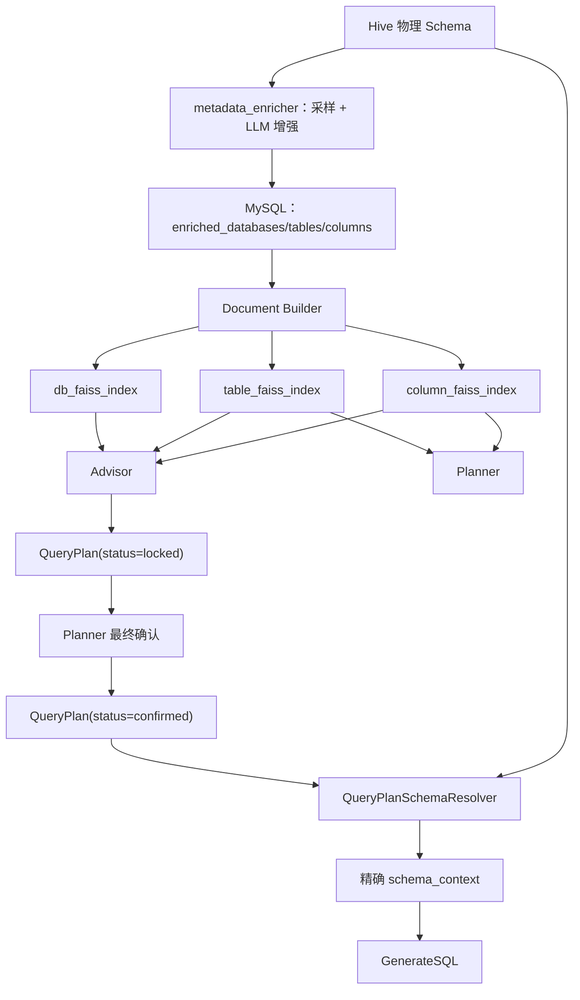

# 架构文档：元数据、向量检索与精确 Schema 加载

> 最后更新：2026-07-31 | Planner/Advisor 使用库、表、字段三层检索；Seeker 已改为 confirmed_plan 驱动的精确 Schema 加载  
> [返回文档索引](../文档索引.md)

---

## 一、当前全景



当前职责边界：

- Planner/Advisor 使用向量检索完成语义识别、候选召回和需求消歧。
- Planner 返回 `partial/none` 时，Advisor 使用不含方案提交工具的澄清 Agent；只有 `full` 才启用方案 Agent。
- Advisor 方案 Agent 形成完整 `locked` 方案，Planner 在用户最终确认后形成 `confirmed` 方案。
- Seeker 不使用向量检索重新选表或选字段，只消费最终确认方案。
- 方案缺失或物理元数据不一致时直接失败，不允许 Seeker 兜底猜测。

---

## 二、FAISS 索引资产

所有索引位于 `agentTest/langgraph_app/cache/`：

| 索引 | 内容 | 当前运行时状态 | 消费者 |
|---|---|---|---|
| `db_faiss_index` | 增强后的库级描述 | 活动 | Advisor |
| `table_faiss_index` | 增强后的表级描述 | 活动 | Planner、Advisor |
| `column_faiss_index` | 增强后的字段级描述 | 活动 | Planner、Advisor |
| `example_faiss_index` | Evaluator 沉淀的高质量问数示例 | 活动 | Planner、Advisor、GenerateSQL |
| `enriched_faiss_index` | 旧单层混合 Schema 文档 | 兼容资产，已退出当前 Graph Runtime | 旧脚本/对比 |
| `schema_faiss_index` | 原始 Schema 文档 | 对比资产，未进入当前主链路 | 调试/对比 |

`build_enriched_schema_rag_app()` 和 `build_schema_rag_app()` 仍保留在基础设施中，但 `build_graph_runtime()` 不再构建 Seeker 通用 `retriever`。保留旧资产不等于当前链路仍在使用它们。

---

## 三、MySQL 与 Document

| MySQL 表 | 读取函数 | Document 粒度 | 主要用途 |
|---|---|---|---|
| `enriched_databases` | `load_enriched_databases()` | 每库一个 | Advisor 库级引导 |
| `enriched_tables` | `load_enriched_tables()` | 每表一个 | Planner 表识别、Advisor 表推荐 |
| `enriched_columns` | `load_enriched_columns()` | 每字段一个 | Planner 字段识别、Advisor 字段推荐 |
| `evaluated_dialogues` | Evaluator 写入 | 每条优质对话一个 | Few-shot 长期经验记忆 |

Document 由两部分组成：

- `page_content`：供 Embedding 理解的自然语言描述。
- `metadata`：数据库、表、字段、类型等确定性标签，用于过滤和追踪来源。

示例：

```text
字段: dwd_trip.dwd_exchange_order_rent_detail_hour.rent_status
类型: 【维度】
别名: 订单状态、租约状态
采样值: renting、finish、closed
```

```python
{
    "database": "dwd_trip",
    "table": "dwd_trip.dwd_exchange_order_rent_detail_hour",
    "column": "rent_status",
    "fields_type": "dimension",
}
```

---

## 四、运行时依赖

当前 `build_graph_runtime()` 的相关依赖：

```python
runtime = {
    "db_vector_store": ...,           # Advisor 库级语义检索
    "table_vector_store": ...,        # Planner/Advisor 表级语义检索
    "column_vector_store": ...,       # Planner/Advisor 字段级语义检索
    "example_vector_store": ...,      # Few-shot 示例检索与同步
    "query_plan_schema_resolver": ...,# Seeker 精确物理 Schema 加载
    "tools": ...,
}
```

当前 Runtime 不再包含 `runtime["retriever"]`，因此 Seeker 与 `enriched_faiss_index` 之间不存在运行时依赖。

---

## 五、检索消费场景

| 场景 | 数据源 | 方法 | 目的 |
|---|---|---|---|
| Planner 初次提问与多轮重判 | `table` + `column` | `similarity_search_with_score` | 解析候选表字段、完整度和候选数量歧义 |
| Advisor 库级引导 | `db` | `similarity_search` | 在库较多时缩小业务域 |
| Advisor 表推荐 | `table` | `similarity_search` | 给出可解释候选表 |
| Advisor 字段推荐 | `column` + 表过滤 | `similarity_search` | 推荐指标、维度和时间字段 |
| Planner/Advisor/GenerateSQL Few-shot | `example` | `search_similar` | 参考历史高质量问数案例 |
| Seeker Schema 准备 | HiveMetadataProvider | `QueryPlanSchemaResolver.resolve()` | 精确校验并加载确认表物理 Schema |

向量检索只负责“发现和澄清”，不负责替代最终执行契约。

---

## 六、QueryPlanSchemaResolver

输入必须是完整的 `confirmed_plan`：

```text
status=confirmed
→ table 与 tables[0] 一致
→ table 使用 database.table
→ list_tables() 精确核对目标表
→ 拒绝跨库同名表歧义
→ describe_table() 加载物理 Schema
→ 再次核对实际库表身份
→ 校验 confirmed_plan.fields 全部存在
→ 格式化 schema_context
```

当前单表上线边界：

- `tables` 必须且只能包含一张表。
- `table` 必须等于 `tables[0]`。
- Provider 目前通过裸表名调用 `describe_table()`，发现跨库同名表时 Resolver 直接拒绝，避免加载错误库表。
- `filters` 仍是字符串，Resolver 暂时加载确认表的完整物理 Schema，而不是只裁剪 `fields`。
- 任何校验失败都会中断执行，不会回到向量库重新猜测。

---

## 七、当前边界与后续演进

### 已完成

- 库、表、字段三层增强元数据与 FAISS 检索。
- Planner 首轮和多轮均可使用表/字段检索进行模糊度判断。
- Advisor 通过分层工具完成候选澄清；`partial/none` 只能追问，`full` 才能提交 `locked` 方案。
- Seeker 完全由 `status=confirmed` 的 QueryPlan 驱动精确 Schema 加载。
- Runtime 已移除 Seeker 通用 Retriever。

### 待完成

- 删除旧 `enriched/schema` 主链路代码和未使用 State 字段前，先确认脚本与对比功能是否仍需保留。
- 将 `filters` 升级为结构化条件，支持精确校验过滤字段和安全编译。
- 扩大库表后重新校准 Planner/Advisor Top-K、阈值和索引刷新流程。
- 下一阶段优先增加表粒度、关联键、基数和关系方向元数据，并建设确定性 Join Planner；业务用户只确认业务指标、维度和时间，不直接选择物理 Join 条件。

---

## 八、相似度候选的使用边界

向量检索返回的是语义相关证据，不是业务歧义的最终裁判。多个字段同时高相似可能表示：

- 同一业务主题下存在多个真实口径。
- 多个字段名称和描述天然接近。
- 用户已经通过 Advisor 选择了其中一个字段，但其他未选字段仍然具有较高向量相似度。

因此，高相似候选数量继续保留在 Planner 日志中，用于观察召回质量、分析索引和调整 Top-K，但不再作为把 `completeness=full` 强制改成 `partial` 的硬路由规则。

最终门禁由以下机制共同完成：

1. Planner 结合完整对话判断 `full/partial/none`。
2. Advisor 在 `partial/none` 时继续澄清。
3. Advisor 在 `full` 时检索并核对目标表字段。
4. `submit_query_plan + lock_query_plan()` 生成结构完整的 `locked` 方案。
5. Planner 在用户最终确认后通过 `confirm_query_plan()` 更新为 `confirmed`。
6. Seeker 只执行 `confirmed` 方案。

当前代码仍保留候选数量硬门禁分支，删除其路由影响属于下一次待实施改造。配置中的阈值在改造后继续作为观测基线使用。

---

## 九、关键文件

| 文件 | 职责 |
|---|---|
| `agentTest/metadata/metadata_enricher.py` | Hive 元数据采集、采样和 LLM 增强 |
| `agentTest/metadata/mysql_store.py` | 增强元数据与评估记录存储 |
| `agentTest/metadata/hive_meta_provider.py` | 物理表清单与 Schema 读取 |
| `agentTest/langchain_app/app_builder.py` | 各层 RAG 构建入口 |
| `agentTest/langchain_app/documents/enriched_db_documents.py` | 库级 Document |
| `agentTest/langchain_app/documents/enriched_table_documents.py` | 表级 Document |
| `agentTest/langchain_app/documents/enriched_column_documents.py` | 字段级 Document |
| `agentTest/langgraph_app/runtime/graph_runtime.py` | 活动向量库、Provider 和 Resolver 初始化 |
| `agentTest/langgraph_app/services/query_plan_schema_resolver.py` | confirmed_plan 到物理 Schema 的精确解析 |
| `agentTest/langgraph_app/nodes/retrieve_schema_node.py` | 调用 Resolver 并写入 `schema_context` |
| `agentTest/langgraph_app/graphs/seeker_graph.py` | Seeker 精确执行管线 |

相关文档：

- [多智能体 Text2SQL 系统架构](./多智能体Text2SQL系统架构文档.md)
- [State 与记忆系统架构](./State与记忆系统架构.md)
