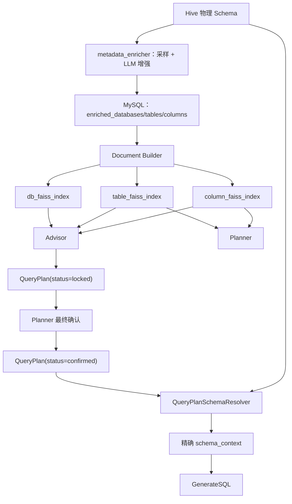

# 架构文档：元数据、向量检索与精确 Schema 加载

> 现状：Planner 先召回表再在表内召回字段（两段式）；Advisor 库/表/字段三层检索；Seeker 由 confirmed_plan 驱动精确 Schema 加载；元数据支持 schema 指纹增量采集、API 结构化增强与向量库按唯一键增量同步
> [返回文档索引](../文档索引.md)

---

## 一、当前全景



当前职责边界：

- Planner/Advisor 使用向量检索完成语义识别、候选召回和需求消歧。
- Planner 返回 `partial/none` 时，Advisor 检索元数据并向用户追问；用户本轮解决歧义或 `full` 时提交完整方案，未确认口径由指标歧义门禁拦截。
- Advisor 方案 Agent 形成完整 `locked` 方案，Planner 在用户最终确认后形成 `confirmed` 方案。
- Seeker 不使用向量检索重新选表或选字段，只消费最终确认方案。
- 方案缺失或物理元数据不一致时直接失败，不允许 Seeker 兜底猜测。

---

## 二、FAISS 索引资产

所有索引位于 `agentTest/langgraph_app/cache/`：

| 索引 | 内容 | 当前运行时状态 | 消费者 |
|---|---|---|---|
| `db_faiss_index` | 增强后的库级描述 | 活动 | Advisor |
| `table_faiss_index` | 增强后的表级描述 | 活动 | Planner、Advisor |
| `column_faiss_index` | 增强后的字段级描述 | 活动 | Planner、Advisor |
| `example_faiss_index` | Evaluator 沉淀的高质量问数示例 | 活动 | Planner、Advisor、GenerateSQL |
| `enriched_faiss_index` | 旧单层混合 Schema 文档 | 兼容资产，已退出当前 Graph Runtime | 旧脚本/对比 |
| `schema_faiss_index` | 原始 Schema 文档 | 对比资产，未进入当前主链路 | 调试/对比 |

`build_enriched_schema_rag_app()` 和 `build_schema_rag_app()` 仍保留在基础设施中，但 `build_graph_runtime()` 不再构建 Seeker 通用 `retriever`。保留旧资产不等于当前链路仍在使用它们。

---

## 三、MySQL 与 Document

| MySQL 表 | 读取函数 | Document 粒度 | 主要用途 |
|---|---|---|---|
| `enriched_databases` | `load_enriched_databases()` | 每库一个 | Advisor 库级引导 |
| `enriched_tables` | `load_enriched_tables()` | 每表一个 | Planner 表识别、Advisor 表推荐 |
| `enriched_columns` | `load_enriched_columns()` | 每字段一个 | Planner 字段识别、Advisor 字段推荐 |
| `evaluated_dialogues` | Evaluator 写入 | 每条优质对话一个 | Few-shot 长期经验记忆 |

Document 由两部分组成：

- `page_content`：供 Embedding 理解的自然语言描述。
- `metadata`：数据库、表、字段、类型等确定性标签，用于过滤和追踪来源。

示例：

```text
字段: dwd_trip.dwd_exchange_order_rent_detail_hour.rent_status
类型: 【维度】
别名: 订单状态、租约状态
采样值: renting、finish、closed
```

```python
{
    "database": "dwd_trip",
    "table": "dwd_trip.dwd_exchange_order_rent_detail_hour",
    "column": "rent_status",
    "fields_type": "dimension",
    "meta_source": "ddl_comment",
}
```

> `metadata.meta_source` 标记字段描述信息来源：`ddl_comment` 表示该字段有 DDL 原始备注（可信）；`llm_enhanced` 表示只有 LLM 增强别名，展示给用户时必须标注“系统推断别名”。

---

## 四、运行时依赖

当前 `build_graph_runtime()` 的相关依赖：

```python
runtime = {
    "db_vector_store": ...,           # Advisor 库级语义检索
    "table_vector_store": ...,        # Planner/Advisor 表级语义检索
    "column_vector_store": ...,       # Planner/Advisor 字段级语义检索
    "example_vector_store": ...,      # Few-shot 示例检索与同步
    "query_plan_schema_resolver": ...,# Seeker 精确物理 Schema 加载
    "tools": ...,
}
```

当前 Runtime 不再包含 `runtime["retriever"]`，因此 Seeker 与 `enriched_faiss_index` 之间不存在运行时依赖。

---

## 五、检索消费场景

| 场景 | 数据源 | 方法 | 目的 |
|---|---|---|---|
| Planner 初次提问与多轮重判 | `table` + `column` | `similarity_search_with_score` | 解析候选表字段、完整度和候选数量歧义 |
| Advisor 库级引导 | `db` | `similarity_search` | 在库较多时缩小业务域 |
| Advisor 表推荐 | `table` | `similarity_search` | 给出可解释候选表 |
| Advisor 字段推荐 | `column` + 表过滤 | `similarity_search` | 推荐指标、维度和时间字段 |
| Planner/Advisor/GenerateSQL Few-shot | `example` | `search_similar` | 参考历史高质量问数案例 |
| Seeker Schema 准备 | HiveMetadataProvider | `QueryPlanSchemaResolver.resolve()` | 精确校验并加载确认表物理 Schema |

向量检索只负责“发现和澄清”，不负责替代最终执行契约。

### 5.1 当前召回逻辑

**Planner：先召回表、再在表内召回字段（两段式）**

1. 表级召回：以「需求基线 + 对话历史 + 本轮输入」拼成的检索问题，用 `TABLE_SEARCH_K=10` 全局检索表索引，得到表作用域（按相似度降序）。
2. 字段级召回（`planner_node._recall_columns`）：
   - 表作用域内逐表检索：每张召回表用 `COLUMN_SEARCH_K=15` 检索该表字段，截断 `PER_TABLE_COLUMN_QUOTA=4`，跨表去重合并。
   - 全局兜底：再以 `COLUMN_SEARCH_K=15` 全局检索字段，只补充不在表作用域内的字段，避免表级漏召导致真实字段丢失。
3. 因此 Planner 输入字段数不是 `COLUMN_SEARCH_K` 本身，而是「表作用域表数 × PER_TABLE_COLUMN_QUOTA + 兜底补充数」；例如 4 张表各命中 4 个字段即为 16 个。

**Advisor：库/表/字段三层递进（工具驱动）**

- `search_databases`：`SEARCH_DB_K=3`，库较多时缩小业务域。
- `search_tables`：`SEARCH_TABLE_K=3`，给出可解释候选表。
- `search_columns`：`SEARCH_COLUMN_K=5`（可带表过滤），推荐指标、维度与时间字段。
- 澄清候选进一步收敛：`MAX_AMBIGUITY_CANDIDATES=6`（最多展示候选数）、`MIN_CANDIDATE_SCORE=0.5`（低于该分视为不相关）。

**执行阶段（Seeker）**：不使用向量检索，由 `confirmed_plan` 驱动 `QueryPlanSchemaResolver` 精确加载物理 Schema。


---

## 六、QueryPlanSchemaResolver

输入必须是完整的 `confirmed_plan`：

```text
status=confirmed
→ table 与 tables[0] 一致
→ table 使用 database.table
→ list_tables() 精确核对目标表
→ 拒绝跨库同名表歧义
→ describe_table() 加载物理 Schema
→ 再次核对实际库表身份
→ 校验 confirmed_plan.fields 全部存在
→ 格式化 schema_context
```

当前边界：

- 单表：`table` 与 `tables[0]` 一致，加载该表物理 Schema。
- 多表：逐表加载 Schema，并按 `field_sources` 精确校验字段归属，拼接 `joins` 生成关联说明。
- Provider 目前通过裸表名调用 `describe_table()`，发现跨库同名表时 Resolver 直接拒绝，避免加载错误库表。
- `filters` 仍是字符串，Resolver 暂时加载确认表的完整物理 Schema，而不是只裁剪 `fields`。
- 任何校验失败都会中断执行，不会回到向量库重新猜测。

---

## 七、当前边界与后续演进

### 已完成

- 库、表、字段三层增强元数据与 FAISS 检索。
- Planner 首轮和多轮均可使用表/字段检索进行模糊度判断。
- Advisor 通过分层工具完成候选澄清；`partial/none` 只能追问，`full` 才能提交 `locked` 方案。
- Seeker 完全由 `status=confirmed` 的 QueryPlan 驱动精确 Schema 加载。
- Runtime 已移除 Seeker 通用 Retriever。

### 待完成

- 删除旧 `enriched/schema` 主链路代码和未使用 State 字段前，先确认脚本与对比功能是否仍需保留。
- 将 `filters` 升级为结构化条件，支持精确校验过滤字段和安全编译。
- 扩大库表后重新校准 Planner/Advisor Top-K 与阈值（索引刷新流程已由增量同步覆盖）。
- 下一阶段优先增加表粒度、关联键、基数和关系方向元数据，并建设确定性 Join Planner；业务用户只确认业务指标、维度和时间，不直接选择物理 Join 条件。

---

## 八、相似度候选的使用边界

向量检索返回的是语义相关证据，不是业务歧义的最终裁判。多个字段同时高相似可能表示：

- 同一业务主题下存在多个真实口径。
- 多个字段名称和描述天然接近。
- 用户已经通过 Advisor 选择了其中一个字段，但其他未选字段仍然具有较高向量相似度。

因此，高相似候选数量继续保留在 Planner 日志中，用于观察召回质量、分析索引和调整 Top-K，但不再作为把 `completeness=full` 强制改成 `partial` 的硬路由规则。

最终门禁由以下机制共同完成：

1. Planner 结合完整对话判断 `full/partial/none`。
2. Advisor 在 `partial/none` 时继续澄清。
3. Advisor 在 `full` 时检索并核对目标表字段。
4. `submit_query_plan + lock_query_plan()` 生成结构完整的 `locked` 方案。
5. Planner 在用户最终确认后通过 `confirm_query_plan()` 更新为 `confirmed`。
6. Seeker 只执行 `confirmed` 方案。

当前 Planner 信任 LLM 的 `completeness` 判定，候选数量不再覆盖路由；多候选未选择时由指标歧义门禁（`submit_query_plan → lock_query_plan`）拦截追问。配置中的阈值继续作为观测基线使用。

---

## 九、关键文件

| 文件 | 职责 |
|---|---|
| `agentTest/metadata/metadata_enricher.py` | Hive 元数据采集、采样和 LLM 增强 |
| `agentTest/metadata/mysql_store.py` | 增强元数据与评估记录存储 |
| `agentTest/metadata/hive_meta_provider.py` | 物理表清单与 Schema 读取 |
| `agentTest/langchain_app/app_builder.py` | 各层 RAG 构建入口 |
| `agentTest/langchain_app/documents/enriched_db_documents.py` | 库级 Document |
| `agentTest/langchain_app/documents/enriched_table_documents.py` | 表级 Document |
| `agentTest/langchain_app/documents/enriched_column_documents.py` | 字段级 Document |
| `agentTest/langgraph_app/runtime/graph_runtime.py` | 活动向量库、Provider 和 Resolver 初始化 |
| `agentTest/langgraph_app/services/query_plan_schema_resolver.py` | confirmed_plan 到物理 Schema 的精确解析 |
| `agentTest/langgraph_app/nodes/retrieve_schema_node.py` | 调用 Resolver 并写入 `schema_context` |
| `agentTest/langgraph_app/graphs/seeker_graph.py` | Seeker 精确执行管线 |

---

## 十、元数据增量采集与向量库变更同步

本节对应课程规划中的"指纹增量采集"与"变更同步"两阶段改造，目标是让 500 表规模下元数据可增量维护：
- 10.1 Hive → MySQL：schema 指纹增量采集（无变化整表跳过，字段级 diff）。
- 10.2 MySQL → FAISS：按唯一键 upsert/delete 变更同步（新增追加、内容变化更新、消失删除）。

### 10.1 指纹增量采集（Hive → MySQL）

#### 目标

- 无变化表整表跳过，不重复采样、不重复调用 LLM。
- 字段新增/修改/删除只处理对应字段，而不是整表重建。
- Hive 中已消失的表可配置自动清理。

#### 指纹定义（`metadata/schema_fingerprint.py`）

指纹只依赖 Hive 可观测的物理元数据（字段名/类型/注释 + 表注释），不依赖 LLM 增强结果，保证"只有 Hive 变了才触发重增强"。

**字段指纹（`column_fingerprint`）**

```python
raw = "|".join([字段名, 字段类型, 字段原始注释])   # 缺失项用空串补齐
指纹 = sha1(raw.encode("utf-8")).hexdigest()
```

字段名、类型、注释中任一变化，字段指纹即变化；`|` 作为分隔符避免 `name="a|b"` 与 `name="a", type="b"` 撞指纹。

**表指纹（`table_fingerprint`）**

```python
字段指纹映射 = {字段名: 该字段的字段指纹 for 每个字段}
raw = json.dumps(字段指纹映射, sort_keys=True, ensure_ascii=False) + "|" + 表注释
表指纹 = sha1(raw.encode("utf-8")).hexdigest()
```

- 表指纹由「全部字段指纹映射」和「表注释」共同决定；字段增删改或表注释变化都会使表指纹变化。
- `sort_keys=True` 按字段名排序序列化，因此**字段声明顺序变化不会改变表指纹**，只有字段本身增删改才会触发重增强。

**字段级 diff（`diff_columns`）**

对比上次 `metadata_sync_state.column_fingerprints` 与本次计算结果：

| 分组 | 判定 |
|---|---|
| `added` | 字段名存在于本次、不存在于上次 |
| `removed` | 字段名存在于上次、不存在于本次 |
| `modified` | 字段名两次都存在，但字段指纹不同（名/类型/注释变化） |

#### 同步状态表 `metadata_sync_state`

| 列 | 说明 |
|---|---|
| `database_name` + `table_name` | 库表标识，联合唯一键 |
| `table_fingerprint` | 上次同步时的表指纹 |
| `column_fingerprints` | JSON：`{字段名: 字段指纹}`，用于字段级 diff |
| `last_synced_at` | 自动更新时间 |

#### 增量执行流程（`metadata_enricher._enrich_columns`）

```text
list_tables → 对每张表 describe_table 计算当前表指纹
  ├─ 与 metadata_sync_state 表指纹一致 → 整表跳过（不采样不增强）
  └─ 首次入库或指纹不一致 → 字段级 diff
       ├─ removed 字段：delete_enriched_column 清理 + column_removed 事件
       ├─ added 字段：采样 + LLM 增强 + save_column + column_added 事件
       │    （已增强过则按 column_exists 断点续跑跳过）
       ├─ modified 字段：强制重新采样 + 重增强 + column_modified 事件
       │    （不受 column_exists 断点续跑影响）
       └─ 处理完成 → save_sync_state 更新指纹
```

- 任何字段变化（新增/修改/删除）都会把该表加入 `changed_tables`，供表级增强判断是否重跑。
- 表级增强（`_enrich_tables`）：表不存在、字段有变化或表注释变化时重跑 LLM。
- 库级增强（`_enrich_databases`）：开销极小，每次全量重跑。
- 表废弃治理（`_retire_missing_tables`）：配置 `auto_retire_missing=True` 时，对比指纹状态表与当前 Hive 表清单，已消失表清理增强数据 + 指纹状态，并写入 `table_retired` 事件。
- 表备注采集：`describe_table` 额外执行 `describe formatted` 解析 `Comment:`/`comment` 写入 `table_comment`；`list_tables(with_comment=True)` 可批量补全（缓存命中也会补查），并复用 `_table_schema_cache` 避免重复查询。
- 表备注同步：表级增强比较 Hive `table_comment` 与 MySQL `original_comment`，变化即重跑 LLM 写库；表向量文档包含“原始备注”，变化会触发 table 层向量 upsert。

#### LLM 增强结构化输出

字段/表/库三级增强均使用 API 层结构化输出（`ChatOpenAI.with_structured_output`），由 function calling 在输出层强制字段完整，不再依赖"prompt 声明 JSON + 正则解析"：

- 输出模型定义在 `langgraph_app/prompts/metadata_enricher_prompt.py`：`ColumnEnrichmentOutput` / `TableEnrichmentOutput` / `DatabaseEnrichmentOutput`。
- `fields_type` 由 `Literal["dimension", "measure"]` 限定；`field_aliases` 要求 3-5 个、`potential_use_cases` 至少 2-3 个、`key_entities` 至少 1 个，避免出现空数组。
- 调用统一封装为 `_build_structured_llm` + `_invoke_structured`：system 放输出规则，user 只放表/字段/采样数据；单条增强失败回退默认值，不中断整批采集。
- 输出规则见 `metadata_enricher_prompt.py` 中 `COLUMN_ENRICH_SYSTEM_PROMPT` / `TABLE_ENRICH_SYSTEM_PROMPT` / `DATABASE_ENRICH_SYSTEM_PROMPT`。

### 10.2 变更同步（MySQL → FAISS）

#### 目标

- 新增文档追加 embedding。
- 内容变化的文档更新旧向量（FAISS 无原生 update，采用"删旧 + 重写"）。
- MySQL 中已消失的文档从向量库删除，避免一直召回脏数据。

#### 唯一键与内容对比

- 唯一键 `_doc_key()`：column 层 `db.table.column`，table 层 `db.table`，db 层 `database`。
- 内容变化判定：唯一键相同但 `page_content` 不同（别名/枚举/备注等变化会反映在 page_content）。

#### `SchemaVectorStore.sync_documents()` 执行流程

```text
force_rebuild=True → 删除缓存目录
  ├─ 缓存不存在或为空 → 全量 build + save_local
  └─ 加载已有 FAISS → 构建 existing {唯一键: [docstore_id]}
       ├─ 新增 key：add_documents
       ├─ 已有 key 且 page_content 不同：delete(旧 id) + add_documents(新文档)
       ├─ 已有 key 但 MySQL 已无此文档：delete(旧 id)
       └─ 有任何变化 → save_local 持久化
```

- `load_or_build()` 与 `sync_documents()` 复用同一逻辑，`app_builder.py` 的四个 builder 函数透传 `force_rebuild`。
- `scripts/build_indexes.py` 抽出 `run_build_all()`，供 CLI 与 `sync_metadata` 复用。

#### 枚举刷新（`refresh_enum_samples.py`）

- 默认只补采 `sample_values` 为空的字段；`--refresh` 强制重采样指定表/字段。
- 新采样与库中旧 `sample_values` 相同则跳过，变化才写库 + `enum_refreshed` 事件。
- 有更新且未指定 `--skip-vector` 时，重建 column 层文档并调用 `sync_documents` 同步向量。
- 枚举值不参与表指纹（枚举变化走本刷新路径，不走字段 diff）。

#### 一键同步（`sync_metadata.py`）

```text
build_enriched_metadata()  # 10.1 指纹增量采集 + 增强 + 白名单多退清理，写 MySQL
        ↓
run_build_all()            # 10.2 按唯一键同步 FAISS + BM25（新增/更新/删除）
        ↓
prune_examples_by_scope()  # 按白名单清理优秀案例（MySQL evaluated_dialogues + example_faiss_index）
```

支持 `--force`（向量强制重建）、`--skip-vector`（只更新 MySQL）、`--skip-prune-examples`（跳过优秀案例清理）、`--dry-run`。

白名单驱动"多退少补"：
- 多退：`_prune_scope_excess` 删除 MySQL 中已移出白名单的表/库（`enriched_tables` / `enriched_columns` / `metadata_sync_state` / `enriched_databases`）；`load_enriched_*` 按白名单过滤，索引构建只包含白名单内文档；`prune_examples_by_scope` 清理引用白名单外表的优秀案例。
- 少补：新加入白名单的表在指纹 diff 采集时自动新增到 MySQL 与索引。
- 运行时一致性：`metadata_scope` 与 `list_tables` 缓存按配置文件 mtime 自动失效，白名单变更无需重启服务。

### 10.3 变更审计 `metadata_change_log`

| 事件类型 | 触发点 |
|---|---|
| `column_added` | 字段级 diff 新增字段增强 |
| `column_modified` | 字段名/类型/注释变化后重增强 |
| `column_removed` | 字段从 Hive 消失后清理 |
| `enum_refreshed` | 枚举采样内容变化 |
| `table_retired` | 废弃表清理（Hive 消失 `auto_retire_missing=True`，或已移出白名单 `out_of_scope`） |
| `database_retired` | 库移出白名单后清理库级/表级/字段级增强数据 |

审计事件可用于回放与问题排查：`detail` 列保存 full_key 等上下文，`created_at` 记录发生时间。

### 10.4 边界与注意事项

- 增量同步的前提是 MySQL 已反映变化：字段内容变化必须先经 10.1 重增强，向量层才会感知；只跑 `build_indexes` 不会检测 Hive 变化。
- FAISS 无原生 update，内容变化 = 删除旧向量 + 重新 embedding，成本集中在变化文档。
- 首次运行无指纹状态 → 全量增强；二次运行无变化表全部跳过。
- 断点续跑：新增字段已增强过则跳过；修改字段必须强制重增强。
- 修改字段备注/枚举后若不想全量重跑，可只重建 column 层：`python -m agentTest.scripts.build_indexes --target column --force`。

### 使用方式

| 命令 | 行为 |
|---|---|
| `python -m agentTest.scripts.sync_metadata` | 一键：指纹 diff 采集 + 增强 + 向量同步 |
| `python -m agentTest.scripts.sync_metadata --force-table` | 强制重跑表级/库级增强并同步向量库，字段级复用 MySQL 现有结果不重新采样 |
| `python -m agentTest.scripts.sync_metadata --force` | 向量索引强制重建（删除缓存重新 embedding） |
| `python -m agentTest.scripts.sync_metadata --skip-vector` | 只更新 MySQL，不同步向量库 |
| `python -m agentTest.scripts.sync_metadata --dry-run` | 仅打印将执行的步骤，不实际执行 |
| `python -m agentTest.scripts.sync_metadata --skip-prune-examples` | 一键同步但跳过优秀案例清理 |
| `python -m agentTest.scripts.prune_examples_by_scope --dry-run` | 预览优秀案例待清理清单（不删除） |
| `python -m agentTest.scripts.prune_examples_by_scope` | 按白名单清理优秀案例（MySQL + FAISS） |
| `python -m agentTest.scripts.build_indexes` | 增量同步：新增/更新/删除 |
| `python -m agentTest.scripts.build_indexes --force` | 全量：删除缓存，从头构建所有索引 |
| `python -m agentTest.scripts.build_indexes --target column` | 只同步指定索引（db/table/column/enriched/bm25） |
| `python agentTest/scripts/refresh_enum_samples.py` | 补采空 `sample_values`（默认只补空） |
| `python agentTest/scripts/refresh_enum_samples.py --table 表名 --column 字段名 --refresh` | 强制重新采样指定字段，内容变化才写库 + 同步 column 向量层 |
| `python -m agentTest.scripts.view_faiss --index table` | 查看向量库内容（db/table/column/example/enriched/schema） |

### 实现文件

- `metadata/schema_fingerprint.py`：指纹计算与字段级 diff。
- `metadata/mysql_store.py`：`metadata_sync_state` / `metadata_change_log` 建表与读写、事件常量、`delete_enriched_column`。
- `metadata/metadata_enricher.py`：`_enrich_columns` 指纹前置过滤、`_retire_missing_tables` 废弃治理、`changed_tables` 驱动表级重跑。
- `langgraph_app/prompts/metadata_enricher_prompt.py`：字段/表/库三级增强的 Pydantic 结构化输出模型与 system prompt。
- `vectorstores/schema_vector_store.py`：`_existing_key_to_ids()` + `sync_documents()`（upsert/delete），`load_or_build()` 复用同一逻辑。
- `scripts/build_indexes.py`：`run_build_all()` 供 CLI 与 sync_metadata 复用。
- `scripts/sync_metadata.py`：一键"采集 + 增强 + 白名单多退清理 + 向量同步 + 优秀案例清理"。
- `scripts/prune_examples_by_scope.py`：按当前白名单清理优秀案例（MySQL `evaluated_dialogues` + `example_faiss_index`），`--dry-run` 预览。
- `metadata/mysql_store.py`：`delete_database_data` / `list_enriched_database_names` 支持库级白名单清理；`load_enriched_*` 按白名单过滤。
- `metadata/metadata_enricher.py`：`_prune_scope_excess` 白名单多退清理（Step0，默认执行）。
- `scripts/refresh_enum_samples.py`：`--refresh` 内容变化才写库 + 同步向量，且按白名单过滤。

## 十一、元数据与多表过滤同步

### 11.1 字段来源优先级

Coverage Analyzer 现在优先使用 `confirmed_plan.field_sources`：

1. Advisor 已锁定字段来源时，在指定表内做精确字段存在性校验。
2. 校验失败则将字段标记为 uncovered，禁止执行阶段自动换到另一张表。
3. 未锁定来源的兼容场景才使用主表优先和全域精确字段检索。

### 11.2 关系元数据

关系键支持：

```json
{
  "left_key": ["pt_platform", "company_id"],
  "right_key": ["pt_platform", "company_id"]
}
```

字符串格式仍兼容单字段关系。JoinPlanner 会统一标准化为字段列表并校验左右键数量一致。

### 11.3 AI Join 推测

- `ALLOW_AI_INFERRED_JOIN=True`：缺少完整关系路径时保留已知边，并向 SQL 生成阶段标记 `ai_inferred_join`。
- `ALLOW_AI_INFERRED_JOIN=False`：缺少关系立即安全拒绝。
- 即使允许推测，最终 SQL 仍受表白名单、只读规则、逐表过滤和执行前校验约束。

### 11.4 全局逐表必选过滤

FAISS 负责召回，Guardrails 负责强约束。当前全局配置为所有表必须过滤 `pt_dt`。校验器会解析 FROM/JOIN 别名，只在 ON/WHERE 谓词中查找真实常量或函数过滤；SELECT、GROUP BY 中出现字段不算，字段对字段等值 Join 也不算。
## 十二、连续问答与检索边界

连续问答不会通过重新执行向量检索来解释“第二个”或“第一名”：

- 候选编号来自 `PendingClarification.options` 的创建时快照，重新检索只可提供补充说明，不能改变原编号。
- “第一名”“这些经销商”引用 `QueryResultSnapshot`，不是再次向量搜索相似问题。
- 方案增量修改可以复用上一轮 confirmed QueryPlan，但新增指标仍需要经过语义检索和指标歧义门禁。
- 后续 BM25 + RAG 负责召回 Metric、Dimension、Entity 和 BusinessTerm，不负责保存对话状态。
- 检索索引版本变化不能静默改变已经展示给用户的候选选项。

因此检索层负责“有哪些可能对象”，State 层负责“本次对话已经展示、确认和引用了什么”。
