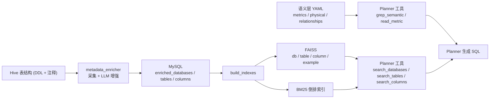

# 元数据与向量检索架构

> 最后更新：2026-10-08
> [返回文档索引](../文档索引.md)

本文说明元数据从 Hive 采集到 MySQL、再向量化成 FAISS/BM25 索引的过程，以及这些检索资产在当前架构里被谁消费。

当前是单 Agent 架构，且**语义层优先、RAG 兜底**：`ENABLE_RAG=false` 时系统只依赖语义层文件检索，不加载任何向量库。

## 一、当前全景


```mermaid
flowchart LR
    Hive["Hive 表结构 (DDL + 注释)"] --> Enricher["metadata_enricher<br/>采集 + LLM 增强"]
    Enricher --> MySQL["MySQL<br/>enriched_databases / tables / columns"]
    MySQL --> Build["build_indexes"]
    Build --> FAISS["FAISS<br/>db / table / column / example"]
    Build --> BM25["BM25 倒排索引"]
    Semantic["语义层 YAML<br/>metrics / physical / relationships"] --> STools["Planner 工具<br/>grep_semantic / read_metric"]
    FAISS --> Tools["Planner 工具<br/>search_databases / search_tables / search_columns"]
    BM25 --> Tools
    STools --> Plan["Planner 生成 SQL"]
    Tools --> Plan
```

分工：

- **语义层是权威口径来源**，负责指标口径、来源表、维度、枚举与 Join 契约；
- **元数据/向量索引是补充**，用于语义层未覆盖时的表/字段召回；
- **执行期 Schema 校验**由 `MultiSourceMetadataProvider`（Hive 主 + 语义层 physical 兜底）提供。

## 二、FAISS 索引资产

所有索引位于 `agentTest/langgraph_app/cache/`：

| 索引 | 内容 | 运行时状态 | 消费者 |
|---|---|---|---|
| `db_faiss_index` | 增强后的库级描述 | RAG 启用时活动 | `search_databases` |
| `table_faiss_index` | 增强后的表级描述 | RAG 启用时活动 | `search_tables` |
| `column_faiss_index` | 增强后的字段级描述 | RAG 启用时活动 | `search_columns` |
| `example_faiss_index` | 高分问答示例（Few-shot） | RAG 启用时活动 | Planner 示例召回 |
| `enriched_faiss_index` | 旧单层混合 Schema 文档 | 兼容资产，已退出主链路 | 旧脚本 / 对比 |
| `schema_faiss_index` | 原始 Schema 文档 | 对比资产，未进入主链路 | 调试 / 对比 |

> `ENABLE_RAG=false` 时 `build_graph_runtime()` 不加载上述 FAISS/BM25/示例库，`db_vector_store` / `table_vector_store` / `column_vector_store` / `bm25_retriever` / `example_vector_store` 均为 `None`，检索类工具安全返回空结果，只保留语义层工具。
> 同时不会读取 `enriched_*` 元数据表（字段类型与枚举映射为空），字段归属与枚举改由语义层 YAML 与物理元数据 Provider 提供。

## 三、MySQL 与 Document

| MySQL 表 | 读取函数 | Document 粒度 | 主要用途 |
|---|---|---|---|
| `enriched_databases` | `load_enriched_databases()` | 每库一个 | 库级检索 |
| `enriched_tables` | `load_enriched_tables()` | 每表一个 | 表级检索 |
| `enriched_columns` | `load_enriched_columns()` | 每字段一个 | 字段检索、字段类型与枚举来源 |
| `evaluated_dialogues` | 评分写入 | 每条对话一个 | 用户评分、审计、Few-shot 来源 |

Document 由两部分组成：

- `page_content`：供 Embedding 理解的自然语言描述；
- `metadata`：数据库、表、字段、类型等确定性标签，用于过滤和来源追踪。

```text
字段: dwd_trip.dwd_exchange_order_rent_detail_hour.rent_status
类型: 【维度】
别名: 订单状态、租约状态
采样值: renting、finish、closed
```

```python
{
    "database": "dwd_trip",
    "table": "dwd_trip.dwd_exchange_order_rent_detail_hour",
    "column": "rent_status",
    "fields_type": "dimension",
    "meta_source": "ddl_comment",
}
```

> `metadata.meta_source` 标记描述来源：`ddl_comment` 表示有 DDL 原始备注（可信）；`llm_enhanced` 表示只有 LLM 增强别名，展示给用户时需标注为"系统推断别名"。

## 四、运行时依赖

`build_graph_runtime()` 装配的相关依赖：

```python
runtime = {
    "db_vector_store": ...,            # 库级语义检索（RAG 关闭时为 None）
    "table_vector_store": ...,         # 表级语义检索（RAG 关闭时为 None）
    "column_vector_store": ...,        # 字段级语义检索（RAG 关闭时为 None）
    "bm25_retriever": ...,             # BM25 倒排索引（RAG 关闭时为 None）
    "example_vector_store": ...,       # Few-shot 示例检索（RAG 关闭时为 None）
    "query_plan_schema_resolver": ..., # 按 QueryPlan 精确加载物理 Schema
    "metadata_provider": ...,          # MultiSource：Hive 主 + 语义层 physical 兜底
    "semantic_metadata_provider": ..., # 语义层元数据（关系、Join 契约、分区字段）
    "tool_registry": ...,
}
```

## 五、检索消费场景

> 以下 RAG 检索场景仅在 `ENABLE_RAG=true` 时生效；关闭时由语义层的 `grep_semantic` / `read_metric` 替代，RAG 工具返回空结果。

| 场景 | 索引/来源 | 调用方式 |
|---|---|---|
| 库级检索 | `db` | `search_databases` |
| 表级检索 | `table` | `search_tables` |
| 字段级检索 | `column` + 表过滤 | `search_columns` |
| Few-shot 示例 | `example` | 示例召回 |
| 口径定位 | 语义层 YAML | `grep_semantic` → `read_metric` |
| 物理 Schema | Hive + 语义层 physical | `MultiSourceMetadataProvider` / `QueryPlanSchemaResolver` |

**执行期不做向量召回**：SQL 生成所需的表与字段来自语义层口径声明，执行前由 Provider 校验物理存在性，避免"检索到一个看起来像的表就用"。

## 六、QueryPlanSchemaResolver

按 `QueryPlan` 精确校验并加载物理 Schema：

1. 校验计划中的表是否存在、字段是否属于对应表；
2. 字段缺失或归属不一致时返回明确错误，不静默换表；
3. 校验通过后加载 `schema_context` 供 SQL 生成使用。

当前主链路中，Planner 依据语义层口径直接生成 SQL，Resolver 由执行辅助链路使用。它在多表场景下的价值是：**把"字段属于哪张表"这件事从模型推断变成程序校验**。

## 七、当前边界与后续演进

- **语义层覆盖不足时才会走 RAG**：多数问数请求不经过向量检索，索引质量对主链路影响有限。
- **增量采集已落地**：schema 指纹变化才重新增强（详见第十节）。
- **元数据接入范围**：`config/metadata.yaml` 决定采集哪些库表；执行期表级白名单已取消，由数据库账号权限控制。
- **后续**：补齐语义层未覆盖的指标、完善字段注释与同义词，比调向量阈值更有效。

## 八、相似度候选的使用边界

| 使用方式 | 是否允许 | 说明 |
|---|---|---|
| 候选排序 | ✅ | 相似度高者优先展示与参考 |
| 日志观测与离线调参 | ✅ | 统计误召回与覆盖缺口 |
| 直接决定是否澄清 | ❌ | 澄清与否由 Planner 结合对话判断 |
| 覆盖用户已明确选择的口径 | ❌ | 用户确认优先 |

## 九、关键文件

| 文件 | 职责 |
|---|---|
| `agentTest/metadata/metadata_enricher.py` | Hive → MySQL 采集与 LLM 增强 |
| `agentTest/metadata/mysql_store.py` | 增强元数据读写与增量检测 |
| `agentTest/metadata/hive_meta_provider.py` | Hive 原始 schema 读取 |
| `agentTest/metadata/semantic_metadata_provider.py` | 语义层元数据（关系 / Join 契约 / 分区字段） |
| `agentTest/metadata/multi_source_meta_provider.py` | 多源元数据合并（Hive 主 + 语义层兜底） |
| `agentTest/langchain_app/vectorstores/` | FAISS 向量库与示例库 |
| `agentTest/langgraph_app/services/query_plan_schema_resolver.py` | 按计划精确加载 Schema |
| `agentTest/scripts/build_indexes.py` | 索引构建与增量同步 |
| `agentTest/scripts/sync_metadata.py` | 一键元数据 + 索引同步 |

## 十、元数据增量采集与向量库变更同步

本节分"指纹增量采集"与"变更同步"两个阶段，目标是让数百张表规模下元数据可增量维护。

### 10.1 指纹增量采集（Hive → MySQL）

- 对每张表计算 schema 指纹（字段名 + 类型 + 注释的稳定摘要）；
- 指纹未变化 → 整表跳过，不重复调用 LLM 增强；
- 指纹变化 → 只对发生 diff 的字段重新增强。

### 10.2 变更同步（MySQL → FAISS / BM25）

按唯一键 upsert / delete：

| 变化 | 动作 |
|---|---|
| 新增库/表/字段 | 追加 Document 并写入向量库 |
| 描述或枚举变化 | 更新对应 Document 与向量 |
| 表/字段消失 | 删除对应 Document 与向量 |

一键执行：

```bash
python -m agentTest.scripts.sync_metadata [--force-table] [--force] [--skip-vector] [--dry-run]
```

## 十一、元数据与多表过滤同步

- 分区字段等执行约束来自 `agentTest/db/hive_guardrails.py`（`PARTITION_FIELDS`、`REQUIRED_FILTER_FIELDS_FOR_ALL_TABLES`）；
- 语义层 `physical` 提供物理表与字段映射，是"逻辑维度名 → 物理字段名"的唯一权威来源；
- 关系与 Join 键来自语义层 `relationships` / `join_contracts`，未配置时不启用 AI 推测。

## 十二、连续问答与检索边界

- 整个对话共享一个 Checkpoint（`thread_id = conversation_id`），检索结果不需要跨轮固化；
- 上一轮查询结果以引用 + 预览形式保存在 `last_query_result`，追问时可用 `query_stored_result` 直接复用，不必重新查库；
- 长历史在构造提示词时按长度截断，并提示模型可用落盘结果取全量。

相关文档：

- [Text2SQL 系统架构文档](./Text2SQL系统架构文档.md)
- [语义层架构](./语义层架构.md)
- [State 与记忆系统架构](./State与记忆系统架构.md)
