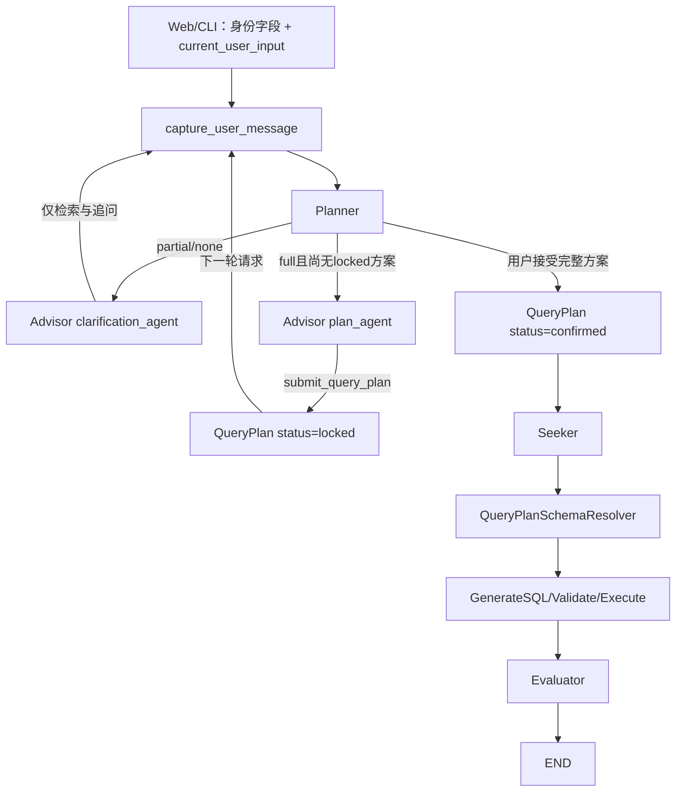

# 多智能体 Text2SQL 系统架构文档

> 最后更新：2026-07-31 | QueryPlan 两阶段确认与 Seeker 精确 Schema 执行已完成  
> [返回文档索引](../文档索引.md)

## 一、概述

本系统基于 LangGraph 构建多智能体协同框架，将用户的自然语言分析需求自动转换为 Hive SQL 并执行查询。架构对齐论文 SQL-MARS 的 Planner → Advisor/Seeker 双通道设计，并扩展了 Evaluator 评估沉淀模块实现系统自迭代。

**技术栈**：LangGraph（图编排）、LangChain（LLM 接口）、FAISS（向量检索）、PyHive（数据源连接）、MySQL（增强元数据存储 + 评估记录）、MemorySaver（进程内短期 checkpoint）、Flask（Web 服务）。

**四大智能体**：
| 智能体 | 职责 | 对应论文章节 |
|--------|------|-------------|
| **Planner** | 模糊度判定 + 路由分发 | 3.1.1 |
| **Advisor** | 模糊需求多轮澄清，三级渐进推荐 | 3.1.2 |
| **Seeker** | SQL 生成 + 校验 + 执行 + 答案格式化 | 3.1.3 |
| **Evaluator** | 多维度评分 + 优质对话沉淀 + 自迭代 | 3.1.4 |

---

## 二、整体架构



### 图结构

- **父图**（Supervisor）：记录用户消息 → Planner 路由决策 → Advisor/Seeker。
- **Advisor 澄清模式**：`clarification_agent` 只绑定库、表、字段检索工具，不绑定 `submit_query_plan`。
- **Advisor 方案模式**：`plan_agent` 在 `completeness=full` 时核对元数据并提交完整方案。
- **查询方案领域服务**：`lock_query_plan()` 将 Advisor 提案标准化为 `locked`；`confirm_query_plan()` 只允许 Planner 将合法 `locked` 方案升级为 `confirmed`。
- **Seeker 子图**：`retrieve_schema → generate_sql → validate_sql → execute_sql → build_final_answer → evaluator`。
- **状态隔离**：MemorySaver 以 `conversation_id:topic_id` 为 checkpoint `thread_id`，同一 Topic 多轮共享状态。
- **消息记忆**：`messages + add_messages` 统一保存用户、Advisor、工具和 Seeker 消息。

### 关键设计原则

1. **执行契约唯一**：`confirmed_plan` 是共享 State 中的唯一查询契约，具体阶段由 `status=locked/confirmed` 区分。
2. **模糊度硬门禁**：Planner 的 `completeness` 决定 Advisor 工具集合，`partial/none` 在工具层无法提交方案。
3. **职责分离**：Advisor 负责澄清或形成 `locked` 方案；Planner 负责理解用户是否接受完整方案；Seeker 只执行 `confirmed` 方案。
4. **不允许执行层猜测**：Seeker 不再通过向量检索重新选表选字段，方案缺失或物理 Schema 不一致时直接失败。
5. **检索证据不直接决定路由**：高相似候选数量保留为日志和调优指标，但不再作为把 `full` 强制降为 `partial` 的硬门禁；业务完整度由对话语义、元数据映射、QueryPlan 校验和用户确认共同决定。
6. **当前实现仍为单表**：QueryPlan 已预留 `tables`，但 `lock_query_plan()`、Resolver 和 SQL 一致性校验仍按单表工作。
7. **下一阶段功能优先**：在保留 confirmed_plan 业务契约的基础上新增 ExecutionPlan、关系元数据和确定性 Join Planner，再扩展分析性查询。

## 三、模块职责

### 3.1 State 分层设计（`state/`）

State 按“身份 → Topic → 公共流程 → 领域状态”分层：

```
state/
├── base_state.py       # IdentityState → TopicState → BaseState
├── planner_state.py    # route / planner_reason / planner_entities / confidence
├── advisor_state.py    # confirmed_plan / final_answer
├── seeker_state.py     # schema / SQL / 结果 / Evaluator 字段
└── agent_state.py      # GraphInput / GraphOutput / AgentState 聚合
```

核心规则：

- Web/CLI 只传 `conversation_id / topic_id / request_id / current_user_input`。
- `original_question / advisor_turns / confirmed_plan` 由 Graph State 管理。
- `messages` 使用 `add_messages` reducer，节点只返回本轮新增消息。
- `advisor_messages` 和 State 字段 `advisor_last_answer` 已删除；Planner 从标准消息中读取最近的 Advisor 回复。
- 子图编译时使用自己的 State，父图使用聚合后的 `AgentState`。
- 父图存在某个字段不代表子图一定能读取；跨 Agent 字段必须显式出现在子图 State Schema 中。
- 当前已发现 `AdvisorState` 缺少 `planner_entities/planner_reason`，会导致 Planner 输出进入 Advisor 后被过滤。目标方案是增加独立 `PlannerHandoffState`，由 PlannerState 和 AdvisorState 共同继承；该代码改造尚未实施。

详见 [State 与记忆系统架构](./State与记忆系统架构.md)。

---

### 3.2 Planner（`nodes/planner_node.py`）

**职责**：唯一调度中心，负责需求还原、模糊度判断、最终确认和父图路由。

核心流程：

1. 用“原始问题 + 本轮输入 + Advisor 最近回复 + 当前方案”组成检索问题，避免用户只回复“1”“A”时丢失语义。
2. 从表层和字段层 FAISS 召回候选元数据，并由 LLM 输出 `effective_query / tables / fields / completeness / accept_locked_plan`。
3. 目标设计使用 LLM 还原后的 `effective_query` 统计高相似候选数量，仅作为可观测指标记录到日志；当前代码仍存在覆盖 `completeness` 的硬分支，尚待删除。
4. `none/partial` 时路由 Advisor 的澄清模式，本轮不能提交方案；`full` 时进入方案模式，由工具和领域服务继续校验。
5. 需求明确但尚无最终确认时路由 Advisor 的方案模式，由 Advisor 生成完整 `locked` 方案。
6. 只有 `accept_locked_plan=true` 且 `confirm_query_plan()` 校验通过时，才写回 `status=confirmed` 并路由 Seeker。

**关键边界**：

- `planner_entities` 是语义分析结果，不是执行契约。
- 用户修改部分口径时，LLM 应尽量在当前 `locked` 方案基础上修改；如果方案根本错误，也允许重新规划。
- 最终确认后严格复用 locked 方案中的表和字段，禁止新一轮向量检索覆盖用户已确认内容。

**配置项（`config/planner.py`）**：

| 参数 | 当前值 | 说明 |
|---|---:|---|
| `TABLE_SEARCH_K` | 5 | 表级召回数量 |
| `COLUMN_SEARCH_K` | 7 | 字段级召回数量 |
| `HIGH_SIMILARITY_THRESHOLD` | 0.65 | 目标定位为高相似候选观测阈值；当前硬分支待删除 |
| `MAX_HIGH_SIMILARITY_COUNT` | 3 | 目标定位为统计和告警基线；当前仍参与硬路由 |
| `EXAMPLE_SIMILARITY_THRESHOLD` | 0.7 | 优质示例最低相似度 |

### 3.3 Advisor（`graphs/advisor_graph.py`）

**职责**：根据 Planner 模糊度选择澄清模式或方案模式，避免模型在业务口径不唯一时自行选字段。

**双 Agent 模式**：

| 模式 | 触发条件 | 可用工具 | 允许结果 |
|---|---|---|---|
| `clarification_agent` | `completeness=partial/none` | `search_databases/search_tables/search_columns` | 解释歧义并向用户追问 |
| `plan_agent` | `completeness=full` | 检索工具 + `submit_query_plan` | 提交完整 `locked` 方案 |

两个 Agent 使用同一套系统 Prompt，但绑定不同工具。澄清模式不是依靠 Prompt 要求模型“不要提交”，而是在工具层完全移除 `submit_query_plan`。

**上下文输入**：

- Planner 还原后的 `effective_query`。
- 用户本轮原始输入。
- Planner 候选表、已确定字段和 `completeness`。
- `planner_reason`，目标用于解释具体是哪一个指标、维度或表存在歧义；当前跨子图传递待 `PlannerHandoffState` 修复。
- 当前已有 `locked/confirmed` 方案。

**方案锁定流程**：

1. Planner 返回 `full`，Advisor 选择 `plan_agent`。
2. 必要时按库 → 表 → 字段逐层检索；提交方案前必须检索目标表字段。
3. 调用 `submit_query_plan` 提交完整提案。
4. 图级代码调用 `lock_query_plan()`，由程序派生 `tables/fields/status/locked_at` 并执行结构校验。
5. Advisor 将标准方案展示给用户，等待下一轮确认或局部修改。

**防幻觉机制**：

- `partial/none` 时提交工具根本不可用，模型无法产生真实 `locked` 方案。
- Prompt 要求结合 Planner 原因和检索结果，使用业务语言解释候选口径。
- 图级钩子校验目标表字段是否在工具结果中。
- `tables`、`fields`、状态和时间戳由领域服务维护，不交给 LLM 自由生成。
- Advisor 不能写入 `status=confirmed`，也不能直接路由 Seeker。

### 3.4 Seeker（`graphs/seeker_graph.py`）

**职责**：只执行最终确认的单表查询方案，完成精确 Schema 加载、SQL 生成、校验、执行和答案生成。

**当前管线**：

```text
retrieve_schema → generate_sql → validate_sql
    ├─ execute_sql → build_final_answer → evaluator
    └─ prepare_sql_fix → generate_sql
```

`retrieve_schema` 不再表示向量检索，而是调用 `QueryPlanSchemaResolver`：

1. 要求 `confirmed_plan.status == "confirmed"`。
2. 当前只允许一张表，并校验 `table == tables[0]`。
3. 要求完整 `database.table` 标识。
4. 通过 `list_tables()` 精确核对目标表，跨库同名表直接拒绝。
5. 通过 `describe_table()` 加载物理 Schema，并再次核对实际库表身份。
6. 校验 `confirmed_plan.fields` 全部存在。
7. 将确认表的完整物理 Schema 写入 `schema_context`。

当前加载完整表结构，是因为 `filters` 仍是字符串，暂时无法可靠提取所有过滤字段；这不是 Seeker 重新选字段。

**SQL 生成与一致性校验**：

- LLM 根据 `confirmed_plan + schema_context` 生成 SQL。
- 程序级校验逐项比对表、度量、维度、时间字段和过滤条件。
- 校验失败时进入修复或 fallback 逻辑，但不能改变确认方案。

**SQL 安全校验**：

- 自动追加 `LIMIT 1000`。
- AST 语法检查。
- 表名白名单和重试次数保护。

### 3.5 Evaluator（`nodes/evaluator_node.py`）

**职责**：多维度评分 + 优质对话沉淀，实现系统自迭代。

**评分指标**：
| 指标 | 类型 | 说明 |
|------|------|------|
| `time_score` | 客观 | LLM 响应耗时（归一化到 0-100） |
| `turn_score` | 客观 | `advisor_turns`（同一 Topic 的 Advisor 澄清次数） |
| `llm_self_score` | 主观 | LLM 对上下文连贯性、需求满足度的自评（0-100） |
| `user_score` | 主观 | 用户打分（1-5 星，映射到 0-100） |

**加权综合分公式**：
```
comprehensive_score = W_TIME * time_score + W_TURN * turn_score
                    + W_LLM_SELF * llm_self_score + W_USER * user_score
```

**优质对话存储**：
- `comprehensive_score >= 80` → 标记 `is_high_quality = 1`
- 生成 `example_hash`（MD5 of question + SQL），用于去重
- **MySQL**：`evaluated_dialogues` 表存储完整记录
- **FAISS**：`example_faiss_index` 存储向量化后的对话示例（`resolved_question` + `generated_sql`）
- **去重机制**：hash 相同 或 余弦相似度 > 0.95 → 跳过写入
- **用户评分联动**：用户打分变化 → 重算综合分 → `is_high_quality` 状态变化 → FAISS 自动增删
- **非阻断边界**：Evaluator 位于 FinalAnswer 之后，LLM 自评、MySQL 或 FAISS 异常记录为 `node.degraded`，返回默认评估值，不得把已经完成的查询改成失败。

**配置项（`config/evaluator.py`）**：
| 参数 | 默认值 | 说明 |
|------|--------|------|
| `HIGH_QUALITY_THRESHOLD` | 80 | 优质对话分数线 |
| `WEIGHT_TIME` | 0.2 | 响应时间权重 |
| `WEIGHT_TURNS` | 0.2 | 交互轮次权重 |
| `WEIGHT_LLM_SELF` | 0.4 | LLM 自评权重 |
| `WEIGHT_USER` | 0.2 | 用户评分权重 |

### 3.6 状态可观测性与日志（`runtime/graph_logger.py`）

- 使用 `ContextVar` 自动附加 `conversation_id/topic_id/request_id/graph_thread_id`。
- 日志格式为 JSON Lines，文件为 `agentTest/logs/langgraph_app.jsonl`。
- 使用 `TimedRotatingFileHandler` 按天滚动，默认保留 14 天。
- 事件覆盖 `request.* / node.* / route.decided / state.changed`。
- 核心异常在 Web 请求边界生成 `error_id` 并记录完整堆栈，前端只展示安全提示。
- Intent Classifier、Evaluator 等可降级能力使用 `node.degraded`，不影响主查询结果。

具体查询命令和排障流程见 [日志使用与问题排查指南](../指南/日志使用与问题排查指南.md)。

### 3.6 状态可观测性与日志（`runtime/graph_logger.py`）

- 使用 `ContextVar` 自动附加 `conversation_id/topic_id/request_id/graph_thread_id`。
- 日志格式为 JSON Lines，文件为 `agentTest/logs/langgraph_app.jsonl`。
- 使用 `TimedRotatingFileHandler` 按天滚动，默认保留 14 天。
- 事件覆盖 `request.* / node.* / route.decided / state.changed`。
- 核心异常在 Web 请求边界生成 `error_id` 并记录完整堆栈，前端只展示安全提示。
- Intent Classifier、Evaluator 等可降级能力使用 `node.degraded`，不影响主查询结果。

具体查询命令和排障流程见 [日志使用与问题排查指南](../指南/日志使用与问题排查指南.md)。

---

## 四、数据流转

```text
Hive 表结构
  ↓ metadata_enricher（采集 + LLM 增强）
MySQL（enriched_databases / enriched_tables / enriched_columns）
  ↓ Document Builder + build_indexes
FAISS（db / table / column）
  ↓ Planner 语义识别与 completeness 判断
partial/none → Advisor clarification_agent → 追问用户
full → Advisor plan_agent → submit_query_plan
  ↓ lock_query_plan
QueryPlan(status=locked)
  ↓ 用户下一轮确认 + Planner confirm_query_plan
QueryPlan(status=confirmed)
  ↓ QueryPlanSchemaResolver + HiveMetadataProvider
精确 schema_context
  ↓ GenerateSQL → ValidateSQL → ExecuteSQL
查询结果
  ↓ Evaluator
MySQL evaluated_dialogues + example_faiss_index
```

执行链路与检索链路已经分离：Planner/Advisor 可以使用语义检索发现候选，Seeker 只能按最终契约精确执行。

## 五、FAISS 索引布局

所有索引统一路径：`agentTest/langgraph_app/cache/`。

| 索引 | 当前状态 | 消费场景 |
|---|---|---|
| `db_faiss_index` | 活动 | Advisor 库级引导 |
| `table_faiss_index` | 活动 | Planner 表识别、Advisor 表推荐 |
| `column_faiss_index` | 活动 | Planner 字段识别、Advisor 字段推荐 |
| `example_faiss_index` | 活动 | Planner、Advisor、GenerateSQL Few-shot |
| `enriched_faiss_index` | 旧兼容资产 | 已退出当前 Graph Runtime，不再供 Seeker 使用 |
| `schema_faiss_index` | 对比资产 | 原始 Schema 对比，不进入主链路 |

Seeker 的 `schema_context` 来自 `QueryPlanSchemaResolver + HiveMetadataProvider`，不是 FAISS 召回结果。

## 六、Web 前端（`web/`）

### 启动方式

```bash
# 安装依赖
pip install flask flask-cors

# 启动服务
python web/server.py

# 浏览器打开
http://localhost:5000
```

### 功能

| 功能 | 说明 |
|------|------|
| 🧠 意图识别 | LLM 自动区分闲聊和查询 |
| ➕ 新建对话 | 左侧栏「+ 新建对话」，每个对话使用独立 `conversation_id` |
| 📋 对话列表 | 左侧栏显示历史对话，支持删除和重命名，点击切换 |
| 🔍 思考过程 | AI 消息下方折叠面板：Planner 路由、命中表/字段、评分详情 |
| 📊 查看 SQL | AI 消息下方折叠面板：实际执行的 SQL 语句 |
| ⭐ 用户打分 | Evaluator 打分入口，1-5 星评分，提交后自动同步 FAISS |

### API

| 方法 | 路径 | 说明 |
|------|------|------|
| `POST` | `/api/conversations` | 新建对话 → `conversation_id` |
| `GET` | `/api/conversations` | 列出所有对话 |
| `PUT/DELETE` | `/api/conversations/{conversation_id}` | 重命名或删除对话 |
| `POST` | `/api/chat` | 传入 `conversation_id + message`，返回 SSE 流式结果 |
| `POST` | `/api/score` | 传入 `conversation_id` 提交用户评分（1-5） |

---

## 七、配置项汇总

| 文件 | 配置项 | 默认值 | 说明 |
|------|--------|--------|------|
| `config/planner.py` | `TABLE_SEARCH_K` | 5 | Planner FAISS 表检索数量 |
| | `COLUMN_SEARCH_K` | 7 | Planner FAISS 字段检索数量 |
| | `HIGH_SIMILARITY_THRESHOLD` | 0.65 | 高相似候选观测阈值（余弦距离换算） |
| | `MAX_HIGH_SIMILARITY_COUNT` | 3 | 目标为历史观测基线；当前强制路由分支待删除 |
| | `EXAMPLE_SIMILARITY_THRESHOLD` | 0.7 | 优质示例最低相似度 |
| `config/advisor.py` | `SEARCH_DB_K` | 3 | Advisor 库检索数量 |
| `config/advisor.py` | `SEARCH_TABLE_K` | 5 | Advisor 表检索数量 |
| | `SEARCH_COLUMN_K` | 10 | Advisor 字段检索数量 |
| | `MAX_DEMO_ADVISOR_TURNS` | 10 | 同一话题 Advisor 追问上限 |
| | `MAX_COLUMN_CHECK_RETRIES` | 3 | 缺少字段检索时的图级重试上限 |
| `config/evaluator.py` | `HIGH_QUALITY_THRESHOLD` | 80 | 优质对话分数线 |
| | `WEIGHT_TIME` | 0.2 | 响应时间权重 |
| | `WEIGHT_TURNS` | 0.2 | 交互轮次权重 |
| | `WEIGHT_LLM_SELF` | 0.4 | LLM 自评权重 |
| | `WEIGHT_USER` | 0.2 | 用户评分权重 |
| `config/settings.py` | 环境变量 | — | LLM 模型名、API Key、Embedding 模型 |

---

## 八、入口命令速查

```bash
# 元数据采集增强（Hive → MySQL，增量）
python -m agentTest.metadata.metadata_enricher

# 构建向量索引（MySQL → FAISS）
python -m agentTest.scripts.build_indexes

# 强制重建所有索引
python -m agentTest.scripts.build_indexes --force

# 查看向量库内容
python -m agentTest.scripts.view_faiss

# CLI 聊天
python -m agentTest.langgraph_app.demo

# Web 服务
python web/server.py
```

---

## 九、文件索引

```
agentTest/
├── config/                          # 全局配置
│   ├── settings.py                  # 环境变量读取
│   ├── planner.py                   # Planner 阈值
│   ├── advisor.py                   # Advisor 参数
│   └── evaluator.py                 # Evaluator 权重与阈值
├── metadata/                        # 元数据层
│   ├── metadata_enricher.py         # 离线：Hive → MySQL 增强
│   ├── mysql_store.py               # MySQL 读写 + 增量检测
│   └── hive_meta_provider.py        # Hive 原始 schema 读取
├── langchain_app/                   # RAG 基础设施
│   ├── app_builder.py               # RAG 与工具构建入口
│   ├── embeddings/
│   │   └── bailian_embeddings.py    # 百炼 Embedding（含批量切分）
│   ├── vectorstores/
│   │   ├── schema_vector_store.py   # FAISS 构建/加载/落盘
│   │   └── example_vector_store.py  # 示例向量库（去重 + 增删同步）
│   ├── documents/                   # Document 构建器
│   │   ├── enriched_db_documents.py     # 库级
│   │   ├── enriched_table_documents.py  # 表级
│   │   ├── enriched_column_documents.py # 字段级
│   │   ├── enriched_schema_documents.py # 单层混合（旧）
│   │   └── schema_documents.py          # 原始 schema
│   └── retrievers/
│       ├── schema_retriever.py      # 原始版检索器
│       └── enriched_schema_retriever.py # 增强版检索器
├── langgraph_app/                   # 多智能体框架核心
│   ├── demo.py                      # CLI 多轮交互入口
│   ├── message_utils.py             # 标准消息读取与可见对话上下文
│   ├── state/                       # 分层 State
│   │   ├── base_state.py
│   │   ├── query_plan.py             # QueryPlan 契约与校验
│   │   ├── planner_state.py
│   │   ├── advisor_state.py
│   │   ├── seeker_state.py
│   │   └── agent_state.py
│   ├── graphs/                      # 图定义
│   │   ├── supervisor_graph.py      # 父图
│   │   ├── seeker_graph.py          # Seeker 子图（含 Evaluator）
│   │   └── advisor_graph.py         # Advisor 子图（ReAct Agent）
│   ├── nodes/                       # 节点实现
│   │   ├── capture_user_message_node.py # 统一记录用户消息
│   │   ├── planner_node.py          # Planner 调度
│   │   ├── generate_sql_node.py     # SQL 生成 + 一致性校验
│   │   ├── validate_sql_node.py     # SQL 语法与安全校验（自动补 LIMIT）
│   │   ├── execute_sql_node.py      # Hive 执行
│   │   ├── retrieve_schema_node.py  # confirmed_plan 精确 Schema 加载
│   │   ├── build_final_answer_node.py # 最终答案生成
│   │   └── evaluator_node.py        # Evaluator 评估入库
│   ├── prompts/                     # LLM 提示词
│   │   ├── planner_prompt.py
│   │   ├── advisor_prompt.py
│   │   ├── sql_generation_prompt.py
│   │   └── evaluator_prompt.py
│   ├── routers/
│   │   ├── planner_router.py        # Planner → Seeker/Advisor
│   │   └── sql_router.py            # SQL 校验后路由
│   ├── tools/
│   │   ├── advisor_tools.py         # Advisor 检索工具
│   │   └── submit_query_plan.py     # Advisor 完整方案提交工具
│   ├── services/                    # 查询方案领域服务
│   │   ├── query_plan_service.py    # locked/confirmed 状态转换
│   │   └── query_plan_schema_resolver.py # 精确物理 Schema 解析
│   ├── runtime/
│   │   ├── graph_runtime.py         # 活动向量库、Provider 与 Resolver 初始化
│   │   └── graph_logger.py          # 统一日志
│   └── cache/                       # FAISS 向量索引（统一路径）
├── scripts/                         # 运维脚本
│   ├── build_indexes.py             # MySQL → FAISS 构建
│   └── view_faiss.py                # 查看 FAISS 内容
├── web/                             # Web 前端
│   ├── server.py                    # Flask API 服务
│   ├── intent_classifier.py         # LLM 意图识别
│   └── static/
│       ├── index.html               # ChatGPT 风格主页面
│       └── app.js                   # 前端交互逻辑
├── logs/                            # 运行时日志
└── docs/                            # 统一文档目录
```

相关专文：

- [State 与记忆系统架构](./State与记忆系统架构.md)
- [元数据与向量检索架构](./元数据与向量检索架构.md)


