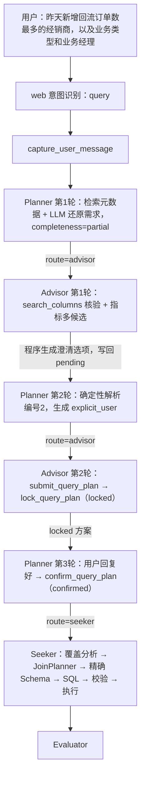
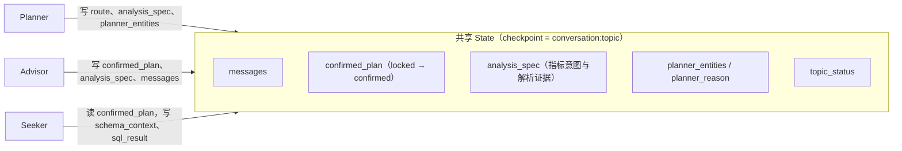
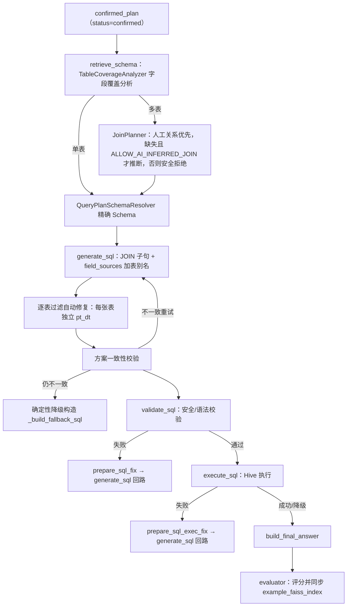
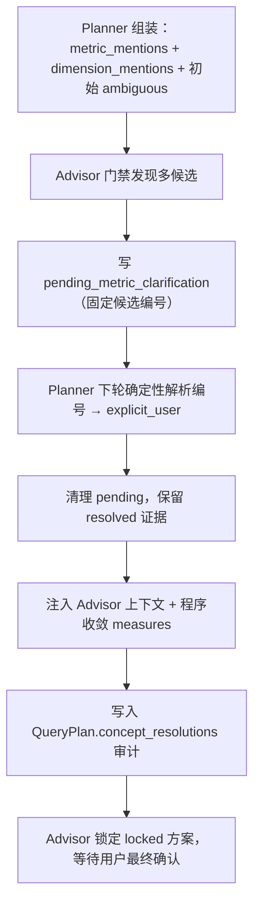

# 多表查询执行过程详解（含 AnalysisSpec 说明）

> 最后更新：2026-08-06
> 适用链路：Planner → Advisor → Seeker（多表安全 Join 场景）
> [返回文档索引](../文档索引.md)

本文用一个贯穿示例讲解一次多表查询的完整执行过程，包括：

- 各智能体（Planner / Advisor / Seeker）之间的状态传递；
- 每个智能体给模型的输入、模型输出、程序处理后的 State 变化；
- 哪些状态是各智能体独有、哪些需要跨子图共享；
- AnalysisSpec 在整个链路中的作用（单独重点说明）。

---

## 一、总体执行流程



一次多表查询通常需要三轮以上交互：

1. 首轮 Planner 只能确定“业务概念 + 候选表”，指标存在多口径 → 交给 Advisor 澄清；
2. 用户选择口径后，Planner 确定性解析选择，Advisor 生成 `locked` 方案；
3. 用户最终确认后，Planner 把方案升级为 `confirmed`，Seeker 才允许执行。

---

## 二、状态：独有 vs 共享

所有子图使用同一个 `AgentState` 和同一个 checkpoint（`thread_id = conversation_id:topic_id`），同名字段自动透传。

### 2.1 共享状态

| 字段 | 谁写 | 谁读 | 用途 |
|---|---|---|---|
| `messages` | 全部（`add_messages` 增量合并） | Planner 读 `advisor_last_answer`，Advisor 读完整历史 | 话题消息记忆 |
| `topic_status` | 各阶段更新 | 全部 | 生命周期：new → clarifying → confirmed → generating_sql → validating_sql → executing → completed |
| `confirmed_plan` | Advisor 写 `locked`，Planner 升级 `confirmed` | Seeker 只读 | Advisor → Seeker 的唯一执行契约 |
| `analysis_spec` | Planner 组装，Advisor 回写 pending/resolutions | Planner 消费 pending，Advisor 读已确认口径 | 跨轮指标意图与解析证据 |
| `planner_entities / planner_reason` | Planner 写 | Advisor 读（`PlannerHandoffState`） | Planner → Advisor 交接契约 |
| `original_question / current_user_input` | 入口写，每轮更新 | Planner、Advisor | 需求还原依据 |
| `conversation_id / topic_id / request_id` | 入口写 | 全部 | 身份与日志关联 |

### 2.2 各智能体独有状态

| 智能体 | 独有字段 | 说明 |
|---|---|---|
| Planner | `route`、`planner_confidence` | `route` 由 `planner_router` 消费；LLM 输出 `PlannerOutput` 不进 State，只拆成 `planner_entities` |
| Advisor | `advisor_turns`、`final_answer` | `advisor_turns` 每轮自增；`final_answer` 是最终对用户可见的回复 |
| Seeker | `schema_context / schema_documents`、`generated_sql / sql_valid / sql_error / sql_result`、`retry_count / sql_fix_reason`、`sql_exec_failed / sql_exec_error / exec_retry_count`、`result_id / result_preview`、`evaluator_score / evaluator_self_score / evaluator_dialogue_id / total_topic_time_ms` | 只在 Seeker 子图内部使用 |



---

## 三、完整示例：三轮走查

示例需求：**“昨天新增回流订单数最多的经销商，以及业务类型和业务经理”**。

涉及表：事实表 `ads_trip.ads_exchange_platform_operations_report_day` + 维表 `dim_trip.dim_company`，复合 Join 键 `pt_platform + company_id`。

### 3.1 第 1 轮：Planner 判定 partial → Advisor 澄清

#### Planner

- 读入 State：`original_question`、`current_user_input`、`confirmed_plan={}`、`messages=[]`、`advisor_last_answer=""`。
- 给模型的输入（`prompts/planner_prompt.py` 的 `PLANNER_USER_TEMPLATE`）：

```text
【Topic 最初问题】昨天新增回流订单数最多的经销商，以及业务类型和业务经理
【用户本轮输入】昨天新增回流订单数最多的经销商，以及业务类型和业务经理
【当前查询方案】当前尚未形成查询方案。
【Advisor 上一轮回复】（空）
【分层元数据检索结果】[表 top5 增强元数据][字段 top7 增强元数据]
【历史相似问题】（仅问题摘要，不注入历史 SQL）
```

- 模型输出（`PlannerOutput`）：

```json
{
  "effective_query": "昨天新增回流订单数最多的经销商，以及业务类型和业务经理",
  "accept_locked_plan": false,
  "tables": ["ads_trip.ads_exchange_platform_operations_report_day", "dim_trip.dim_company"],
  "fields": [],
  "completeness": "partial",
  "complex": true,
  "metric_mentions": ["新增回流订单数"],
  "dimension_mentions": ["经销商名称", "业务类型", "业务经理"],
  "analysis_type": "ranking",
  "reason": "能定位表和维度，但“新增回流订单数”存在多个候选口径"
}
```

- 程序处理后写入 State：

```json
{
  "route": "advisor",
  "topic_status": "clarifying",
  "planner_entities": {
    "effective_query": "昨天新增回流订单数最多的经销商，以及业务类型和业务经理",
    "tables": ["ads_trip.xxx", "dim_trip.dim_company"],
    "fields": [],
    "completeness": "partial",
    "table_candidates": [],
    "column_candidates": []
  },
  "planner_reason": "LLM 判定元数据映射为 partial：...",
  "analysis_spec": {
    "metric_mentions": ["新增回流订单数"],
    "metric_resolutions": [
      {"mention": "新增回流订单数", "status": "ambiguous", "selected_field": "", "candidates": []}
    ]
  }
}
```

Planner 不做的事：不选 `new_order / really_add_order` 等物理字段、不生成 SQL、不把方案置为 confirmed。

#### Advisor

- 读入 State：`planner_entities`、`planner_reason`、`analysis_spec`、`messages`。
- 给模型的输入：`ADVISOR_SYSTEM_PROMPT` + 本轮注入上下文（`graphs/advisor_graph.py`）：

```text
【Planner还原的当前完整需求】...
【用户本轮原始输入】...
【Planner候选表】ads_trip.xxx, dim_trip.dim_company
【Planner已确定字段】（空）
【Planner模糊度】partial
【Planner判断原因】...
【本轮操作模式】Planner仅完成初步判断。请先使用工具核验；如果存在多个业务口径，只向用户询问一个关键问题...
【历史相似问题（仅供参考，不能代替当前用户确认口径）】1. 问题：...
Planner 检索结果 - 候选字段：{table}.{field} (相似度=0.9x) - 原始备注；别名: ...
```

- 模型输出（ReAct）：先调用 `search_columns(table=事实表)`、`search_columns(table=维表)`，再输出追问草稿。
- 程序处理：本轮未调用 `submit_query_plan` → 走预校验分支，`MetricAmbiguityValidator` 用真实元数据生成多候选，`MetricClarificationService.build_clarification_message` 生成最终回复：

```text
“新增回流订单数”存在多个口径，请选择：
1. 新增回流订单数（reflow_addition_order）
2. 净增回流订单数（really_add_order）
...
请回复编号、字段名或完整中文含义。
```

- 写入 State：

```json
{
  "messages": [AIMessage(最终澄清文本, name="advisor")],
  "advisor_turns": 1,
  "topic_status": "clarifying",
  "analysis_spec": {
    "pending_metric_clarification": {
      "mention": "新增回流订单数",
      "options": [
        {"index": 1, "field": "reflow_addition_order", "meaning": "新增回流订单数"},
        {"index": 2, "field": "really_add_order", "meaning": "净增回流订单数"}
      ]
    },
    "metric_resolutions": [{"status": "ambiguous", "candidates": []}]
  }
}
```

关键点：候选不仅展示给用户，还写回 `analysis_spec.pending_metric_clarification`，下一轮编号以这份固定顺序为准。此时 `confirmed_plan` 仍为空，不能进入 Seeker。

### 3.2 第 2 轮：Planner 消费 pending → Advisor 锁定

#### Planner

- 读入 State：`current_user_input="2"`、`advisor_last_answer=上轮候选文本`、`analysis_spec`（含 pending）。
- LLM 之前的确定性步骤（`nodes/planner_node.py`）：`MetricClarificationService.resolve_pending_selection("2", pending)` 命中 option 2，先写好解析记录 `{mention, status=resolved, selected_field=..., source=explicit_user}`，并沿用 pending 的 mention，避免“2”被 LLM 重写成新指标名。
- 给模型的输入：`current_user_input="2"`、`advisor_last_answer=候选1-4全文`，其余同前。
- 模型输出：

```json
{
  "effective_query": "昨天净增回流订单数最多的经销商，以及业务类型和业务经理",
  "tables": ["ads_trip.xxx", "dim_trip.dim_company"],
  "completeness": "partial",
  "accept_locked_plan": false,
  "metric_mentions": ["净增回流订单数"],
  "dimension_mentions": ["经销商名称", "业务类型", "业务经理"]
}
```

- 程序处理：`analysis_spec.metric_resolutions` 中该 mention 为 `resolved`（保留上轮证据），清理 `pending_metric_clarification`；`route=advisor`（需求已解决但还没有 locked 方案）。

#### Advisor

- 给模型的输入多了一段（`MetricClarificationService.build_resolution_context`）：

```text
【程序已确认指标口径】
- 新增回流订单数 -> ads_trip.xxx.really_add_order
这些字段来自用户明确选择，提交方案时必须直接使用，不得再次追问或改写。
```

- 模型输出：核验字段后调用 `submit_query_plan`：

```json
{
  "tables": ["ads_trip.xxx", "dim_trip.dim_company"],
  "measures": ["really_add_order"],
  "dimensions": ["company_name", "biz_type", "manager_name"],
  "time_field": "pt_dt",
  "time_range": "昨天",
  "field_sources": [
    "ads_trip.xxx.really_add_order",
    "dim_trip.dim_company.company_name"
  ],
  "order_by": [{"field": "really_add_order", "direction": "DESC"}],
  "result_limit": 1,
  "concept_resolutions": [
    {"mention": "新增回流订单数", "field": "really_add_order", "source": "explicit_user"}
  ]
}
```

- 程序处理（`graphs/advisor_graph.py` + `services/query_plan_service.py`）：
  1. 图级拦截：已对两张表调用过 `search_columns`；
  2. `MetricAmbiguityValidator.validate`：`really_add_order` 落在候选或上轮已确认字段内 → `resolved`；否则丢弃提交并重新追问；
  3. 程序按 resolved 字段收敛 `measures`（LLM 漏传或改写时强制覆盖）；
  4. `lock_query_plan`：标准化 `fields`、从 `field_sources` 推导 `tables/table`、为每张表自动补齐独立 `table_plans`、写入 `concept_resolutions`、`status=locked`；
  5. `final_answer` 由 `_build_confirmation_message` 程序生成：

```text
查询方案确认：
- 表：运营日报、经销商维表
- 指标：净增回流订单数（really_add_order）
- 维度：经销商名称、业务类型、业务经理
- 时间：昨天（pt_dt）
回复“好”开始查询。
```

- 写入 State：`confirmed_plan={status:"locked", ...}`、`advisor_turns=2`、`messages`。

### 3.3 第 3 轮：Planner 确认 → Seeker 多表执行

#### Planner

- 给模型的输入：`confirmed_context`（locked 方案全文）+ `advisor_last_answer=确认消息` + `current_user_input="好"`。
- 模型输出：`accept_locked_plan=true`，`tables/fields` 复用方案，`completeness=full`。
- 程序处理：`confirm_query_plan` 校验 `status=="locked"` → 升级 `status="confirmed"` → `route=seeker`，`topic_status=confirmed`。只有到这里 Seeker 才被允许执行。

#### Seeker

- 读入 State：`confirmed_plan`（confirmed）。
- `retrieve_schema`（纯程序，无 LLM）：
  1. `TableCoverageAnalyzer.analyze` → `needed_tables=[事实表,维表]`、`field_sources`；
  2. 非单表 → `JoinPlanner.plan` → `joins=[{left, right, left_keys:["pt_platform","company_id"], right_keys:["pt_platform","company_id"]}]`、`target_grain`；
  3. `QueryPlanSchemaResolver.resolve` → `schema_context`（两表精确物理 Schema）。
  - 写入：`confirmed_plan.joins/field_sources/target_grain`、`schema_context`、`topic_status=generating_sql`。
- `generate_sql`（LLM）：输入 `用户问题 + confirmed_section + example_section（此时才注入历史 SQL 案例）+ schema_context`，输出带 JOIN、GROUP BY、TOP1 的 Hive SQL；程序后处理：逐表过滤自动修复（每张表独立 `pt_dt`）→ 方案一致性校验 → 重试/确定性降级。写入：`generated_sql`、`topic_status=validating_sql`。
- `validate_sql → execute_sql → build_final_answer`：程序校验、Hive 执行、生成自然语言答案。写入：`sql_valid/sql_result/result_preview/final_answer`，最终 `topic_status=completed`。

---

## 四、Seeker 多表执行链路



---

## 五、AnalysisSpec 重点解释

### 5.1 它是什么

`AnalysisSpec`（`state/analysis_spec.py`）是从自然语言中提取的**结构化业务分析意图**，跨轮保存在 Topic State 中。它回答“用户到底想问什么业务概念”，而不关心“这些概念落在哪张表的哪个物理字段”。

核心思想：**业务概念与物理字段解耦**。Planner 只提取 `metric_mentions`（如“新增回流订单数”），不选 `new_order / really_add_order`；物理字段由 Advisor 检索 + 程序门禁 + 用户确认共同解析。

### 5.2 字段结构

```json
{
  "analysis_type": "ranking",
  "metric_mentions": ["新增回流订单数"],
  "dimension_mentions": ["经销商名称", "业务类型", "业务经理"],
  "time_range": "",
  "time_grain": "",
  "filters": [],
  "order_by": [],
  "limit": 0,
  "comparison": {},
  "metric_resolutions": [
    {
      "mention": "新增回流订单数",
      "concept_type": "metric",
      "status": "ambiguous",
      "selected_field": "",
      "selected_table": "",
      "resolution_source": "",
      "candidates": []
    }
  ],
  "pending_metric_clarification": {
    "clarification_id": "request-id",
    "mention": "新增回流订单数",
    "options": [
      {"index": 1, "field": "reflow_addition_order", "table": "...", "meaning": "新增回流订单数"},
      {"index": 2, "field": "really_add_order", "table": "...", "meaning": "净增回流订单数"}
    ]
  }
}
```

### 5.3 五大作用

1. **跨轮保留解析证据，防止每轮被 LLM 重写**
   用户上一轮选了“净增回流订单数”，`metric_resolutions` 中的 `resolved` 记录会一直保留。即使本轮 LLM 漏传 `concept_resolutions` 或候选重新召回排序，Validator 仍认可上轮真实候选中的字段，不会退回 `ambiguous` 重复追问。

2. **是指标歧义门禁的事实来源**
   `MetricAmbiguityValidator` 用 `metric_mentions` 决定校验哪些概念，用 `metric_resolutions.candidates` 判断“多候选未选择”还是“唯一口径/已确认”。历史案例和最高相似度只能参与候选排序，不能产生解析证据。

3. **pending 固化候选编号，保证“第二个”可解析**
   `pending_metric_clarification` 在首轮把候选列表和编号顺序固化写入 State。下一轮 Planner 在 LLM 之前用 `MetricClarificationService.resolve_pending_selection` 确定性解析“2 / 第二个 / 字段名 / 中文含义”，编号语义不随后续召回排序变化，从根上解决“模型已理解但 State 仍 ambiguous”的循环确认。

4. **把已确认口径注入 Advisor，程序收敛 measures**
   `build_resolution_context` 把“mention -> table.field”注入 Advisor 上下文；Advisor 提交方案时若漏传或改写，程序按 resolved 字段强制收敛 `proposed_plan["measures"]`，再写入 `QueryPlan.concept_resolutions` 做审计。

5. **与 QueryPlan 明确分工**
   - AnalysisSpec：业务意图层，跨轮演进，允许存在 `ambiguous`；
   - QueryPlan：物理方案层，只有 `locked → confirmed` 两态，未解决候选不允许进入。
   - 只有指标全部 resolved 后，QueryPlan 才被允许锁定。

### 5.4 生命周期



### 5.5 涉及代码文件

| 文件 | 职责 |
|---|---|
| `agentTest/langgraph_app/state/analysis_spec.py` | AnalysisSpec 与 ConceptResolution 定义 |
| `agentTest/langgraph_app/services/metric_ambiguity_validator.py` | 候选收集、字段合法性校验、已解析证据保持 |
| `agentTest/langgraph_app/services/metric_clarification_service.py` | 候选固化、编号解析、状态回写、澄清文本、上下文注入 |
| `agentTest/langgraph_app/nodes/planner_node.py` | 组装 AnalysisSpec，LLM 前消费 pending 选择 |
| `agentTest/langgraph_app/graphs/advisor_graph.py` | 门禁集成、澄清选项生成、锁定方案 |
| `agentTest/langgraph_app/state/query_plan.py` | QueryPlan 增加 `concept_resolutions` 审计字段 |

---

## 六、一句话总结

- 共享靠同一 checkpoint：`confirmed_plan` 是 Advisor → Seeker 的唯一执行契约，`analysis_spec` 是跨轮口径证据，`planner_entities/planner_reason` 是 Planner → Advisor 交接契约，`messages` 是全链路记忆。
- 独有只在子图内部使用：Planner 的 `route`、Advisor 的 `advisor_turns`、Seeker 的 `schema_context/generated_sql/sql_result/evaluator_*` 不跨子图传递。
- 需求分层确定：Planner 定业务概念与候选表 → Advisor 定物理字段并锁定方案 → 用户授权 `confirmed` → Seeker 只按 `confirmed_plan` 精确执行，全程不做二次语义选表选字段。
