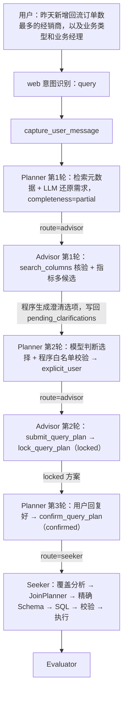
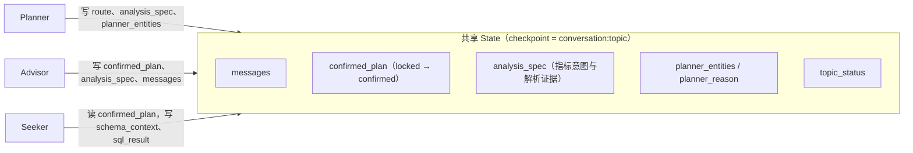
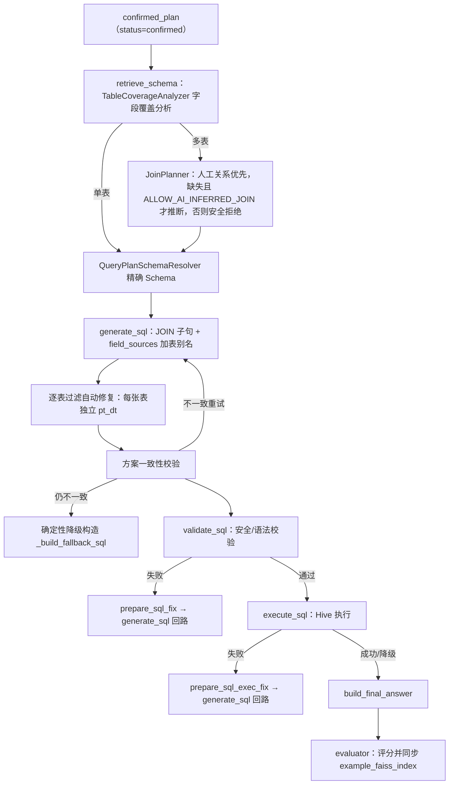
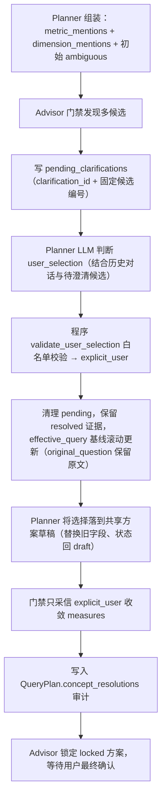

# 多表查询执行过程详解

> ⚠️ **现状提示（2026-08-27）**：本文的 State 示例基于早期"Topic + pending_clarifications"流程编写。当前已**去 Topic 化 + 去 pending 状态机**：整对话共享一个 Checkpoint（`thread_id = conversation_id`），`original_question` 已删除、`pending_clarifications`/`metric_resolutions` 不再跨轮保存，改为 `effective_query` 每轮改写 + 完整对话历史还原。示例中的字段/状态机请以 [State 与记忆系统架构](./State与记忆系统架构.md) 和 [语义层架构](./语义层架构.md) 为准，本文仅保留多表执行链路的流程讲解。（含 AnalysisSpec 说明）

> 最后更新：2026-08-12
> 适用链路：Planner → Advisor → Seeker（多表安全 Join 场景）
> [返回文档索引](../文档索引.md)

本文用一个贯穿示例讲解一次多表查询的完整执行过程，包括：

- 各智能体（Planner / Advisor / Seeker）之间的状态传递；
- 每个智能体给模型的输入、模型输出、程序处理后的 State 变化；
- 哪些状态是各智能体独有、哪些需要跨子图共享；
- AnalysisSpec 在整个链路中的作用（单独重点说明）。

---

## 一、总体执行流程



一次多表查询通常需要三轮以上交互：

1. 首轮 Planner 只能确定“业务概念 + 候选表”，指标存在多口径 → 交给 Advisor 澄清；
2. 用户选择口径后，Planner 模型判断选择 + 程序白名单校验，Advisor 同轮生成 `locked` 方案；
3. 用户最终确认后，Planner 把方案升级为 `confirmed`，Seeker 才允许执行。

---

## 二、状态：独有 vs 共享

所有子图运行在同一份 `AgentState`（父图合并态 = `PlannerState` + `AdvisorState` + `SeekerState`）上，使用同一个 checkpoint（`thread_id = conversation_id`，去 Topic 化后整对话共享），同名字段自动透传；各智能体只读写**自己子 State 的独有字段 + 共享 `BaseState` 字段**，下文每个读/写点都标注了归属的子 State。

### 2.1 共享状态

| 字段                                        | 谁写                                        | 谁读                                            | 用途                                                                                          |
| ----------------------------------------- | ----------------------------------------- | --------------------------------------------- | ------------------------------------------------------------------------------------------- |
| `messages`                                | 全部（`add_messages` 增量合并）                   | Planner 读 `advisor_last_answer`，Advisor 读完整历史 | 话题消息记忆                                                                                      |
| `topic_status`                            | 各阶段更新                                     | 全部                                            | 当轮请求阶段：clarifying → confirmed → generating_sql → validating_sql → executing → completed |
| `confirmed_plan`                          | Advisor 写 `locked`，Planner 升级 `confirmed` | Seeker 只读                                     | Advisor → Seeker 的唯一执行契约                                                                    |
| `analysis_spec`                           | Planner 组装                                  | Planner、Advisor                                  | 仅当轮指标/维度意图（去 pending 后不再跨轮保存解析证据/候选快照）                                        |
| `planner_entities / planner_reason`       | Planner 写                                 | Advisor 读（`PlannerHandoffState`）              | Planner → Advisor 交接契约                                                                      |
| `effective_query / current_user_input`    | 入口写，Planner 每轮改写                           | Planner、Advisor                               | 需求还原依据（`original_question` 已删除，`effective_query` 滚动更新）                                    |
| `conversation_id / topic_id / request_id` | 入口写                                       | 全部                                            | 身份与日志关联                                                                                     |

### 2.2 各智能体独有状态

| 智能体     | 独有字段                                                                                                                                                                                                                                                                                              | 说明                                                                                   |
| ------- | ------------------------------------------------------------------------------------------------------------------------------------------------------------------------------------------------------------------------------------------------------------------------------------------------- | ------------------------------------------------------------------------------------ |
| Planner | `route`、`planner_confidence`                                                                                                                                                                                                                                                                      | `route` 由 `planner_router` 消费；LLM 输出 `PlannerOutput` 不进 State，只拆成 `planner_entities` |
| Advisor | `advisor_turns`、`final_answer`                                                                                                                                                                                                                                                                    | `advisor_turns` 每轮自增；`final_answer` 是最终对用户可见的回复                                      |
| Seeker  | `schema_context / schema_documents`、`generated_sql / sql_valid / sql_error / sql_result`、`retry_count / sql_fix_reason`、`sql_exec_failed / sql_exec_error / exec_retry_count`、`result_id / result_preview`、`evaluator_score / evaluator_self_score / evaluator_dialogue_id / total_topic_time_ms` | 只在 Seeker 子图内部使用                                                                     |



---

## 三、完整示例：三轮走查

> **统一 State 说明**：`AgentState` 是父图合并态，由 `PlannerState / AdvisorState / SeekerState`（均继承 `BaseState → TopicState → IdentityState`）合并而来。各智能体读写**自己子 State 的独有字段 + 共享 `BaseState` 字段**，运行在同一份 `AgentState` 上；下文每个读/写点都标注了归属的子 State。
> 共享 `BaseState`：`messages / original_question / effective_query / current_user_input / topic_status / advisor_turns / confirmed_plan / analysis_spec`（身份字段来自 `TopicState/IdentityState`）。
> `PlannerState + PlannerHandoffState`：`route / planner_confidence / planner_reason / planner_entities`；`AdvisorState`：`final_answer`；`SeekerState`：`schema_* / generated_sql / sql_* / result_* / retry_count / exec_* / evaluator_*`。

示例需求：**“昨天新增回流订单数最多的经销商，以及业务类型和业务经理”**。

涉及表：事实表 `ads_trip.ads_exchange_platform_operations_report_day` + 维表 `dim_trip.dim_company`，复合 Join 键 `pt_platform + company_id`。

### 3.1 第 1 轮：Planner 判定 partial → Advisor 澄清

#### Planner

- 读入 State（PlannerState + 共享 BaseState，父图 `AgentState`）：

  ```text
  {
    #BaseState
    "original_question": "昨天新增回流订单数最多的经销商，以及业务类型和业务经理",
    "current_user_input": "昨天新增回流订单数最多的经销商，以及业务类型和业务经理",
    "confirmed_plan": {},
    "messages": []
  }
  # 注：advisor_last_answer 非 State 字段，由程序从 messages 最后一条 advisor 消息提取
  ```
- 给模型的输入（`prompts/planner_prompt.py` 的 `PLANNER_USER_TEMPLATE`）：

```text
【当前需求基线】昨天新增回流订单数最多的经销商，以及业务类型和业务经理
【当前查询方案】当前尚未形成查询方案。
【对话历史（最近 N 轮）】（首轮为空）
【本轮用户输入】昨天新增回流订单数最多的经销商，以及业务类型和业务经理
【待澄清候选】（首轮为空）
【已确认口径】（首轮为空）
【分层元数据检索结果】[表级召回 top-K（TABLE_SEARCH_K）增强元数据][字段级：表作用域内逐表检索（每表配额 PER_TABLE_COLUMN_QUOTA）+ 全局兜底]
【历史相似问题】（仅问题摘要，不注入历史 SQL）
```

- **检索备注**：
  
  - 【检索】Planner 基于【有效需求 + 对话上下文】两段式召回：先在 `table_vector_store`（表级 FAISS）召回 top-K 表，再在表作用域内用 `column_vector_store`（字段级 FAISS，`filter={"table": ...}`）逐表检索字段（每表配额 `PER_TABLE_COLUMN_QUOTA`），最后全局字段检索兜底；只作候选，不决定物理字段。
  - 【未变】`【对话历史】`、`【待澄清候选】`、`【已确认口径】` 均为空，因为这是首轮。

- 模型输出（`PlannerOutput`）：

```json
{
  "effective_query": "昨天新增回流订单数最多的经销商，以及业务类型和业务经理",
  "accept_locked_plan": false,
  "tables": [],
  "fields": [],
  "completeness": "partial",
  "complex": false,
  "metric_mentions": ["新增回流订单数"],
  "dimension_mentions": ["经销商名称", "业务类型", "业务经理"],
  "analysis_type": "top_n",
  "user_selection": {"selected": false, "clarification_id": "", "field": "", "reasoning": ""},
  "follow_up_mode": "new_query",
  "reason": ""
}
```

- 程序处理后写入 State（PlannerState + 共享 BaseState，父图 `AgentState`）：

```text
{
  #BaseState
  "original_question": "昨天新增回流订单数最多的经销商，以及业务类型和业务经理", # 未变：Planner 首轮写入的话题原文，后续轮不覆盖
  "topic_status": "clarifying", # 修改：new → clarifying

  "analysis_spec": { # 新增：首轮组装指标意图与解析证据
    "analysis_type": "top_n",
    "comparison": {}, # 同比/环比/基期对比
    "dimension_mentions": ["经销商","业务类型","业务经理"], # 用户提到的维度业务概念
    "filters": [], # 用户业务过滤条件
    "limit": 0, # TopN 数量
    "metric_mentions": ["新增回流订单数"], # TopN 数量
    "metric_resolutions": [ # 指标解析证据，跨轮保留候选
      {
         "candidates": [],           # ConceptCandidate 列表（按排序分数降序）
         "concept_type": "metric",   # metric / dimension
         "mention": "新增回流订单数",  # 用户提到的业务概念，如"新增订单"
         "resolution_source": "",
         "selected_field": "",      # 已选物理字段，未解析时为空
         "selected_table": "",     # 已选字段所属表
         "status": "ambiguous"      # ambiguous / resolved   （未定义/用户已确认）
     }
    ],
    "order_by": [],            # 排序规则 [{"direction": "DESC"}]
   "time_grain": "",            # 时间粒度 day/week/month/quarter/year
   "time_range": ""
  },
  #PlannerState
  "route": "advisor", # 新增：路由到 Advisor 澄清

  #PlannerHandoffState
  "planner_reason": "LLM 判定元数据映射为 partial：...", # 新增
  "planner_entities": { # 新增：语义分析 + 检索候选
    "effective_query": "昨天新增回流订单数最多的经销商，以及业务类型和业务经理",
    "table": "",
    "tables": [],
    "fields": [],
    "measures": [],
    "dimensions": [],
    "time_field": "pt_dt",
    "filters": "",
    "complex": false,
    "completeness": "partial",
    "table_candidates": [
        {
            "table": "dim_trip.dim_company_snapshot_day",
            "score": 0.5646, --重新计算过
            coment:"表名：...所属领域：...核心功能：..关键词：..."
        },
        ...
    ],
    "column_candidates": [
            {
            "table": "ads_trip.ads_exchange_platform_operations_report_day",
            "field": "reflow_addition_order",
            "score": 0.6889,
            "comment": "字段: ... 类型: ... 别名：... 原始备注：..."
        },
        ...
    ],
  }
}
```

Planner 不做的事：不选 `new_order / really_add_order` 等物理字段、不生成 SQL、不把方案置为 confirmed。

#### Advisor

- 读入 State（AdvisorState + 共享 BaseState，父图 `AgentState`）：

  ```text
  {
    #PlannerHandoffState
    "planner_entities": {...effective_query、tables、table_candidates/column_candidates...},
    "planner_reason": "LLM 判定元数据映射为 partial：...",
    #BaseState
    "analysis_spec": {...metric_resolutions[0].status="ambiguous"...},
    "messages": [...Human/AI 历史消息...]
  }
  ```
- 给模型的输入：`ADVISOR_SYSTEM_PROMPT` + 本轮注入上下文（`graphs/advisor_graph.py`）：

```text
【Planner还原的当前完整需求】...
【用户本轮原始输入】...
【Planner候选表】ads_trip.xxx, dim_trip.dim_company
【Planner已确定字段】（空）
【Planner模糊度】partial
【Planner判断原因】...
【本轮操作模式】Planner仅完成初步判断。请先使用工具核验；如果存在多个业务口径，只向用户询问一个关键问题...
【历史相似问题（仅供参考，不能代替当前用户确认口径）】1. 问题：...
Planner 检索结果 - 候选字段：{table}.{field} (相似度=0.9x) - 原始备注；别名: ...
```

- **检索备注**：
  
  - 【检索】Advisor 基于【用户需求 + `【Planner候选表】`】通过 `search_columns` 工具在 `column_vector_store`（FAISS 字段索引，`filter={"table": ...}`）定向检索字段，核验字段真实性。

- 模型输出（ReAct）：先调用 `search_columns(table=事实表)`、`search_columns(table=维表)`，再输出追问草稿。

- 程序处理：本轮未调用 `submit_query_plan` → 走预校验分支，`MetricAmbiguityValidator` 用真实元数据生成多候选，`MetricClarificationService.build_clarification_message` 生成最终回复：

```text
“新增回流订单数”存在多个口径，请选择：
1. 新增回流订单数（reflow_addition_order）
2. 净增回流订单数（really_add_order）
...
请回复编号、字段名或完整中文含义。
```

- 写入 State（AdvisorState + 共享 BaseState，父图 `AgentState`）：

```text
{
  #BaseState
  "messages": [AIMessage(最终澄清文本, name="advisor")], # 新增：追加澄清消息
  "advisor_turns": 1, # 修改：0 → 1
  "topic_status": "clarifying", # 未变
  "analysis_spec": { # 修改：新增 pending_clarifications（候选编号固化）
    "pending_clarifications": [
      {
        "clarification_id": "request-id",
        "mention": "新增回流订单数",
        "question": "“新增回流订单数”存在多个口径，请选择：",
        "options": [
          {"index": 1, "field": "reflow_addition_order", "meaning": "新增回流订单数"},
          {"index": 2, "field": "really_add_order", "meaning": "净增回流订单数"}
        ],
        "status": "open",
        "created_request_id": "request-id",
        "last_active_request_id": "request-id",
        "resolved_value": {}
      }
    ],
    "metric_resolutions": [{"status": "ambiguous", "candidates": []}]
  }
}
```

关键点：候选不仅展示给用户，还写回 `analysis_spec.pending_clarifications`（`clarification_id` 用创建时的 `request_id` 固化），下一轮编号以这份固定顺序为准；用户未选择时该 open pending 会被复用，不随后续召回重排变化。此时 `confirmed_plan` 仍为空，不能进入 Seeker。

### 3.2 第 2 轮：Planner 模型判断选择 → Advisor 锁定

#### Planner

- 读入 State（PlannerState + 共享 BaseState，父图 `AgentState`）：

  ```text
  {
    #BaseState
    "current_user_input": "2",
    "original_question": "昨天新增回流订单数最多的经销商，以及业务类型和业务经理", # 未变：话题首轮原文（Planner 不再滚动覆盖）
    "messages": [
        "HumanMessage(U1)",
        "AIMessage(Advisor1 候选文本)"
    ],
    "confirmed_plan": {},
    "analysis_spec": {
        "metric_mentions": [
            "新增回流订单数"
        ],
        "metric_resolutions": [
            {
                "mention": "新增回流订单数",
                "status": "ambiguous",
                "candidates": []
            }
        ],
        "pending_clarifications": [
            {
                "clarification_id": "request-id",
                "mention": "新增回流订单数",
                "options": [
                    {"index": 1, "field": "reflow_addition_order"},
                    {"index": 2, "field": "really_add_order"}
                ],
                "status": "open"
            }
        ]
    }
  }
  # 注：对话历史由程序从 messages 组装（_build_history_context），非 State 字段
  ```

- 给模型的输入（`PLANNER_USER_TEMPLATE`）：

```text
【当前需求基线】昨天新增回流订单数最多的经销商，以及业务类型和业务经理
【当前查询方案】当前尚未形成查询方案。
【对话历史（最近 N 轮）】用户: 昨天新增回流订单数最多的经销商...
助手(advisor): “新增回流订单数”存在多个口径，请选择：
1. 新增回流订单数（reflow_addition_order）
2. 净增回流订单数（really_add_order）
3. ...
请回复编号、字段名或完整中文含义。
【本轮用户输入】2
【待澄清候选】
[新增回流订单数 id=request-id]
1. 新增回流订单数（字段：reflow_addition_order）
2. 净增回流订单数（字段：really_add_order）
【已确认口径】（空）
【分层元数据检索结果】[基于 effective_query 重新检索的表 top-K][表作用域内字段 + 全局兜底]
【历史相似问题】（仅问题摘要，不注入历史 SQL）
```

- **变化备注**：
  - 【变化】`【对话历史（最近 N 轮）】` 取代原 `【Advisor 上一轮回复】`：由程序从 `messages` 组装最近 10 轮、每条截断 500 字符；`【待澄清候选】` 单独列出，编号以 pending 固化顺序为准。
  - 【检索】Planner 基于【有效需求 `effective_query` + 对话上下文】两段式召回：先表级召回 top-K，再在表作用域内逐表检索字段（每表配额 `PER_TABLE_COLUMN_QUOTA`）+ 全局兜底；只作候选，不决定物理字段。
  - 【未变】`【当前查询方案】` 仍为空，因为本轮尚无 locked 方案。

- 模型输出（`PlannerOutput`，`user_selection` 由模型结合历史对话判断）：

```json
{
  "effective_query": "昨天净增回流订单数最多的经销商，以及业务类型和业务经理",
  "accept_locked_plan": false,
  "tables": ["ads_trip.xxx", "dim_trip.dim_company"],
  "fields": [],
  "completeness": "partial",
  "complex": true,
  "metric_mentions": ["净增回流订单数"],
  "dimension_mentions": ["经销商名称", "业务类型", "业务经理"],
  "analysis_type": "ranking",
  "user_selection": {
    "selected": true,
    "clarification_id": "request-id",
    "field": "really_add_order",
    "reasoning": "用户回复“2”，对应待澄清候选第 2 项 really_add_order"
  },
  "follow_up_mode": "plan_refinement",
  "reason": "用户选择第 2 个口径，已确定净增回流订单数"
}
```

- **变化备注**：
  - 【变化】`user_selection` 由模型判断（判断归模型），程序随后做白名单校验（`MetricClarificationService.validate_user_selection`）：`field` 必须逐字命中 `pending.options`、`clarification_id` 必须对齐当前 open pending，失败则 `selected=false` 处理，宁可不选也不猜测。
  - 【变化】`metric_mentions` 输出的“净增回流订单数”会被程序覆盖为 existing_spec 的“新增回流订单数”（沿用 pending mention）。
  - 【未变】`completeness=partial`：指标已解决但尚无 locked 方案，仍走 Advisor。

- 程序处理后写入 State（PlannerState + 共享 BaseState，父图 `AgentState`）：

```text
{
  #PlannerState
  "route": "advisor", # 未变：仍路由 Advisor
  #BaseState
  "topic_status": "clarifying", # 未变
  "original_question": "昨天新增回流订单数最多的经销商，以及业务类型和业务经理", # 未变：保留话题首轮原文
  "effective_query": "昨天净增回流订单数最多的经销商，以及业务类型和业务经理", # 新增/修改：每轮滚动更新为改写后的有效需求
  "analysis_spec": { # 修改：metric_resolutions 置为 resolved，pending_clarifications 清空
    "analysis_type": "ranking",
    "metric_mentions": ["新增回流订单数"],
    "dimension_mentions": ["经销商名称", "业务类型", "业务经理"],
    "metric_resolutions": [
      {
        "mention": "新增回流订单数",
        "concept_type": "metric",
        "status": "resolved",
        "selected_field": "really_add_order",
        "selected_table": "ads_trip.xxx",
        "resolution_source": "explicit_user",
        "candidates": [
          {"table": "ads_trip.xxx", "field": "really_add_order", "comment": "净增回流订单数", "score": 0.9}
        ]
      }
    ],
    "pending_clarifications": []
  },
  #PlannerHandoffState
  "planner_entities": { # 修改：effective_query 更新为“净增回流订单数”
    "effective_query": "昨天净增回流订单数最多的经销商，以及业务类型和业务经理",
    "tables": ["ads_trip.xxx", "dim_trip.dim_company"],
    "fields": [],
    "completeness": "partial",
    "complex": true,
    "table_candidates": [...],
    "column_candidates": [...]
  },
  "planner_reason": "需求映射明确，交由 Advisor 生成并展示完整 locked 方案：用户已确认口径", # 修改
}
```

（`pending_clarifications` 已清空，解析证据保留在 `metric_resolutions`；该轮需求已解决但还没有 locked 方案，因此 `route=advisor`。）

> 补充：若用户本轮不是选择而是询问“这两个口径有什么区别”（Planner 输出 `follow_up_mode=clarification_explanation` 且 `user_selection.selected=false`），Advisor 会改用 `MetricClarificationService.build_clarification_explanation`，基于候选的原始备注/别名/来源表生成口径区别说明，`pending_clarifications` 保持 open，不会重复展示“请选择”选项。
>
> 展示分层：澄清选项、口径区别说明与方案确认统一优先展示字段“原始备注”（可信）；仅当字段无原始备注时才回退 LLM 增强别名，并显式标注“系统推断别名：”，避免增强元数据误导用户。

- **变化备注**：
  - 【变化】`metric_resolutions[0]` 由 `ambiguous` 变为 `resolved`，`resolution_source` 为 `explicit_user`（程序白名单校验写入，非 LLM 直接信任）。
  - 【变化】`pending_clarifications` 被清空（本轮已解决），避免下一轮继续重复确认。
  - 【变化】`effective_query` 滚动更新为改写后的有效需求，作为下一轮【当前需求基线】；`original_question` 保留话题首轮原文。
  - 【未变】`route=advisor`：需求已解决但没有 locked 方案，仍交 Advisor 锁定。

#### Advisor

- 读入 State（AdvisorState + 共享 BaseState，父图 `AgentState`）：

  ```text
  {
    #PlannerHandoffState
    "planner_entities": {...effective_query 已还原为“净增回流订单数”...},
    "planner_reason": "需求映射明确，交由 Advisor 生成并展示完整 locked 方案：用户已确认口径",
    #BaseState
    "analysis_spec": {...metric_resolutions[0].status="resolved"...},
    "messages": [...HumanMessage("2"), AIMessage(Advisor1 候选文本)...],
    "confirmed_plan": {}
  }
  ```
- 给模型的输入：`ADVISOR_SYSTEM_PROMPT` + 本轮注入上下文（`graphs/advisor_graph.py`），已确认口径只以【当前已有方案】的 `concept_resolutions` 为准：

```text
【Planner还原的当前完整需求】昨天净增回流订单数最多的经销商...
【用户本轮原始输入】2
【Planner候选表】ads_trip.xxx, dim_trip.dim_company
【Planner已确定字段】（空）
【Planner模糊度】partial
【Planner判断原因】...
【本轮操作模式】...调用 submit_query_plan 提交方案...
【当前已有方案】（本轮尚无 draft/locked 方案）
【候选口径（只读事实）】...（来自程序预校验，用户改选后以最新方案为准）
【历史相似问题（仅供参考，不能代替当前用户确认口径）】...
```

- **检索备注**：
  - 【检索】Advisor 基于【用户需求 + `【Planner候选表】`】通过 `search_columns` 工具在 `column_vector_store`（FAISS 字段索引，`filter={"table": ...}`）定向检索字段，核验字段真实性。
  - 【变化】Advisor 不再注入“已确认指标口径”列表：已确认口径以【当前已有方案】的 `concept_resolutions` 为准，避免改选后旧口径因程序提示而保留；门禁只采信 `explicit_user` 证据收敛 `measures`。

- 模型输出（ReAct）：调用 `search_columns` 核验两张表字段后调用 `submit_query_plan`，提交 `measures=["really_add_order"]`、`dimensions=[...]`、`field_sources=[...]`、`concept_resolutions={...}`。

- 程序处理（`graphs/advisor_graph.py` + `services/query_plan_service.py`）：

  1. 图级拦截：本轮已对两张表调用过 `search_columns`，否则拦截并重试；
  2. `MetricAmbiguityValidator.validate`：`really_add_order` 落在候选或上轮已确认字段内 → `resolved`；不在则丢弃提交并重新追问；
  3. 门禁只采信 `explicit_user` 证据收敛 `measures`（LLM 漏传或改写时强制覆盖，`llm_submitted` 不进最终方案）；
  4. `lock_query_plan`：标准化 `fields`、从 `field_sources` 推导 `tables/table`、为每张表自动补齐独立 `table_plans`、写入 `concept_resolutions`、`status="locked"`；
  5. `final_answer` 由 `_build_confirmation_message` 程序生成（不展示 LLM 原文）。

- 写入 State（AdvisorState + 共享 BaseState，父图 `AgentState`）：

```text
{
  #BaseState
  "confirmed_plan": { # 新增：locked 方案（Advisor 锁定）
    "status": "locked",
    "tables": ["ads_trip.xxx", "dim_trip.dim_company"],
    "table": "ads_trip.xxx",
    "measures": ["really_add_order"],
    "dimensions": ["company_name", "biz_type", "manager_name"],
    "fields": ["really_add_order", "company_name", "biz_type", "manager_name", "pt_dt"],
    "time_field": "pt_dt",
    "time_range": "昨天",
    "filters": "",
    "order_by": [{"field": "really_add_order", "direction": "DESC"}],
    "result_limit": 1,
    "complex": true,
    "table_plans": [
      {"table": "ads_trip.xxx", "time_field": "pt_dt", "time_range": "昨天", "filters": ""},
      {"table": "dim_trip.dim_company", "time_field": "pt_dt", "time_range": "昨天", "filters": ""}
    ],
    "concept_resolutions": {
      "新增回流订单数": {"field": "really_add_order", "table": "ads_trip.xxx", "source": "explicit_user"}
    },
    "locked_at": "2026-08-06T10:00:00"
  },
  "advisor_turns": 2, # 修改：1 → 2
  "topic_status": "clarifying", # 未变
  "messages": [AIMessage(最终确认文本, name="advisor", id="{request_id}:advisor")], # 新增
  #AdvisorState
  "final_answer": "查询方案确认：\n- 表：运营日报、经销商维表\n- 指标：净增回流订单数（really_add_order）\n- 维度：经销商名称、业务类型、业务经理\n- 时间：昨天（pt_dt）\n回复“好”开始查询。", # 新增：程序生成的确认文本
}
```

- **变化备注**：
  - 【变化】`measures` 由程序按 resolved 字段收敛（LLM 漏传/改写时强制覆盖）。
  - 【变化】`fields/tables/table_plans/concept_resolutions` 由 `lock_query_plan` 程序标准化推导；`final_answer` 由 `_build_confirmation_message` 程序生成，不展示 LLM 原文。

### 3.3 第 3 轮：Planner 确认 → Seeker 多表执行

#### Planner

- 读入 State（PlannerState + 共享 BaseState，父图 `AgentState`）：

  ```text
  {
    #BaseState
    "current_user_input": "好",
    "confirmed_plan": {status:"locked", ...（完整方案）},
    "messages": [...最后一条 advisor=确认消息...]
  }
  # 注：advisor_last_answer 非 State 字段，由程序从 messages 最后一条提取
  ```
- 给模型的输入（`PLANNER_USER_TEMPLATE`）：

```text
【当前需求基线】昨天净增回流订单数最多的经销商，以及业务类型和业务经理
【当前查询方案】方案状态: locked
数据表: ads_trip.xxx
度量字段: really_add_order
维度字段: company_name, biz_type, manager_name
全部字段: really_add_order, company_name, biz_type, manager_name, pt_dt
时间字段: pt_dt
时间范围: 昨天
过滤条件: (无)
【对话历史（最近 N 轮）】用户: ... 助手(advisor): 查询方案确认：
- 表：运营日报、经销商维表
- 指标：净增回流订单数（really_add_order）
- 维度：经销商名称、业务类型、业务经理
- 时间：昨天（pt_dt）
回复“好”开始查询。
【本轮用户输入】好
【待澄清候选】（空）
【已确认口径】- 新增回流订单数 -> ads_trip.xxx.really_add_order
【分层元数据检索结果】[表级召回 top-K][表作用域内字段 + 全局兜底]
【历史相似问题】（仅问题摘要，不注入历史 SQL）
```

- **变化备注**：
  
  - 【未变/复用】`【当前查询方案】` 为 locked 方案全文，确认轮必须复用，检索结果不得覆盖。
  - 【检索】Planner 仍基于【有效需求】在 `table_vector_store` + `column_vector_store`（FAISS）检索，但确认分支下检索结果被程序丢弃。

- 模型输出：

```json
{
  "effective_query": "昨天净增回流订单数最多的经销商，以及业务类型和业务经理",
  "accept_locked_plan": true,
  "tables": ["ads_trip.xxx", "dim_trip.dim_company"],
  "fields": ["really_add_order", "company_name", "biz_type", "manager_name", "pt_dt"],
  "completeness": "full",
  "complex": true,
  "metric_mentions": ["新增回流订单数"],
  "dimension_mentions": ["经销商名称", "业务类型", "业务经理"],
  "analysis_type": "ranking",
  "user_selection": {"selected": false, "clarification_id": "", "field": "", "reasoning": ""},
  "follow_up_mode": "plan_refinement",
  "reason": "用户回复“好”，接受完整 locked 方案"
}
```

- **变化备注**：
  
  - 【变化】`accept_locked_plan=true` 需经 `confirm_query_plan` 程序校验才生效：`status` 必须为 `locked`，否则即使 LLM 误判也返回 advisor。
  - 【变化】`completeness` 强制为 `full`，`tables/fields` 复用方案。

- 程序处理（`nodes/planner_node.py` + `services/query_plan_service.py`）：
  
  1. `accept_locked_plan=true` → `confirm_query_plan(confirmed_plan)` 校验 `status=="locked"`；
  2. 校验通过 → 方案升级 `status="confirmed"`、写入 `confirmed_at`；
  3. `tables/fields` 严格复用方案，不重新检索覆盖；`completeness` 强制 `"full"`；`route="seeker"`；
  4. 校验失败（如方案不是 locked）→ `route="advisor"` 返回继续澄清，即使 LLM 误判为确认也不能进入 Seeker。

- 写入 State（PlannerState + 共享 BaseState，父图 `AgentState`）：

```text
{
  #PlannerState
  "route": "seeker", # 修改：advisor → seeker
  #BaseState
  "topic_status": "confirmed", # 修改：clarifying → confirmed
  "confirmed_plan": { # 修改：locked → confirmed，写入 confirmed_at
    "status": "confirmed",
    "confirmed_at": "2026-08-06T10:00:01",
    "tables": ["ads_trip.xxx", "dim_trip.dim_company"],
    "table": "ads_trip.xxx",
    "measures": ["really_add_order"],
    "dimensions": ["company_name", "biz_type", "manager_name"],
    "fields": ["really_add_order", "company_name", "biz_type", "manager_name", "pt_dt"],
    "time_field": "pt_dt",
    "time_range": "昨天",
    "filters": "",
    "order_by": [{"field": "really_add_order", "direction": "DESC"}],
    "result_limit": 1,
    "complex": true,
    "table_plans": [
      {"table": "ads_trip.xxx", "time_field": "pt_dt", "time_range": "昨天", "filters": ""},
      {"table": "dim_trip.dim_company", "time_field": "pt_dt", "time_range": "昨天", "filters": ""}
    ],
    "concept_resolutions": {
      "新增回流订单数": {"field": "really_add_order", "table": "ads_trip.xxx", "source": "explicit_user"}
    },
    "locked_at": "2026-08-06T10:00:00"
  },
  #PlannerHandoffState
  "planner_reason": "用户接受完整 locked 方案，程序校验通过：...", # 修改
}
```

- **变化备注**：
  - 【变化】`confirmed_plan.status` 由 `locked` 变为 `confirmed`，写入 `confirmed_at`；只有此时 Seeker 才被允许执行。

#### Seeker

- 读入 State（SeekerState + 共享 BaseState，父图 `AgentState`）：

  ```text
  {
    #BaseState
    "confirmed_plan": {status:"confirmed", ...（完整方案）},
    "original_question": "昨天新增回流订单数最多的经销商，以及业务类型和业务经理"
  }
  ```

- `retrieve_schema`（纯程序，无 LLM，`nodes/retrieve_schema_node.py`）：
  
  1. `TableCoverageAnalyzer.analyze(confirmed_plan)` → `single_table=false`、`needed_tables=[事实表, 维表]`、`field_sources={really_add_order: ads_trip.xxx, company_name: dim_trip.dim_company, ...}`；
  
  2. 非单表 → `JoinPlanner.plan` → `joins=[{left_table, right_table, left_keys:["pt_platform","company_id"], right_keys:["pt_platform","company_id"], join_type:"LEFT", cardinality:"many_to_one"}]`、`target_grain=["company_name"]`、`metadata_version`；
  
  3. `QueryPlanSchemaResolver.resolve` → `schema_context`（两表精确物理 Schema）。
  - **变化备注**：
    
    - 【检索】Seeker 不检索：`retrieve_schema` 是纯程序（覆盖分析 + JoinPlanner + Schema Resolver），按 confirmed_plan 精确加载，与 Planner/Advisor 的检索职责分离。
  
  - 写入（SeekerState）：
    
    ```text
    {
      #BaseState
      "topic_status": "generating_sql", # 修改：confirmed → generating_sql
      "confirmed_plan": { # 修改：程序补充 joins/field_sources/target_grain/metadata_version
        "joins": [{"left_table": "事实表", "right_table": "维表", "left_keys": ["pt_platform","company_id"], "right_keys": ["pt_platform","company_id"], "join_type": "LEFT", "cardinality": "many_to_one"}],
        "field_sources": {"really_add_order": "ads_trip.xxx", "company_name": "dim_trip.dim_company", ...},
        "target_grain": ["company_name"],
        "metadata_version": "..."
      },
      #SeekerState
      "schema_context": "两表精确物理 Schema" # 新增
    }
    ```

- `generate_sql`（LLM，`nodes/generate_sql_node.py`）：
  
  - 给模型的输入：

```text
用户问题：昨天净增回流订单数最多的经销商，以及业务类型和业务经理
【已确认的分析方案 —— 以下规则必须严格遵守】
- 表: ads_trip.xxx, dim_trip.dim_company
- 度量: really_add_order
- 维度: company_name, biz_type, manager_name
- 时间: pt_dt in 昨天
- 每表独立过滤: ads_trip.xxx.pt_dt=昨天; dim_trip.dim_company.pt_dt=昨天
- Join: ads_trip.xxx.pt_platform=dim_trip.dim_company.pt_platform AND ads_trip.xxx.company_id=dim_trip.dim_company.company_id
相关 schema（两表精确物理 Schema）
历史 SQL 案例（此时才注入，且指标已 resolved）
```

- **变化备注**：
  
  - 【变化】`【已确认的分析方案】` 为第12课后的强制输入；逐表独立 `pt_dt` 过滤、Join 键由程序写入方案，并由 SQL 后处理自动修复。

- 模型输出：带 JOIN、GROUP BY、窗口函数 `ROW_NUMBER()` 取 TOP1 的 Hive SQL。

- 程序后处理：逐表分区过滤自动修复（每张表独立 `pt_dt`）→ 方案一致性校验（字段别名、GROUP BY 粒度）→ 不一致自动修复/重试/确定性降级。

- 写入（SeekerState）：

  ```text
  {
    #BaseState
    "topic_status": "validating_sql", # 修改：generating_sql → validating_sql
    #SeekerState
    "generated_sql": "带 JOIN、GROUP BY、窗口函数 ROW_NUMBER() 取 TOP1 的 Hive SQL" # 新增
  }
  ```
  
  - `validate_sql → execute_sql → build_final_answer`：

- `validate_sql`：程序校验（只读、禁危险语句、逐表过滤覆盖）→ `sql_valid/sql_error`；

- `execute_sql`：Hive 执行 → `sql_result={row_count, columns, rows}`，失败自动修复重试，耗尽后确定性降级；

- `build_final_answer`：LLM 基于 `sql_result` 生成自然语言答案 → `final_answer`。

- 最终写入（SeekerState）：

```text
{
  #SeekerState
  "generated_sql": "SELECT t2.company_name, t2.biz_type, t2.manager_name, SUM(t1.really_add_order) AS really_add_order FROM ads_trip.xxx t1 LEFT JOIN dim_trip.dim_company t2 ON t1.pt_platform=t2.pt_platform AND t1.company_id=t2.company_id WHERE t1.pt_dt='20260805' AND t2.pt_dt='20260805' GROUP BY t2.company_name, t2.biz_type, t2.manager_name ORDER BY SUM(t1.really_add_order) DESC LIMIT 1", # 新增
  "sql_valid": true, # 新增
  "sql_result": { # 新增
    "row_count": 1,
    "columns": ["company_name", "biz_type", "manager_name", "really_add_order"],
    "rows": [["XX汽车销售有限公司", "新车销售", "张三", 128]]
  },
  "result_preview": [{"company_name": "XX汽车销售有限公司", "biz_type": "新车销售", "manager_name": "张三", "really_add_order": 128}], # 新增
  "last_query_result": { # 新增：build_final_answer 写入的结果快照（引用+预览+实体键，供结果追问）
    "result_id": "{request_id}:result",
    "source_request_id": "{request_id}",
    "confirmed_plan": {"status": "confirmed", "...": "引用，不复制全量"},
    "columns": ["company_name", "biz_type", "manager_name", "really_add_order"],
    "preview_rows": [{"company_name": "XX汽车销售有限公司", "biz_type": "新车销售", "manager_name": "张三", "really_add_order": 128}],
    "row_count": 1,
    "result_summary": "共 1 行，列：company_name, biz_type, manager_name, really_add_order",
    "entity_keys": ["XX汽车销售有限公司"],
    "created_at": "2026-08-06T10:01:00"
  },
  "final_answer": "昨天净增回流订单数最多的经销商是 XX汽车销售有限公司，业务类型为新车销售，业务经理为张三，净增回流订单数为 128。", # 新增
  #BaseState
  "topic_status": "completed" # 修改：validating_sql → executing → completed
}
```

- **变化备注**：
  - 【变化】`sql_valid/sql_result/result_preview/last_query_result` 由程序写入；`topic_status=completed` 为终态，前端据此创建新 Topic。

关键点：Seeker 只在 `confirmed_plan.status=="confirmed"` 后执行；多表 Join 键、逐表 `pt_dt` 过滤由程序保证，不依赖 LLM 自觉。

#### 检索与校验职责（Planner / Advisor / Seeker）

| 智能体     | 检索方式                                                                                          | 检索对象                          | 目的                             | 结果去向                                                  |
| ------- | --------------------------------------------------------------------------------------------- | ----------------------------- | ------------------------------ | ----------------------------------------------------- |
| Planner | 基于 `effective_query` + 对话上下文 → 两段式召回：先 `table_vector_store` 表级召回，再在表作用域内逐表 `column_vector_store` 检索 + 全局兜底 | 库/表/字段增强元数据（表 top-K + 表作用域内每表配额字段 + 全局兜底） | 两段式粗召回：判断需求完整度、生成候选池            | `planner_entities.table_candidates/column_candidates` |
| Advisor | 基于用户需求 + 候选表 → `search_columns` 工具查 `column_vector_store`（FAISS 字段索引，`filter={"table": ...}`） | Planner 候选表内的字段（增强元数据）        | 表内精筛字段、核验候选、支撑选字段与组方案          | ReAct 消息 + `submit_query_plan.field_sources`          |
| Seeker  | 不检索 → `HiveMetadataProvider` 精确加载物理 Schema                                                    | 无                             | 按 confirmed_plan 程序加载物理 Schema | `schema_context`（覆盖分析/Join/Resolver 程序输出）             |

**两层检索**

1. Planner：两段式召回——先表级粗召回（`TABLE_SEARCH_K`），再在表作用域内逐表检索字段（每表配额 `PER_TABLE_COLUMN_QUOTA`）+ 全局兜底，只产出候选，不决定最终物理字段；
2. Advisor：在 Planner 候选表内用 `search_columns(question, table=...)` 定向召回字段，并在候选基础上决策 `measures/dimensions/field_sources`；
3. 澄清展示：`MetricAmbiguityValidator` 两段式召回后，`candidate_reranker` 让模型按用户意图挑选 ≤`MAX_AMBIGUITY_CANDIDATES` 个候选（输入不含增强别名），`MetricClarificationService.freeze_reranked_options` 程序冻结编号；用户选择按冻结编号解析，跨轮由 pending 复用保证编号稳定。

注意：`search_columns` 使用的同样是 FAISS 增强元数据索引，不是实时 Hive；它做的是“候选表内的定向检索”，不是“对物理表的实时校验”。

**三层校验（字段真实性层层兜底）**

1. Advisor 图级拦截：提交 `submit_query_plan` 前必须对目标表调用过 `search_columns`，否则拦截重试；
2. `MetricAmbiguityValidator` 白名单：提交字段必须落在检索候选或上轮已确认字段内，否则丢弃提交并重新追问；
3. Seeker 物理 Schema 兜底：`TableCoverageAnalyzer` 用 `HiveMetadataProvider` 精确加载物理 Schema，`uncovered_fields` 直接报错——真正证明字段物理存在。

一句话：**Planner 全库粗召回候选，Advisor 表内精检索并决策方案，Seeker 不检索、用物理 Schema 做最终真实性兜底**。

---

## 四、Seeker 多表执行链路



---

## 五、AnalysisSpec 重点解释

### 5.1 它是什么

`AnalysisSpec`（`state/analysis_spec.py`）是从自然语言中提取的**结构化业务分析意图**，跨轮保存在 Topic State 中。它回答“用户到底想问什么业务概念”，而不关心“这些概念落在哪张表的哪个物理字段”。

核心思想：**业务概念与物理字段解耦**。Planner 只提取 `metric_mentions`（如“新增回流订单数”），不选 `new_order / really_add_order`；物理字段由 Advisor 检索 + 程序门禁 + 用户确认共同解析。

### 5.2 字段结构

```json
{
  "analysis_type": "ranking",
  "metric_mentions": ["新增回流订单数"],
  "dimension_mentions": ["经销商名称", "业务类型", "业务经理"],
  "time_range": "",
  "time_grain": "",
  "filters": [],
  "order_by": [],
  "limit": 0,
  "comparison": {},
  "metric_resolutions": [
    {
      "mention": "新增回流订单数",
      "concept_type": "metric",
      "status": "ambiguous",
      "selected_field": "",
      "selected_table": "",
      "resolution_source": "",
      "candidates": []
    }
  ],
  "pending_clarifications": [
    {
      "clarification_id": "request-id",
      "mention": "新增回流订单数",
      "question": "“新增回流订单数”存在多个口径，请选择：",
      "options": [
        {"index": 1, "field": "reflow_addition_order", "table": "...", "meaning": "新增回流订单数"},
        {"index": 2, "field": "really_add_order", "table": "...", "meaning": "净增回流订单数"}
      ],
      "status": "open",
      "created_request_id": "request-id",
      "last_active_request_id": "request-id",
      "resolved_value": {}
    }
  ]
}
```

### 5.3 五大作用

1. **跨轮保留解析证据，防止每轮被 LLM 重写**
   用户上一轮选了“净增回流订单数”，`metric_resolutions` 中的 `resolved` 记录会一直保留。即使本轮 LLM 漏传 `concept_resolutions` 或候选重新召回排序，Validator 仍认可上轮真实候选中的字段，不会退回 `ambiguous` 重复追问。

2. **是指标歧义门禁的事实来源**
   `MetricAmbiguityValidator` 用 `metric_mentions` 决定校验哪些概念，用 `metric_resolutions.candidates` 判断“多候选未选择”还是“唯一口径/已确认”。历史案例和最高相似度只能参与候选排序，不能产生解析证据。

3. **pending 固化候选编号 + 模型判断选择，程序白名单校验**
   `pending_clarifications` 在首轮把候选列表、编号顺序和 `clarification_id` 固化写入 State。下一轮由 Planner LLM 结合【对话历史】+【待澄清候选】判断用户选的是哪个候选（`user_selection`），程序用 `MetricClarificationService.validate_user_selection` 做白名单校验：`field` 必须逐字命中 `options`、`clarification_id` 必须对齐。判断归模型、校验归程序，编号语义不随后续召回排序变化，从根上解决“模型已理解但 State 仍 ambiguous”的循环确认。

4. **全局一份共享方案：Planner 改选落草稿，门禁收敛 measures**
   用户选择/改选口径后，Planner 调用 `_apply_user_selection_to_draft` 把选择落到 `confirmed_plan` 草稿（替换该概念旧字段、更新 `concept_resolutions`、状态回 `draft`）；Advisor 只依赖当前方案判断已确认口径。提交时门禁只采信 `explicit_user` 证据强制收敛 `proposed_plan["measures"]`，`llm_submitted` 不进入最终方案，再写入 `QueryPlan.concept_resolutions` 做审计。

5. **与 QueryPlan 明确分工**
   
   - AnalysisSpec：业务意图层，跨轮演进，允许存在 `ambiguous`；
   - QueryPlan：物理方案层，`draft → locked → confirmed` 三态，未解决候选不允许进入。
   - 只有指标全部 resolved 后，QueryPlan 才被允许锁定。

### 5.4 生命周期



### 5.5 涉及代码文件

| 文件                                                                 | 职责                                      |
| ------------------------------------------------------------------ | --------------------------------------- |
| `agentTest/langgraph_app/state/analysis_spec.py`                   | AnalysisSpec 与 ConceptResolution 定义     |
| `agentTest/langgraph_app/services/metric_ambiguity_validator.py`   | 候选收集、字段合法性校验、已解析证据保持                    |
| `agentTest/langgraph_app/services/metric_clarification_service.py` | 候选固化、模型选择白名单校验、pending 生命周期、澄清文本、解析证据过滤（llm_submitted 不跨轮保留） |
| `agentTest/langgraph_app/services/candidate_reranker.py`           | 模型受限精选：按用户意图挑选展示候选（输入不含增强别名），程序白名单校验与下限补足 |
| `agentTest/langgraph_app/services/candidate_reranker.py`           | 模型受限精选：按用户意图挑选展示候选（输入不含增强别名），程序白名单校验与下限补足 |
| `agentTest/langgraph_app/nodes/planner_node.py`                    | 组装 AnalysisSpec，模型判断选择 + 白名单校验 + 基线滚动 |
| `agentTest/langgraph_app/graphs/advisor_graph.py`                  | 门禁集成、澄清选项生成、锁定方案                        |
| `agentTest/langgraph_app/state/query_plan.py`                      | QueryPlan 增加 `concept_resolutions` 审计字段 |

---

## 六、一句话总结

- 共享靠同一 checkpoint：`confirmed_plan` 是 Advisor → Seeker 的唯一执行契约，`analysis_spec` 是跨轮口径证据，`planner_entities/planner_reason` 是 Planner → Advisor 交接契约，`messages` 是全链路记忆。
- 独有只在子图内部使用：Planner 的 `route`、Advisor 的 `advisor_turns`、Seeker 的 `schema_context/generated_sql/sql_result/evaluator_*` 不跨子图传递。
- 需求分层确定：Planner 定业务概念与候选表 → Advisor 定物理字段并锁定方案 → 用户授权 `confirmed` → Seeker 只按 `confirmed_plan` 精确执行，全程不做二次语义选表选字段。
