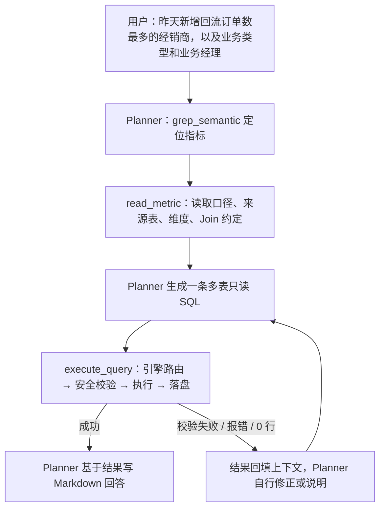

# 多表查询执行过程详解

> 最后更新：2026-10-08
> [返回文档索引](../文档索引.md)

本文用一个贯穿示例讲解一次多表查询从提问到出数的完整过程，重点说明 SQL 是怎么生成的、执行前经过哪些校验、失败时如何收敛。

当前是单 Agent 架构，细节见 [Text2SQL 系统架构文档](./Text2SQL系统架构文档.md)。

---

## 一、总体流程


```mermaid
flowchart TD
    U["用户：昨天新增回流订单数最多的经销商，以及业务类型和业务经理"] --> P["Planner：grep_semantic 定位指标"]
    P --> R["read_metric：读取口径、来源表、维度、Join 约定"]
    R --> G["Planner 生成一条多表只读 SQL"]
    G --> E["execute_query：引擎路由 → 安全校验 → 执行 → 落盘"]
    E -->|成功| A["Planner 基于结果写 Markdown 回答"]
    E -->|校验失败 / 报错 / 0 行| F["结果回填上下文，Planner 自行修正或说明"]
    F --> G
```

关键点：**没有 Advisor 澄清阶段，也没有 Seeker 执行智能体**。口径确认由 Planner 通过 `read_metric` 完成，澄清由 Planner 直接输出文案；执行由 `execute_query` 工具完成。

---

## 二、多表 SQL 是怎么来的

1. **定位指标**：`grep_semantic(["回流", "订单"])` 命中候选指标文件。
2. **确认口径**：`read_metric` 读取该指标的完整定义——来源表、聚合表达式、支持维度、枚举值、以及需要与哪些维表关联（`join_contracts`）。
3. **确认字段**：来源表字段以语义层 `physical` / 指标定义为准；逻辑维度名（如 `platform`、`dealer`）需映射到物理字段（如 `pt_platform`、`company_id`）。
4. **生成 SQL**：Planner 自行编写一条只读 SQL。多表关联必须使用语义层中已人工审核的连接关系与连接键（如按 `pt_platform + company_id` 复合键关联经销商维表）。
5. **一次提交**：需要多个视角（不同分组、汇总、Top N）时，把它们放进同一次 `execute_query` 的 `steps` 多段脚本，一次执行、各自落盘，避免逐轮重复查库。

---

## 三、执行前的校验（真实生效的规则）

`execute_query` 内部对每条 SQL 依次执行三层校验，任一层失败即拒绝执行：

| 顺序 | 校验 | 说明 |
|---|---|---|
| 1 | `is_read_only_sql` | 仅允许 `SELECT` / `WITH`，禁止任何写操作与 DDL |
| 2 | `validate_hive_sql` | 必须带显式 `LIMIT`；`JOIN` 是否允许由 `ALLOW_JOIN` 控制；解析 `FROM/JOIN` 后的库表名 |
| 3 | `validate_sql_ast_guardrails` | AST 级：只读、必须有 `LIMIT`、**禁止 `SELECT *`**、必须包含时间/分区过滤条件（默认 `pt_dt`），表名解析失败直接拒绝 |

此外还有两条链路规则：

- **跨引擎拒绝**：一次 SQL 涉及的表若分属不同引擎候选链（如 `data_project` 与其余库），直接拒绝并提示拆开查询。
- **表级白名单已取消**：`is_table_allowed()` 统一放行，SQL 能访问哪些表由底层数据库账号权限决定。

> 说明：`ALLOW_AI_INFERRED_JOIN=False`。语义层没有配置连接关系时，不允许模型自行推测 Join 条件。

---

## 四、失败与自愈

工具只把真实结果回填给 Planner，不替它做决定：

| 情况 | 工具返回 | Planner 的下一步 |
|---|---|---|
| 安全校验失败 | `SQL 未通过安全校验：<原因>` | 按原因改写 SQL 重试（如补 `LIMIT`、补 `pt_dt` 过滤、去掉 `SELECT *`） |
| 引擎执行异常 | 逐引擎错误信息 | 判断是否语法/字段问题，改写后重试 |
| 返回 0 行 | 列 + 0 行的摘要 | 用 `probe_values` 探查字段真实取值后改条件重查；确认无数据则如实说明 |
| 跨引擎表 | 明确的拒绝提示 | 拆成多条 SQL 分别查询 |

> 安全校验失败**不会**降级到其他引擎——换个引擎大概率同样拒绝；只有连接/执行异常才按候选链降级。

---

## 五、结果落盘与回答

- 每次执行都会落盘：CSV 全量、JSON 预览、脚本元数据（含 SQL、引擎、行数），放在 `agentTest/query_results/` 下按日期与 `request_id` 归档。
- 回填给 Planner 的是摘要：列名、预览行、行数、落盘路径、实际执行的 SQL。
- Planner 基于摘要撰写回答；需要图表时调用 `make_chart`，由程序从落盘结果取数生成规范的 `chart` 代码块。
- 前端展示的 SQL 只包含**本轮真正执行过的**语句，用于向用户说明口径，不是审计日志。

---

## 六、一个多表例子

用户问："昨天新增回流订单数最多的经销商，以及业务类型和业务经理。"

```text
1. grep_semantic("回流,经销商")
2. read_metric 命中「回流新增订单」
     → 来源表 ads_trip.xxx_hour（事实）
     → 需要关联 dim_trip.dim_company_snapshot_day（维表），键 = pt_platform + company_id
3. Planner 生成 SQL：
     SELECT d.company_name, d.business_type, ...
     FROM ads_trip.xxx_hour f
     JOIN dim_trip.dim_company_snapshot_day d
       ON f.company_id = d.company_id AND f.pt_platform = d.pt_platform
      AND d.pt_dt = '20261007'
     WHERE f.pt_dt = '20261007'
     GROUP BY ...
     ORDER BY ... DESC
     LIMIT 20
4. execute_query 校验：有 LIMIT、无 SELECT *、事实表与维表都带 pt_dt 条件 → 通过
5. 执行 → 落盘 → 返回摘要
6. Planner 写回答：Top 结果表 + 口径说明（来源表、时间范围、平台口径）
```

---

## 七、当前边界

- **逐表分区过滤**：当前主链路校验的是"整条 SQL 是否包含分区过滤条件"；`sql_table_filter_validator.py` 提供了逐表校验能力，目前仅在执行辅助节点中接线。多表查询建议在语义层与提示词中约束每张表都带 `pt_dt`，并在结果异常（行数明显放大）时回到 SQL 复核。
- **Join 路径规划**：`JoinPlanner` 目前只在辅助节点链路中使用，主链路由 Planner 依据语义层 `join_contracts` 直接编写。
- **多指标长查询**：仍是主要耗时来源，`steps` 已支持并行执行并在出错时降级串行。
